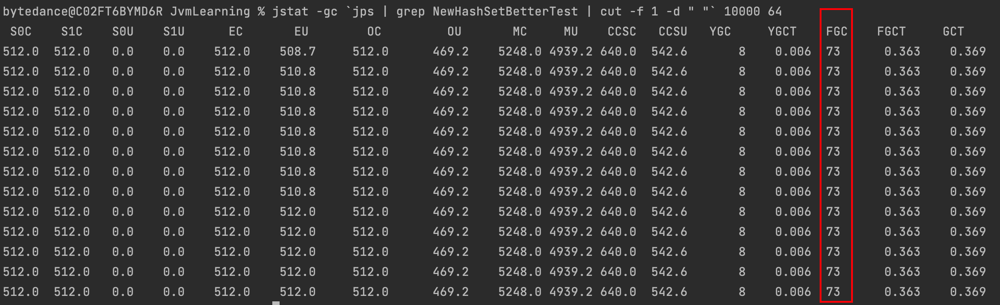

# 什么时候应该谨慎使用putIfAbsent

# 前言

- putIfAbsent的作用是当Map中某个key对应的value为null时，put一个value到Map中。

```java
@Slf4j
public class NewHashSetBadTest {
    public static void main(String[] args) throws InterruptedException {
        long start = System.currentTimeMillis();
        Map<String, Set<String>> map = new HashMap<>();
        int N = 100000;
        for (int i = 0; i < N; i++) {
            Thread.sleep(1);
            map.putIfAbsent("equator", Sets.newHashSet());
            // do something here ~
        }
        log.info("cost {}", System.currentTimeMillis() - start);
    }
}
```

- 其等价于下面的写法，下面的写法是不是不够优雅？

```java
@Slf4j
public class NewHashSetBetterTest {
    public static void main(String[] args) throws InterruptedException {
        long start = System.currentTimeMillis();
        Map<String, Set<String>> map = new HashMap<>();
        int N = 100000;
        for (int i = 0; i < N; i++) {
            Thread.sleep(1);
            if (map.get("equator") == null) {
                // 等同于 !map.containsKey("equator")
                map.put("equator", Sets.newHashSet());
            }
            // do something here ~
        }
        log.info("cost {}", System.currentTimeMillis() - start);
    }
}
```

- 那么它俩有什么区别呢？

# 问题所在

- 使用`putIfAbsent`语法最大的问题在于`map.putIfAbsent("equator", Sets.newHashSet())`这一句，其不管key是否为空，都会执行`Sets.newHashSet()`方法，导致在上述代码中，使用`putIfAbsent`语法的代码片段，“创建一个新对象”这种高难度动作发生了100000次。

- 先加上Jvm参数`-Xms1m -Xmx1m`，分别运行一下两个程序，使用`jstat`工具查看GC情况。

  ```shell
  // 也可以使用下面两个命令快速查看GC情况：先jps获取进程信息，再用cut命令提取进程ID，最后以10秒一次的频率输出GC情况64次
  jstat -gc `jps | grep NewHashSetBetterTest | cut -f 1 -d " "` 10000 64
  
  jstat -gc `jps | grep NewHashSetBadTest | cut -f 1 -d " "` 10000 64
  ```

- 使用`putIfAbsent`语法的程序。（这里由于采样问题，S0U、S1U显示不太准确，实际上二者是有频繁变化的）


- 不使用`putIfAbsent`语法的程序



- 为什么频繁创建对象，并且这些对象没有被引用，Full GC还是会频繁发生呢？这是因为由于空间担保策略的存在，在发生Minor GC之前，虚拟机会检查老年代最大可用的连续空间是否大于新生代所有对象的总空间。如果老年代剩余连续内存空间 < 历次晋升到老年代的对象的平均大小 < 新生代对象总空间，则不会触发Young GC而是转为触发FullGC。[详见](https://blog.csdn.net/wangxuelei036/article/details/108180150)
- 既然在GC层面二者行为有较大差别，那么其执行耗时也必定有所不同。（此时将`Thread.sleep(1)`注释掉）

| N\|执行耗时（ms） | 使用`putIfAbsent`语法 | 不使用`putIfAbsent`语法 |
| ----------------- | --------------------- | ----------------------- |
| 100000            | 604                   | 78                      |
| 1000000           | 4274                  | 81                      |
| 10000000          | 37531                 | 102                     |

- 结果非常amazing啊，二者性能差异如此明显~

# 结论

- 本文产生的原因是个悲剧，算是线上问题的解决总结吧。简单说一下这个线上问题：现象是某个方法被调用时，CPU被打满，严重影响其它线程运作。

  - 初步排查结论是GC过于频繁，大量线程状态为BLOCKED。

  - 初步解决方案是参数`Xmx2048m`，调整至`Xmx3072m`，但是调用问题方法后进程会被系统内核KILL掉重启（可能因为Out-Of-Memory killer机制，但是具体内核信息无权限查看，只能猜测是如此）。
  - 然后尝试分批方式处理数据，但是由于方法本身需要构建全局的数据血缘关系，分批这条道路也困难重重。
  - 最后在一位零零后同事的提醒下，`putIfAbsent`语法创建了很多无用的对象，我先在本地实验了一下，发现二者差异确实明显；然后我在本地使用测试数据在参数为`Xmx200m`的情况下，进行了测试：原方法代码在该参数下会OOM，将方法中多处`putIfAbsent`代码优化后，其在有限的堆内存场景下正常执行完毕。在线上小流量机器上运行优化后的程序，CPU满负荷运行几秒后恢复正常水平（这个方法线上是天级调度），GC情况正常，日志输出显示方法正常执行完毕。

  

- 除了`putIfAbsent`语法，`getOrDefault`等类似的语法也有可能出现这种问题。看起来不起眼的一行代码，却是一次线上问题的罪魁祸首QAQ。

- 结论很简单：大数据量下，还是需要谨慎使用`putIfAbsent`语法，`map.putIfAbsent("equator", Sets.newHashSet())`这种写法的代码会造成重复创建大量无用对象，导致频繁GC，平平淡淡才是真！
