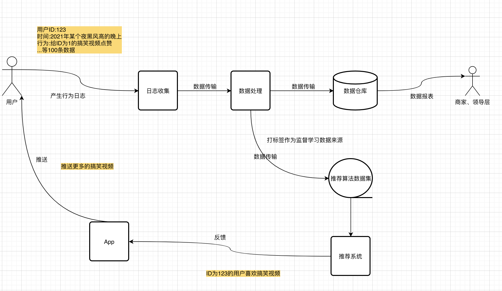

# 为什么我推荐你做数据研发

## 前言

- 为什么我推荐，尤其是做服务端方面的你做数据研发？因为这样你大概率找我内推，用我内推码我就hin开心啊哈哈哈~

## gossip

- 在很多论坛，可以看到很多人说“面试造火箭，工作拧螺丝”。我也参加了几个新人培训，也有很多人问工作拧螺丝怎么破。我个人觉得觉得工作拧螺丝的同学，大多是因为其在工作中已经“游刃有余”了。但是我在工作中就没有这种拧螺丝的感觉，因为要学习的东西永远是很多的（本公众号名称“菜蛋学”来源），别说可以游刃有余地拧螺丝，有一段时间我的状态如下：

- 说回正题，服务端研发围绕着数据相关的领域进行开发。即使你不实际上参与大数据开发（如写Flink程序倒腾Kafka啥的），你也会在工作中接触到很多相关的知识，更广的领域知识可以让你没有拧螺丝的感觉，反而很有挑战性。

## 数据研发一览

- 那么数据研发大概干啥：拿很多公司的经典架构以及《大数据之路》中说到的模式举例，就是让收集起来的数据经过处理后变得更有价值，让数据应用起来，反哺业务。
- 数据在大公司内的处理都是一环紧扣一环的，很多时候一个团队只能负责其中一块。当数据规模上来之后，治理管控等需求也随之出现了，说白了需求很多，很缺人。

- 最近的技术分享会，值得一听~

## 如何学习大数据

- 如果是想我一样几乎没什么大数据基础的，我觉得可以这样学起：[传送门](https://www.equator8848.xyz/pages/justdoit/%E6%95%B0%E6%8D%AE%E6%B5%81%E5%AE%9E%E6%88%98/)。
- 书籍可以看《大数据之路：阿里巴巴大数据实践》，视频可以学习哔哩哔哩上尚硅谷的系列视频入门。

## 真的内推码

- 字节跳动校招内推码: 4FX66HV，投递链接: https://jobs.toutiao.com/s/eq7yxXM
- 社招：https://job.toutiao.com/s/eq7Pdrg
- 认准数据平台~