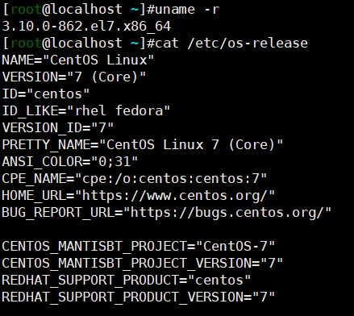
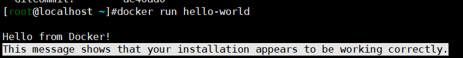
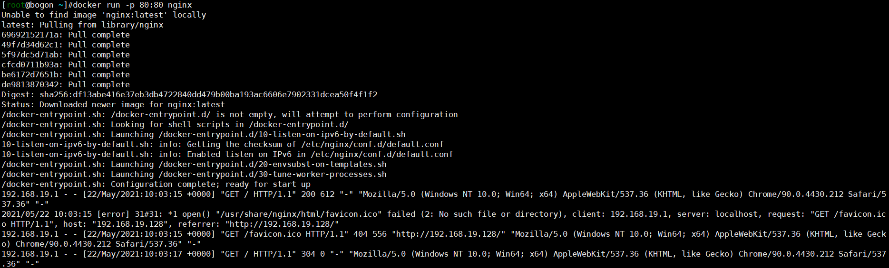
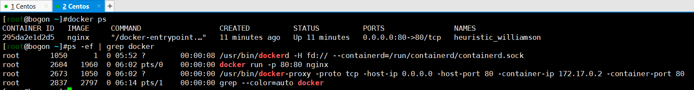
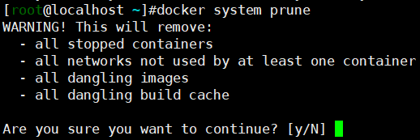

# 安装与配置

> 软件的具体安装教程看一下网络上的吧~

## Linux环境准备

- 使用`Windows`系统的同学推荐使用`VMware Workstation`或者`Oracle VirtualBox`软件安装Linux虚拟机，一般是CentOS即可。使用Mac系统的同学可以不用安装Linux虚拟机。

- Docker需要Linux内核为`3.10.0`及以上的，也就是CentOS7及以上。可以通过`uname -r`以及`cat /etc/os-release`命令查看内核版本以及系统发行版本。

  

- 在Windows系统上使用VM虚拟机的同学可以安装`XShell`软件，操作起来更加方便。

## Docker安装

- [参考官网安装教程](https://docs.docker.com/engine/install/centos/)

  ```shell
  # 安装依赖
  yum install -y yum-utils device-mapper-persistent-data lvm2
  # 设置仓库地址
  yum-config-manager --add-repo http://mirrors.aliyun.com/docker-ce/linux/centos/docker-ce.repo
  # 生成缓存
  yum makecache fast
  # 安装
  sudo yum install docker-ce docker-ce-cli containerd.io
  # 启动
  systemctl start docker
  # 查看版本
  docker version
  # 运行测试项目
  docker run hello-world
  ```

- 查看是否安装成功

  

# Docker概览

## 为什么需要Docker

- 现在的系统越来越复杂了，动不动就各种依赖，难免出现在这台机器上运行可以，在另外的机器上运行就不行的情况，这容易破坏开发与运维之间的神圣友谊，有什么解决方法呢？我们先想一想Java是怎么做到一次编译，处处运行的：Java程序运行在虚拟机上，环境的差异性都被虚拟机屏蔽了，所以Java程序得以实现跨平台。哪有什么岁月静好，只不过是底层有人给你负重前行！
- 那么如果我们在开发的时候就将系统部署到一个类似虚拟机的东西，开发完毕上线之后也同样部署到类似虚拟机的东西上，环境的差异问题是不是就得以解决了呢？我们管这种类似于虚拟机的东西叫容器吧。容器有着严谨的规格，安装在其上面的软件服务也有着严谨的版本，这样秩序明确的小小世界使得我们的系统具有了超好的可移植性。

## Docker的世界


- Docker的一些关键概念

  - Image，镜像。简单点说，镜像可以看作是一种饼印，也就是一种模板，一种固化下来的流程。饼印，可以自己做，可以用别人的，可以在别人的饼印上加工几刀变成新的一种饼印。

    

  - Container，容器。饼印印出来的饼子，鲜活的，动态的。

  - Registry，仓库。饼印的集市，上面有各种各样的饼印供人选择。

  - Docker Daemon，Docker服务端。负责管理饼印以及使用饼印制作饼子。

  - Client，客户端。发出制作什么样的饼子以及制作多少个等指令。
  
- 注意

  - Docker服务端与客户端可以不在同一台机器上，但是服务端默认只处理本地的客户端请求。要想服务端处理远程客户端的请求，需要在配置文件种进行相应的配置。

## 运行一个容器

```
# 运行一个nginx容器（-p 即port，指的是将容器的80端口映射到主机的80端口）
docker run -p 80:80 nginx
```

- 可以看到由于本地没有nginx镜像，Docker会到远程仓库中拉取nginx的最新镜像并启动对应的容器。



- 可以使用主机访问虚拟机对应的IP，如无意外可以看到nginx的欢迎页面。（如果无法访问，注意虚拟机防火墙是否开启）


- 可以看到，上面运行nginx容器之后，终端就阻塞了，我们只能新开一个终端查看。输入`docker ps`或者`docker container ls`命令查看当前运行中的容器，输入`ps -ef | grep docker`命令，可以看到主机也创建了对应的进程。可见，Docker通过容器技术，以更小的体积与更快的速度达到了与虚拟机媲美的虚拟效果。



- 要想运行容器之后终端不阻塞，我们可以在运行命令后面加上`-d`参数，以守护进程的形式启动：`docker run -d -p 80:80 nginx`。（d是daemon的缩写，意为守护进程，后台程序）

# 还原

- 做实验搞东搞西，数据太多了看着不舒服，可以使用命令`docker system prune`清除无用的数据。



- 批量停止容器`docker stop $(docker ps -q)`