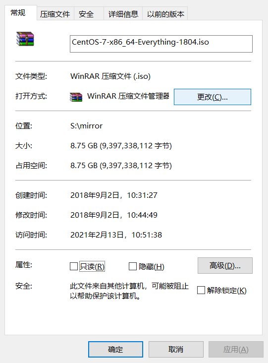
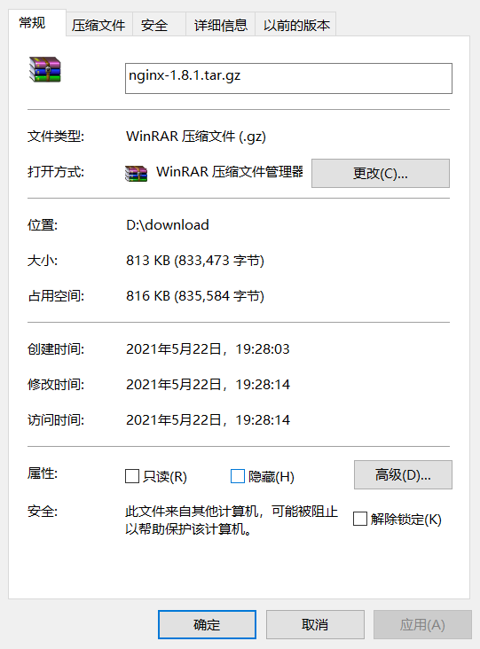
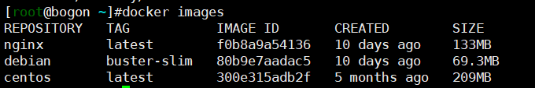
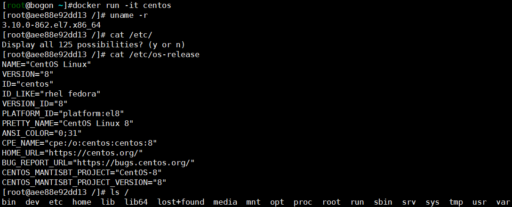
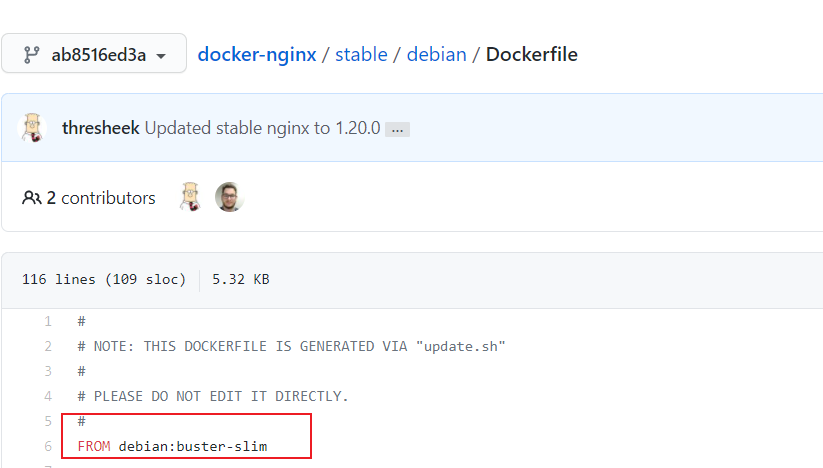
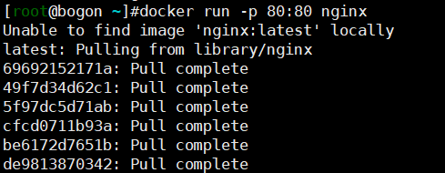
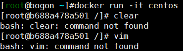
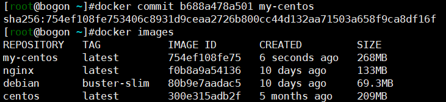

# 镜像概述

## 基础镜像







- 用于构建实验用的虚拟机CentOS7镜像`iso`文件，大小接近9G，而Nginx1.8.1的安装包，大小不足1M。使用docker images查看在Docker中的镜像，可以看到CentOS的镜像大小才200M，而Nginx的镜像大小为130多M，反而大了许多倍，这是为什么呢？
- Docker中的CentOS镜像，实际上是CentOS的阉割版，只具有最基础的系统功能。很多镜像都是在这样的阉割版系统上构建起来的，这种不依赖其它镜像的迷你操作系统镜像也被称为**基础镜像**。



- Linux操作系统包含内核空间以及用户空间：内核空间（Kernel）是系统的核心，拥有资源管理等操作的最高权限。用户空间包含了文件系统（rootfs）等工具软件，并通过系统调用调用内核空间的函数以完成相应的功能。基础镜像只需要提供rootfs，直接共享主机的Kernel，大大地缩小了自己的体积。
- 由于基础镜像直接使用主机的Kernel，容器也只能是使用主机的Kernel而不能对其进行任何的修改。如果需要使用指定版本的Kernel，那么使用虚拟机可能是一个更好的选择。



- Docker中的CentOS镜像就是一个基础镜像，只包含了基本系统的功能，所以体积非常小。而用于构建虚拟机的iso镜像文件，其中包含了许多的安装包以及桌面程序，体积好几个G也就不足为奇了。而再小的Nginx程序，它也需要一个可以运行它的操作系统，所以Nginx镜像比单纯的安装包大得多。（在DockerHub中可以看到nginx使用到了Debian作为基础镜像）

## 联合文件系统以及容器的Copy-on-Write机制



- Nginx镜像使用到了Debian作为基础镜像，在从远程仓库中拉取镜像的时候，也可以看到拉取了许多层。镜像都是通过这样搭积木的形式一层一层地迭代产生新的镜像的，这种分层的结构最大的好处就是可以共享资源。试想：在拉取Nginx镜像的时候，本地以及存在Debian基础镜像了，后面再拉取新的镜像，它也依赖了Debian基础镜像，那么Debian基础镜像就可以直接被共享了，不需要重新到远程仓库中重新拉取。
- 当启动一个容器时，一个新的容器层会被加到各层镜像的顶部。联合文件系统通过将容器层以及若干镜像层联合起来，得到一个统一的视图。容器层是可读写的，而镜像层是只读的。这种机制与PS的图层机制原理类似，都是通过一层一层地叠加得到一个最终的视图。
- Copy-on-Write机制：当新增文件时，文件只添加到容器层；删除文件时，只在容器层标记该文件已删除；修改文件时，从上到下查找相应的文件拷贝一份到容器层进行修改；查询文件时，从上到下查找对应的文件读取数据。容器层在Copy-on-Write机制的作用下，文件的增删改查操作都无法影响镜像层，从而保证了镜像层的只读性，使得镜像可以被多个容器共享。

# 镜像的构建

## commit

> 前面说到，镜像都是一层一层搭积木得到的，为了DIY得到我们自己想要的镜像，我们可以在原有的基础上修修改改缝缝补补得到一个新的镜像。



- `run`命令加上`-it`参数以交互的方式启动并进入CentOS容器，敲入几个命令，好巧啊，都没有。

- 通过命令`yum install -y ncurses `以及`yum install -y vim`安装对应的工具依赖，然后通过命令`exit`退出当前容器回到主机（或者使用CTRL+D快捷键）。

- 此时此刻如果我们直接执行命令`docker run -it centos`，会启动并进入一个全新的容器，里面并没有我们刚刚安装的工具软件，所以我们需要找到我们之前的容器的ID。通过`docker ps -a`显示所有的容器（包括已停止的），复制其容器ID。

  ```
  # 启动容器
  docker start 容器ID
  # 进入容器 可以看到这个容器中有我们之前安装的工具软件
  docker attach 容器ID
  # 提交修改得到新的镜像
  docker commit 容器ID 新的镜像名称
  ```



- 可以看到，由于安装的两个工具软件，CentOS镜像的大小由209M变为268M。通过新的镜像运行一个新的容器，新的容器中可以直接使用`clear`以及`vim`命令。我们通过commit命令成功得到了一个新的镜像。

## docker file