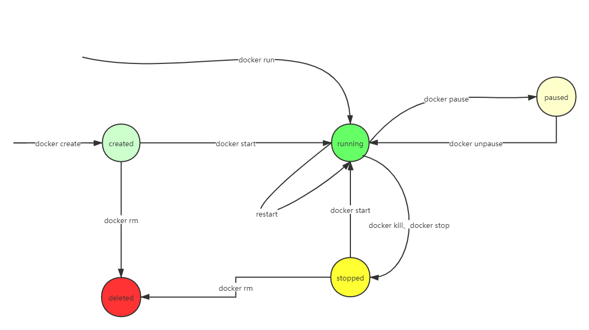

# 容器生命周期



## 容器启动

```
docker run [OPTIONS] IMAGE [COMMAND] [ARG...]

-d 以守护进程的形式启动（当CMD、Entrypoint和docker run命令行指定的命令运行结束时，容器停止）

--name 指定容器名称
```

- 进入容器内部，需要容器是运行中的状态
  - `docker attach $container_id`，不启动新的终端进程，直接进入启动容器命令的终端
  - `docker exec -it $container_id bash|sh`，启动新的终端进程

## 容器运维

- `stop`，停止容器
- `start`，快速停止容器
- `restart`，重启容器。`--restart=always`指定容器退出后立即重启。指定`--restart=on-failure:n`，容器非正常退出后，最多重启n次。
- `pause`，暂停容器，让出CPU资源；`unpause`取消暂停。
- `rm`，删除容器，可以指定多个