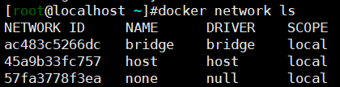
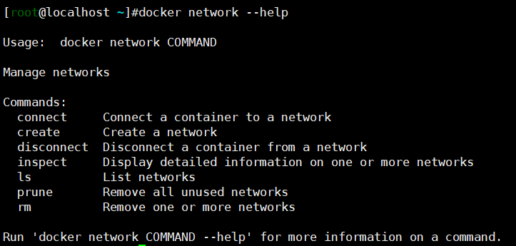
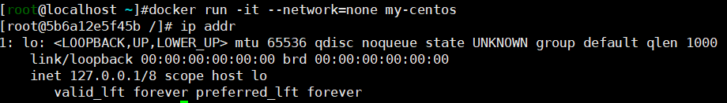
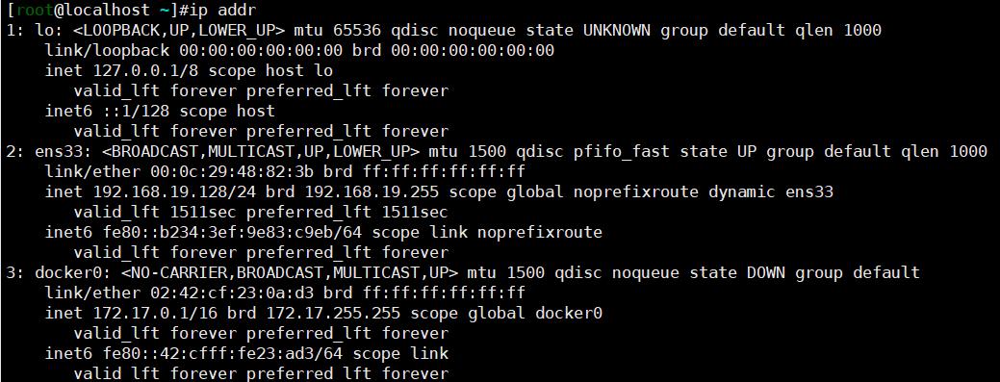
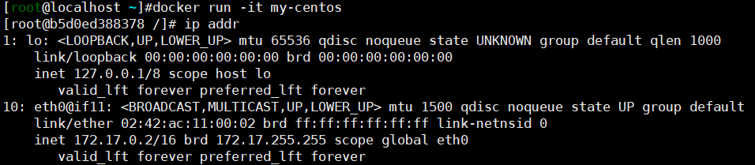

# Docker网络

## 概述

- 网络定义了容器之间以及容器与外界之间如何通信的。

- 通过`docker network ls`可以查看网络列表

- 默认情况下，Docker会自动创建三个网络：none、host、bridge。

  

- 启动容器是通过`--network=network_name`参数指定使用的网络模式。

- 通过命令`docker network inspect network_name`查看网络详情。



## None网络

- 完全隔离的无网络状态，适用于安全性要求高的容器。



## Host 网络

- 共享主机的网络。


## Bridge 网络

- 默认的网络模式
- Docker会自动创建一个docker0的网卡，通过`veth pair`技术将容器的网卡与docker0进行连接。





## 自定义网络

```
docker network create --drive=bridge|overlay|macvlan network_name
```

#容器间通信

## 利用IP通信

- 在启动容器时使用`--network`参数指定网络，或者通过`docker network connect`将容器加入到指定网络，使得两个容器拥有属于同一个网络的网卡，两个容器之间即可通信。

## Docker DNS通信

- 用户自定义的网络中，可以使用容器名称进行通信，Docker内部的DNS服务将容器名称转换为对应的IP。

## joined容器通信

- 通过命令参数`--network=container:target_container_name`，将得当前容器加入到target_container，二者共享网络。

# 容器与外部通信

## 容器访问外部

- 利用NAT机制转换

## 外部访问容器

- 利用端口映射机制