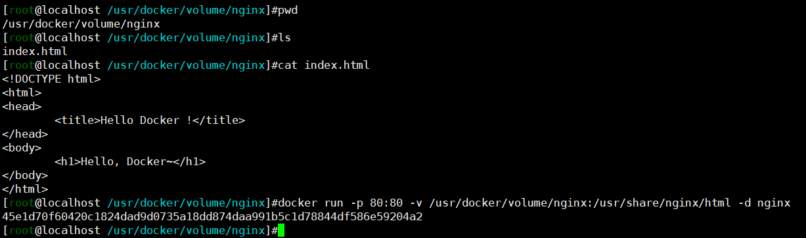
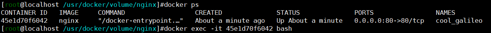
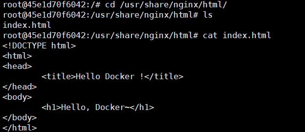
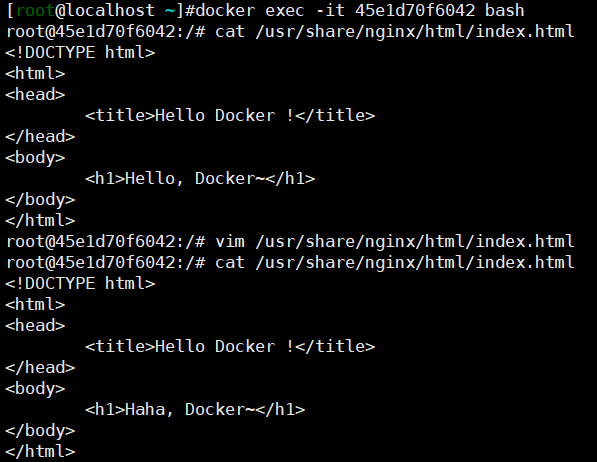
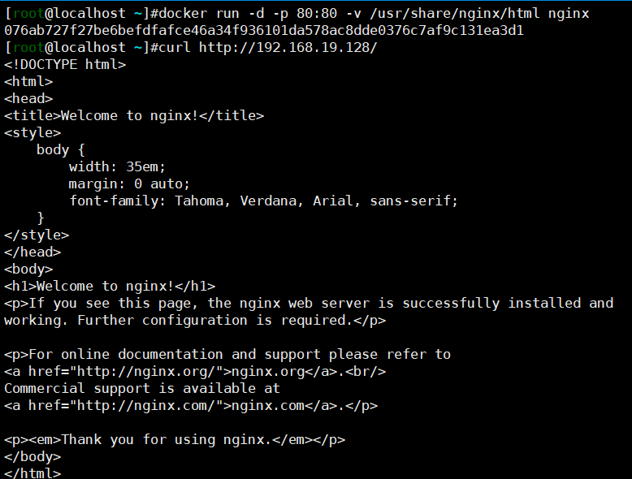
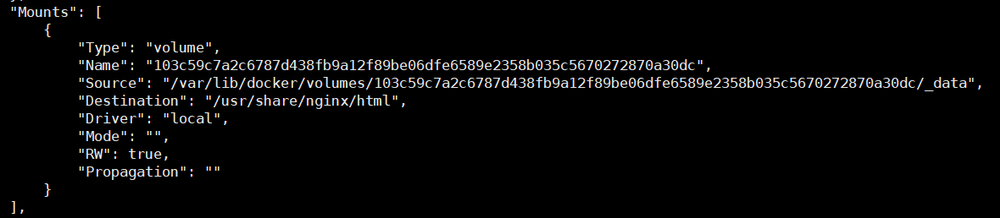
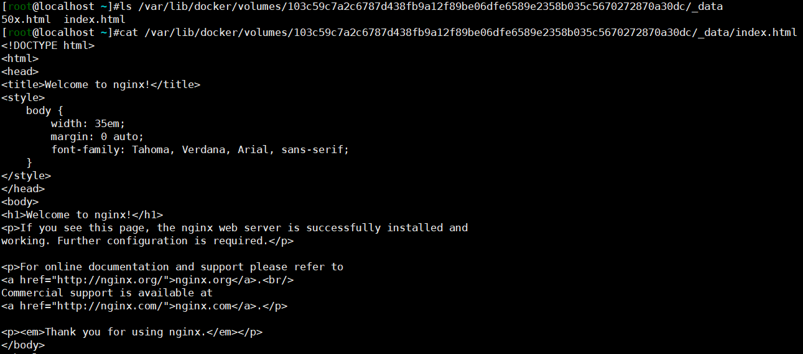
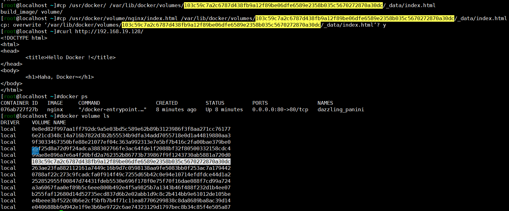

# 数据存储

## storage driver

- storage driver提供得联合文件系统使得容器层和若干镜像层进行叠加，向用户提供一个统一的视图。改动的数据保存到容器层，容器删除之后数据也被删除，适用于无状态的容器，如`busybox`、临时的`centos`。

## data volume

> data volume即数据卷，指的是将主机中的目录或者文件挂载到容器的文件系统中，容器可以直接进行读写。容器删除之后，数据卷的数据可以保留下来。

### bind mount

- 启动容器时可以使用参数`-v`指定数据卷，格式为`-v $host_path:$container_path`，容器中container_path目录会被host_path覆盖。
- 可以设置为只读：`-v $host_path:$container_path:ro`
- 可以仅挂载一个文件，前提是文件已经在主机中存在

#### example

- 在一个目录下创建一个`index.html`文件，主要内容为`HEllo, Docker~`，将其挂载到nginx容器中得html目录下。

- 访问nginx可以看到文件已生效

- 进入容器中修改`index.html`文件，将主要内容改为`Haha, Docker~`。再次访问nginx，文件修改已生效。

- 退出容器，主机中得文件也已经被修改，说明数据卷的修改是双向的。

### docker managed volume

- bind mount指定了主机的绝对路径，导致移植性不高
- docker managed volume只指定了mount point（容器目录），而不需要指定mount源（主机路径）。主机路径有Docker统一管理。

#### example

- 不设置mount源

- 使用`docker inspect`命令查看容器详情，可以看到实际的挂载目录

- 查看主机上对应目录，可见容器中的数据被拷贝了一份到主机的挂载目录

- 修改主机中的数据，容器对应的数据也被修改

### 运维

- `docker volume ls`以及`docker volume inspect`命令查看docker managed volume详情
- `docker inspect`命令查看bind mount详情

# 数据共享

## 主机与容器之间数据共享

- 通过数据卷机制

## 容器之间共享数据

### 数据卷共享

- 将一个目录挂载到多个容器中

### 数据卷容器

- 数据卷容器是专门为其它容器提供数据卷的容器
- 使用流程
  - `docker create`创建一个容器，并进行数据卷挂载
  - 其它容器使用`--volumes-from`参数指定使用数据卷容器