# 大数据技术

## 大数据基本理念

- 基本理念：分而治之。通过分布式的存储与计算方案，平摊了存储与计算的压力。
- 分布式计算方案
  - 消息传递接口 MPI：多进程多节点数据通信解决方案，但是比较复杂，使用成本较高。
  - 映射规约模型 MapReduce：一种简单的分布式计算编程模型，Map就是分，Reduce就是治。

## 大数据相关技术生态

### Hadoop

| 技术         | 备注          |
| ------------ | ------------- |
| HDFS         | 分布式存储    |
| HBase        | 数据库        |
| Yarn         | 资源调度      |
| Zookeeper    | 协调管理      |
| Sqoop        | 数据管道      |
| Hive         | SQL on Hadoop |
| Spark        | 内存计算      |
| Flink、Kafka | 流处理        |

### Spark

- 比原生MapReduce更加友好；基于内存计算，速度更快。

| 技术            | 备注                   |
| --------------- | ---------------------- |
| Spark核心       |                        |
| Spark SQL       |                        |
| Spark Streaming | 流处理，基于mini-batch |
| MLLib           |                        |
| GraphX          |                        |

### Kafka

- Kafka作为消息队列一般作为不同系统之间的数据管道，其也有原生的流处理框架。

### Flink

- 第三代流处理技术（第一代是Storm，第二代是Spark Streaming）

- 优点
  - 支持多种时间语义，可以处理乱序到达数据
  - Exactly-Once保障
  - 毫秒级延迟
  - 简单易用的API
  - 易于拓展，生态丰富

## 大数据处理平台演变

### 传统数据处理

- OLTP，事务处理：计算与存储分离，实时性较好，能够处理的数据量有限。

### 分析处理

- OLAP，将数据从业务数据库中复制到数据仓库，再进行查询与分析

### Lambda架构

- 为了保证实时性与准确性，同时采用批处理以及流处理对源数据进行处理（同时使用OLTP与OLAP）
- 需要开发与维护两个系统

### Kappa架构

- 舍弃批处理层，批流合一

## 流处理基础

### 延迟与吞吐

- 延迟 Latency，表示一个时间被系统处理的总时间。分为平均延迟以及分位延迟。
- 吞吐 Throughout，表示一个系统最多可以处理多少时间。

- 延迟高，吞吐量一般就比较小。

### 窗口与时间

- 窗口
  - 滚动窗口 Tumbling Window，定长，窗口之间不包含重复数据。
  - 滑动窗口 Sliding Window，定长，窗口之间包含重复数据。
  - 会话窗口 Session Window 不定长，使用会话间隔（Window Gap）划分事件

- 时间语义
  - Event Time 事件实际发生的时间
  - Processing Time 事件被流处理引擎处理的时间

- Watermark
  - 控制数据接收的最长等待时间
- 状态与检查点
  - 计算分为有状态计算与无状态计算
  - 检查点主要是保存状态数据

- 数据一致性保障
  - At-Most-Once，可能丢数据
  - At-Least-Once，可能重复处理数据
  - Exactly-Once，不重不漏数据

# Flink

## 基础概念

- Flink 是一个分布式处理引擎与框架，用于对无界和有界数据进行状态计算。
- 传统的数据架构是基于有限数据集的，而流式数据更加真实地反映了生产环境的数据产生特点。流式数据处理的目标是低延迟、高吞吐、结果的准确性、良好的容错性。

## Flink特点

- 事件驱动
- 一切皆是流：离线数据是有界流，实时数据是无界流
- 分层的API结构（Table API、DataStream（DataSet） API、ProcessFunction）

# 安装配置

## 本地测试

> 测试环境是Kafka系列中配置的Kafka集群

- 在IDEA中编写如下测试程序

```java
import lombok.extern.slf4j.Slf4j;
import org.apache.flink.api.common.serialization.SimpleStringSchema;
import org.apache.flink.api.common.typeinfo.Types;
import org.apache.flink.api.java.tuple.Tuple2;
import org.apache.flink.streaming.api.datastream.DataStream;
import org.apache.flink.streaming.api.environment.StreamExecutionEnvironment;
import org.apache.flink.streaming.api.windowing.time.Time;
import org.apache.flink.streaming.connectors.kafka.FlinkKafkaConsumer;
import org.apache.flink.util.Collector;
import org.apache.kafka.clients.consumer.ConsumerConfig;
import org.apache.kafka.common.protocol.types.Field;
import java.util.Properties;

@Slf4j
public class WordCount {
    public static void main(String[] args) throws Exception {
        // 设置运行环境
        StreamExecutionEnvironment env = StreamExecutionEnvironment.getExecutionEnvironment();
        // 设置Kafka参数
        Properties conf = new Properties();
        conf.put(ConsumerConfig.BOOTSTRAP_SERVERS_CONFIG, "kafka1:9092;kafka2:9093;kafka3:9094");
        conf.put(ConsumerConfig.GROUP_ID_CONFIG, "flink-group");

        // 设置数据源
        String inputTopic = "flink-test-topic";
        FlinkKafkaConsumer<String> consumer = new FlinkKafkaConsumer<>(inputTopic, new SimpleStringSchema(), conf);
        DataStream<String> stream = env.addSource(consumer);

        // 使用Flink API 对输入文本流进行操作
        DataStream<Tuple2<String, Integer>> wordCount = stream.flatMap((String line, Collector<Tuple2<String, Integer>> collector) -> {
            String[] tokens = line.split("\\s");
            // 输出结果
            for (String token : tokens) {
                if (token.length() > 0) {
                    collector.collect(new Tuple2<>(token, 1));
                }
            }
        }).returns(Types.TUPLE(Types.STRING, Types.INT)).keyBy(0)
                .timeWindow(Time.seconds(5))
                .sum(1);
        // Sink
        wordCount.print();
        // 执行
        env.execute("Kafka Stream WordCount");
    }
}
```

- 创建对应的topic并发送数据，`kafka-console-producer.sh --broker-list kafka1:9092 --topic flink-test-topic`

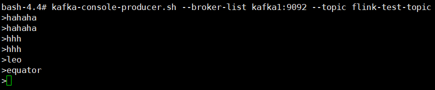

- 在控制台可以看到wordcount的输出

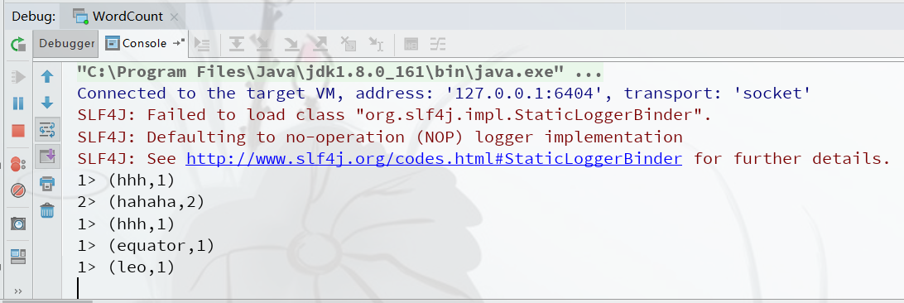

## 集群配置

- 创建自定义网络

```
docker network create --driver=bridge --subnet=172.18.0.0/16 --gateway=172.18.0.1 my-cluster-network
```

| 服务         | IP         | 端口（主机:容器） |
| ------------ | ---------- | ----------------- |
| zookeeper1   | 172.18.1.1 | 2181:2181         |
| zookeeper2   | 172.18.1.2 | 2182:2181         |
| zookeeper3   | 172.18.1.3 | 2183:2181         |
| kafka1       | 172.18.2.1 | 9092:9092         |
| kafka2       | 172.18.2.2 | 9093:9092         |
| kafka3       | 172.18.2.3 | 9094:9092         |
| jobmanager   | 172.18.3.1 | 8081:8081         |
| taskmanager1 | 172.18.3.2 | none              |

- 编写配置文件`flink-cluster.yml`

```yaml
version: '3'
services:
  zoo1:
    image: zookeeper:3.4
    restart: always
    hostname: zoo1
    container_name: zoo1
    ports:
      - 2181:2181
    volumes:
      - "/usr/workspace/volumes/zkcluster/zoo1/data:/data"
      - "/usr/workspace/volumes/zkcluster/zoo1/datalog:/datalog"
    environment:
      ZOO_MY_ID: 1
      ZOO_SERVERS: server.1=zoo1:2888:3888 server.2=zoo2:2888:3888 server.3=zoo3:2888:3888
    networks:
      my-cluster-network:
        ipv4_address: 172.18.1.1

  zoo2:
    image: zookeeper:3.4
    restart: always
    hostname: zoo2
    container_name: zoo2
    ports:
      - 2182:2181
    volumes:
      - "/usr/workspace/volumes/zkcluster/zoo2/data:/data"
      - "/usr/workspace/volumes/zkcluster/zoo2/datalog:/datalog"
    environment:
      ZOO_MY_ID: 2
      ZOO_SERVERS: server.1=zoo1:2888:3888 server.2=zoo2:2888:3888 server.3=zoo3:2888:3888
    networks:
      my-cluster-network:
        ipv4_address: 172.18.1.2

  zoo3:
    image: zookeeper:3.4
    restart: always
    hostname: zoo3
    container_name: zoo3
    ports:
      - 2183:2181
    volumes:
      - "/usr/workspace/volumes/zkcluster/zoo3/data:/data"
      - "/usr/workspace/volumes/zkcluster/zoo3/datalog:/datalog"
    environment:
      ZOO_MY_ID: 3
      ZOO_SERVERS: server.1=zoo1:2888:3888 server.2=zoo2:2888:3888 server.3=zoo3:2888:3888
    networks:
      my-cluster-network:
        ipv4_address: 172.18.1.3

  kafka1:
    image: wurstmeister/kafka:2.12-2.4.1
    restart: always
    hostname: kafka1
    container_name: kafka1
    privileged: true
    ports:
      - 9092:9092
    environment:
      KAFKA_ADVERTISED_HOST_NAME: kafka1
      KAFKA_LISTENERS: PLAINTEXT://kafka1:9092
      KAFKA_ADVERTISED_LISTENERS: PLAINTEXT://$你的虚拟机IP:9092
      KAFKA_ADVERTISED_PORT: 9092
      KAFKA_ZOOKEEPER_CONNECT: zoo1:2181,zoo2:2181,zoo3:2181
    volumes:
      - "/usr/workspace/volumes/kafkaCluster/kafka1/logs:/kafka"
    networks:
      my-cluster-network:
        ipv4_address: 172.18.2.1
    depends_on:
      - zoo1
      - zoo2
      - zoo3

  kafka2:
    image: wurstmeister/kafka:2.12-2.4.1
    restart: always
    hostname: kafka2
    container_name: kafka2
    privileged: true
    ports:
      - 9093:9092
    environment:
      KAFKA_ADVERTISED_HOST_NAME: kafka2
      KAFKA_LISTENERS: PLAINTEXT://kafka2:9092
      KAFKA_ADVERTISED_LISTENERS: PLAINTEXT://$你的虚拟机IP:9093
      KAFKA_ADVERTISED_PORT: 9092
      KAFKA_ZOOKEEPER_CONNECT: zoo1:2181,zoo2:2181,zoo3:2181
    volumes:
      - "/usr/workspace/volumes/kafkaCluster/kafka2/logs:/kafka"
    networks:
      my-cluster-network:
        ipv4_address: 172.18.2.2
    depends_on:
      - zoo1
      - zoo2
      - zoo3

  kafka3:
    image: wurstmeister/kafka:2.12-2.4.1
    restart: always
    hostname: kafka3
    container_name: kafka3
    privileged: true
    ports:
      - 9094:9092
    environment:
      KAFKA_ADVERTISED_HOST_NAME: kafka3
      KAFKA_LISTENERS: PLAINTEXT://kafka3:9092
      KAFKA_ADVERTISED_LISTENERS: PLAINTEXT://$你的虚拟机IP:9094
      KAFKA_ADVERTISED_PORT: 9092
      KAFKA_ZOOKEEPER_CONNECT: zoo1:2181,zoo2:2181,zoo3:2181
    volumes:
      - "/usr/workspace/volumes/kafkaCluster/kafka3/logs:/kafka"
    networks:
      my-cluster-network:
        ipv4_address: 172.18.2.3
    depends_on:
      - zoo1
      - zoo2
      - zoo3

  jobmanager:
    image: flink:1.9.2-scala_2.12
    hostname: jobmanager
    container_name: jobmanager
    expose:
      - "6123"
    ports:
      - "8081:8081"
    command: jobmanager
    environment:
      - JOB_MANAGER_RPC_ADDRESS=jobmanager
    networks:
      my-cluster-network:
        ipv4_address: 172.18.3.1

  taskmanager1:
    image: flink:1.9.2-scala_2.12
    hostname: taskmanager1
    container_name: taskmanager1
    expose:
      - "6121"
      - "6122"
    depends_on:
      - jobmanager
    command: taskmanager
    links:
      - "jobmanager:jobmanager"
    environment:
      - JOB_MANAGER_RPC_ADDRESS=jobmanager
    networks:
      my-cluster-network:
        ipv4_address: 172.18.3.2

networks:
  my-cluster-network:
    external:
      name: my-cluster-network
```

- 启动集群，`docker-compose -f flink-cluster.yml up -d`

## 提交作业到集群

- 修改代码中Kafka相关配置

```java
conf.put(ConsumerConfig.BOOTSTRAP_SERVERS_CONFIG, "kafka1:9092;kafka2:9092;kafka3:9092");
```

- 通过maven将程序打包为jar文件（注意需要将依赖打包到jar包中），通过Flink Web UI提交作业到集群

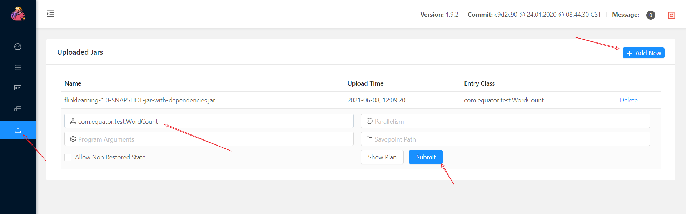

- 查看Job运行状态，正常运行中

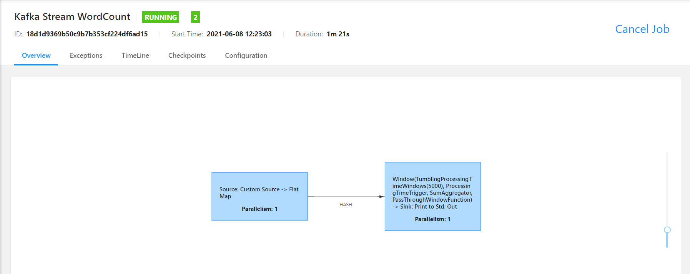

- Kafka生产数据，通过命令`docker logs taskmanager1 -f`查看Job输出

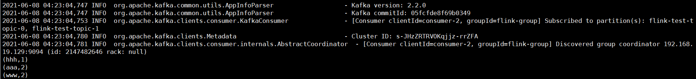

## Web UI查看输出配置

- 在Web界面查看输出，发现无法查看日志

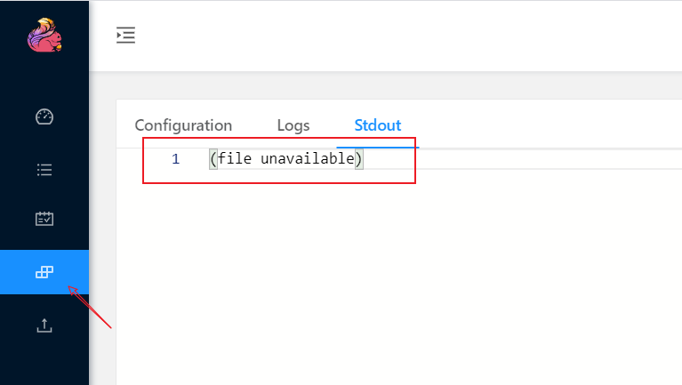

- 到`jobmanager`容器根目录下修改配置文件`/docker-entrypoint.sh`，指定重定向文件路径`>$FLINK_HOME/log/STD.log 2>&1`。（安装vim命令如下`apt-get update && apt-get install vim`）

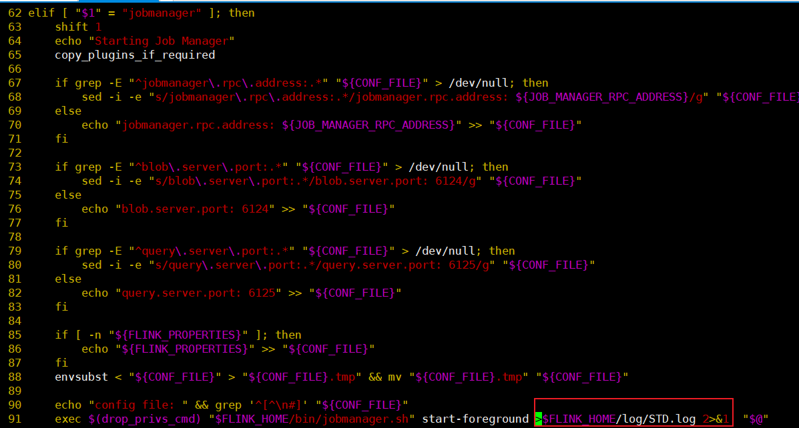

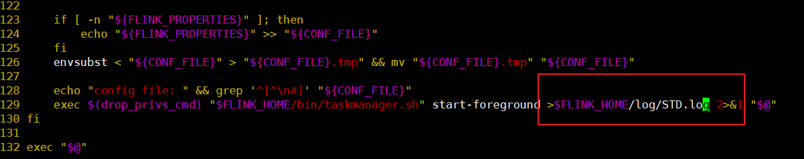

- 配置文件`/opt/flink/conf/flink-conf.yaml`添加配置

```
web.log.path: /opt/flink/log/STD.log
taskmanager.log.path: /opt/flink/log/STD.log
```

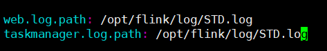

- 可以创建新的镜像以便复用

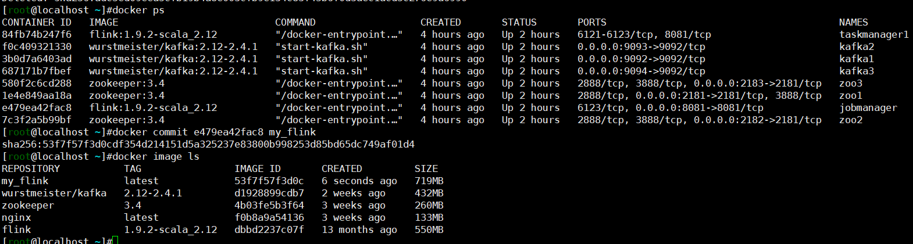

- 修改docker-compose文件

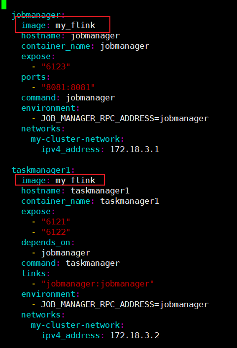

- 重启集群，重新提交任务并查看日志

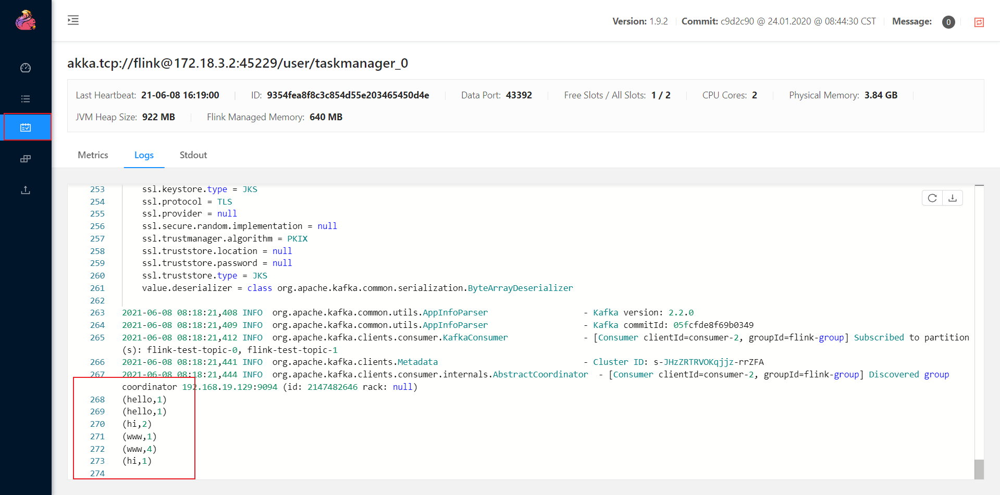

