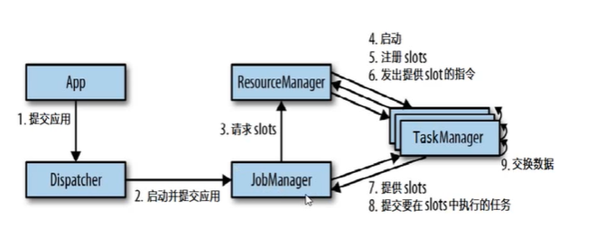

# Flink 运行时组件

## JobManager

> 作业管理器

- 控制一个Flink程序（Flink Job）执行的主进程，每个Flink Job的JobManager都是独立的。
- JobManager接收到作业图（JobGraph）、逻辑数据流图（logical dataflow graph）、整体Jar包后，将作业图转换为包含了所有可以并发执行任务的物理数据流图（ExecutionGraph），也被称为执行图。JobManager向资源管理器（ResourceManager）申请资源：任务管理器（TaskManager）上的插槽（Slot）。资源申请成功后任务将被部署到TaskManager上，JobManager负责期间的调度协调工作。

## TaskManager

> 任务管理器

- TaskManager启动之后，其会向资源管理器注册Slot信息以供资源管理器调度。
- 执行过程中，一个TaskManager可以跟其它运行同一个Job的TaskManager进行数据交互。

## ResourceManager

> 资源管理器

- 负责管理TaskManager的插槽Slot，Slot是Flink中定义的最小处理资源单元。

## Dispatcher

> 分发器

- 可能不是必须的，取决于应用提交运行的方式。
- Dispacher会启动一个WenUI便于展示与监控作业的执行信息。
- 当一个应用被提交时，分发器会启动并将应用移交给一个JobManager。

## 任务提交流程

1. 通过命令行或者WebUI提交任务至Dispatcher
2. Dispatcher启动并提交任务至JobManager
3. JobManager向ResourceManager申请Slot
4. ResourceManager启动TaskManager，TaskManager向ResourceManager注册Slot信息
5. ResourceManager向TaskManager发出提供Slot的指令
6. TaskManager提供Slot，JobManager提交需要在Slot中执行的任务

# Flink任务调度

## 并行度

- 一个任务（steam）有多个步骤，也就是算子（operator）。
- 一个算子也可以被拆分为多个子任务，一个特定算子的子任务（subtask）的个数被称为它的并行度（parallelism）。
- 一般情况下（slot默认分组），一个steam的并行度可以认为就是其所有算子中最大的并行度。

## TaskManager与Slot

- Flink中每一个TaskManager都是一个JVM进程，它可能会在独立的线程上执行一个或者多个子任务。
- TaskManager通过slot来控制一个TaskManager能够接收多少个task（一个TaskManager最少有一个slot）。

- 默认情况下，子任务可以共享Slot，即使它们是不同任务的子任务。（前提是先后顺序的子任务，不具有先后顺序的子任务部署到同一个slot中没有并行意义）

- 代码中每一个算子都可以单独设置并行度`setParallelism`与slot共享组`slotSharingGroup`。slot共享组中任务可以共享slot，不同组的任务必须占用不同的slot。（共享组默认组为“default”，一个算子不进行设置的话，默认与前一个算子在同一个共享组中）

## 数据传输

- 算子间的数据传输主要有以下两种形式：One-to-One以及Redistribution，具体形式取决于算子的种类。
- One-to-One（窄依赖）：steam维护者分区以及元素的顺序，map、filter、flatMap算子都是这种类型
- Redistribution（宽依赖）：steam分区发送变化，keyBy（hash）、broadcast、rebalance（随机）算子都是这种类型，类似于shuffle操作。

## 程序与数据流

- Flink程序三部曲：Source、Transformation、Sink
- Flink程序会被映射为逻辑数据流（dataflows、StreamGraph），大部分情况下，程序中的转换运算（transformation）与dataflows中的算子一一对应。
- 执行图
  - SteamGraph，程序结构的图结构。（Client上生成）
  - JobGraph，将多个符合条件的节点chain在一起作为一个节点，任务合并的前提条件是算子是窄依赖的（Client上生成）
  - ExecutionGraph，JobGraph的并行化版本，是调度层最核心的数据结构。（JobManager上生成）
  - 物理执行图，并不是具体的数据结构，指的是task部署后形成的“图”。

## 任务链

- **相同并行度**的**one-to-one操作**，可以被链接在一起成为一个task，原来的算子成为里面的subtask。任务链的优化技术可以减少通信的开销。（slot共享组因素除外）