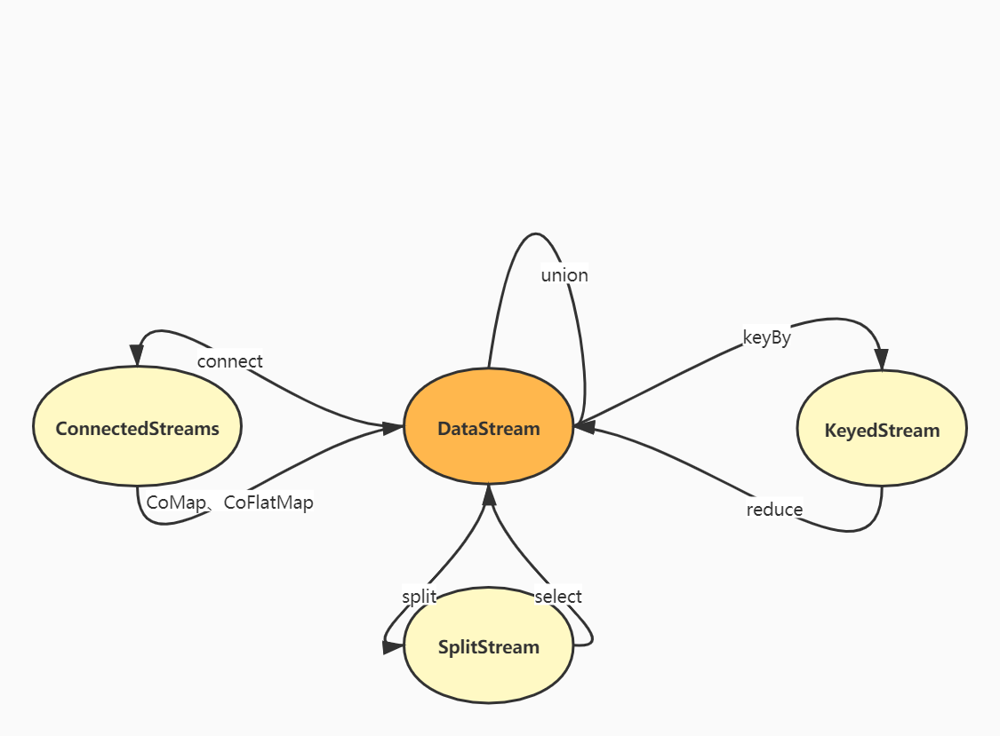
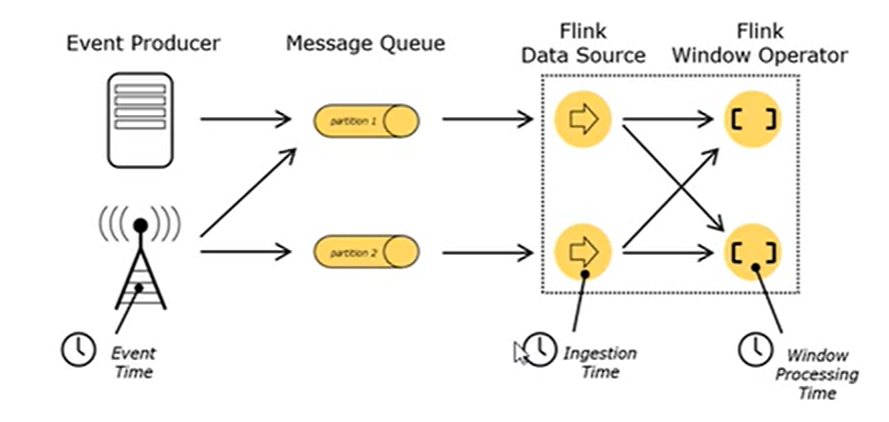

# 流处理API

## Environment

- **createExecutionEnvironment**，返回本地执行环境，需要在调用时指定默认的并行度。

- **createRemoteEnvironment**，返回远程执行环境，需要指定JobManager的IP以及端口号，并指定要在集群种运行的Jar包。
- 以上两种方法不太通用，可以使用**getExecutionEnvironment**，根据提交任务的方式返回本地的或者集群的运行环境，为最常用的执行环境创建方式。

```java
ExecutionEnvironment env = ExecutionEnvironment.getExecutionEnvironment();
或者
StreamExecutionEnvironment env = StreamExecutionEnvironment.getExecutionEnvironment();
```

## Source

### 从集合中读取数据

### 从文件中读取数据

### 从消息队列读取数据（Kafka）

```java
StreamExecutionEnvironment env = StreamExecutionEnvironment.getExecutionEnvironment();

Properties conf = new Properties();
conf.setProperty(ConsumerConfig.BOOTSTRAP_SERVERS_CONFIG, "kafka1:9092;kafka2:9093;kafka3:9094");

DataStreamSource<String> dataStreamSource = env.addSource(new FlinkKafkaConsumer<>("sensor_topic", new SimpleStringSchema(), conf));

dataStreamSource.print("sensor");

env.execute();
```

### 自定义消息源

- 实现自定义SourceFunction

```java
public class SensorDataSource implements SourceFunction<SensorReading> {

    /**
     * 标记位控制数据的产生
     */
    private boolean isRunning = true;

    @Override
    public void run(SourceContext<SensorReading> sourceContext) throws Exception {
        Random random = new Random();

        int sensorNum = 10;
        // 随机生成初始化温度
        Map<String, Double> temperatureMap = new HashMap<>(sensorNum);
        for (int i = 0; i < sensorNum; i++) {
            // 服从正态分布的温度
            temperatureMap.put("sensor_" + (i + 1), 60 + random.nextGaussian() * 20);
        }
        // 在循环中源源不断地生成数据
        while (isRunning) {
            for (String sensorId : temperatureMap.keySet()) {
                // 在原温度基础上随机波动
                Double temperature = temperatureMap.get(sensorId) + random.nextGaussian();
                temperatureMap.put(sensorId, temperature);
                sourceContext.collect(new SensorReading(sensorId, System.currentTimeMillis(), temperature));
            }
            // 控制输出频率
            Thread.sleep(2000);
        }
    }

    @Override
    public void cancel() {
        isRunning = false;
    }
}
```

- 使用数据

```java
public class SourceFunctionTest {
    public static void main(String[] args) throws Exception {
        StreamExecutionEnvironment env = StreamExecutionEnvironment.getExecutionEnvironment();
        // 自定义SourceFunction
        DataStreamSource<SensorReading> dataStreamSource = env.addSource(new SensorDataSource());

        dataStreamSource.print("sensor");

        env.execute();
    }
}
```

## Transform

### 基本转换操作

- map，一对一转换
- flatMap，一对一或者一对多转换
- filter，过滤

```java
public class BaseTransformation {
    public static void main(String[] args) throws Exception {
        StreamExecutionEnvironment env = StreamExecutionEnvironment.getExecutionEnvironment();
        // 加上这句代码可以实现顺序输出
        env.setParallelism(1);

        DataStreamSource<String> fileDataStreamSource = env.readTextFile("src/main/resources/data/sensordata.txt");

        DataStream<Integer> mapStream = fileDataStreamSource.map(String::length);


        DataStream<String> flatMapStream = fileDataStreamSource.flatMap(new FlatMapFunction<String, String>() {
            @Override
            public void flatMap(String line, Collector<String> collector) throws Exception {
                String[] fields = line.split(",");
                for (String field : fields) {
                    collector.collect(field);
                }
            }
        });

        SingleOutputStreamOperator<String> filterStream = fileDataStreamSource.filter((line) -> line.startsWith("sensor_1"));

        mapStream.print("map");
        flatMapStream.print("flatMap");
        filterStream.print("filter");

        env.execute();
    }
}
```

- keyBy，分组：DataStream->KeyedStream，逻辑地将一个流拆分为不相交的分区，每个分区包含具有相同key的元素，在内部以hash的方式实现。

### 滚动聚合

> 对KeyedStreamd的每一个支流做聚合

- sum
- min，保留一个字段；minBy，保留全部字段
- max；maxBy

### reduce聚合

> KeyedStreamd->DataStream，一个分组数据流的聚合操作，合并当前的元素和上次聚合的结果，产生一个新的结果。（更加一般化的聚合操作）

```java
public class ReduceAggregationTest {
    public static void main(String[] args) throws Exception {
        StreamExecutionEnvironment env = StreamExecutionEnvironment.getExecutionEnvironment();
        // 加上这句代码可以实现顺序输出
        env.setParallelism(1);

        DataStreamSource<String> fileDataStreamSource = env.readTextFile("src/main/resources/data/sensordata.txt");

        // String数据包装为SensorReading
        DataStream<SensorReading> dataStream = fileDataStreamSource.map((line) -> {
            String[] fields = line.split(",");
            return new SensorReading(fields[0], Long.valueOf(fields[1]), Double.valueOf(fields[2]));
        });

        KeyedStream<SensorReading, Tuple> keyedStream = dataStream.keyBy("id");

        // reduce聚合，取最大的温度值以及最新的时间戳
        SingleOutputStreamOperator<SensorReading> reduceStream = keyedStream.reduce(new ReduceFunction<SensorReading>() {
            @Override
            public SensorReading reduce(SensorReading oldVal, SensorReading newVal) throws Exception {
                return new SensorReading(oldVal.getId(), newVal.getTimestamp(), Math.max(oldVal.getTemperature(), newVal.getTemperature()));
            }
        });

        reduceStream.print();

        env.execute();
    }
}
```

### 分流

> Split：DataStream->SplitStream，根据某些特征把一个DataStream拆分为多个或者多个DataStream。
>
> Select：SplitStream->DataStream，从一个SplitStream中获取一个或者多个DataStream。
>
> Split与Select两个操作是分流的一个流程

### connect合流

> DataStream，DataStream->ConnectStreams，连接两个保持他们类型的数据流，两个数据流被Connect之后，内部的数据和形式不变，两条流相互独立。需要通过CoMap或者CoFlatMap操作合并为真正的一条数据流。

### union合流

> DataStream->DataStream，连接多条数据类型一致的数据流



## Sink

- 对外的输出操作都需要使用Sink完成，`stream.addSink(new SinkFunction(xxx))`，Flink提供了一些连接器，其余的需要用户自定义
- Kafka等消息队列可以作为source来源或者sink的目的地，HDFS、Redis等一般只作为sink目的地。

### Kafka

- 使用Kafka作为数据管道的两端，Flink进行ETL操作

### Redis

### ES

### JDBC

- 继承RichSinkFunction

## Flink数据类型

- Flink使用类型信息的概念来表示数据类型，为每个数据类型生成特定的序列化器、反序列化器以及比较器。
- Flink具有类型提取系统，分析函数的输入和返回类型，以自动获取类型信息。但是再lambda函数或者泛型类型场景下，需要程序显式地提供类型信息。
- 具体类型
  - Java、Scala的基础类型以及其包装类型
  - Java、Scala的元组类型Tuple（最大25元组）
  - Scala样例类（Scala Classes）、Java简单对象（POJO，需要有空参构造方法以及setter、getter方法）

## UDF函数类

### 函数类

- Flink暴露了所有UDF函数的接口（实现方式为接口或者抽象类），如MapFunction、FilterFunction。

### 匿名函数

- lambda表达式

### 富函数

- DataStream API提供的函数类接口，所有的Flink的函数类都有其Rich版本。其可以获取运行环境的上下文（`getRuntimeContext`，获取子任务编号、上下文、状态等信息），并拥有一些生命周期方法（`open`、`close`），可以实现更加复杂的功能。如RichMapFunction、RichFilterFunction。

## 数据重分区操作

- forward，传播到下一个分区
- keyBy，哈希重分区
- broadcast，广播到所有下游
- shuffle，随机传播到下游
- reblance，轮询传播
- rescale，分组轮询
- global，将全部数据汇总到下游第一个分区
- partitionCustom，自定义重分区分区器

# 窗口API

## 基本概念

> 窗口（window）就是将无限流切割为有限流的一种方式，其将无限流数据分发到有限大小的桶（bucket）中进行分析。

## 窗口的类型

### 时间窗口（Time Window）

> 按照时间开窗

#### 滚动时间窗口（Tumbling）

- 将数据依据固定的窗口长度进行切分，时间对齐，窗口长度（`window_size`）固定，没有重叠。

#### 滑动时间窗口（Sliding）

- 滚动窗口的广义形式，由固定的窗口长度（`window_size`）和滑动间隔（`window_slide`）组成，可以有重叠（一条数据最多属于`window_size/window_slide`个窗口）
-  可以通过偏移量控制窗口起始位置。

#### 会话窗口

- 一段时间`timeout`没有接收到新数据就会生成新的窗口，时间不对齐

### 计数窗口（Count Window）

> 按照数据条数开窗

#### 滚动计数窗口

#### 滑动计数窗口

## 窗口分配器

- 使用window方法定义一个窗口，基于这个window去做一些聚合操作。或者使用timeWindow或者countWindow方法直接定义时间窗口与计数窗口。
- 开窗的前提是处理keyedStream，否则使用windowAll方法，需要将所有数据发送到下游同一个算子，类似于global的传播方式。

## 窗口增量聚合

> 每条数据到来就进行计算，保持一个简单的状态，如ReduceFunction，AggregationFunction。

- ReduceFunction即reduce聚合
- AggregationFunction<IN,ACC,OUT>，ACC表示累加器

## 窗口全窗口聚合

> 先把窗口所有的数据收集起来再处理，计算时遍历所有数据处理，如ProcessFunction、WindowFunction。 统计平均数、中位数等场景下需要用到。更加灵活，可操作性更强。

- WindowFunction<IN,OUT,KEY,W>

## 其它可选API

# 时间语义

- Event Time：事件创建的时间
- Ingestion Time：数据进入Flink的时间
- Processing Time：执行操作算子的本地系统时间，与机器相关



- 一般来说，EventTime更为重要，其代表了事件的实际发生时间，可以从日志数据时间戳中提取。 （EventTime使用更大的时间延迟来换取相对更加准确的计算结果）
- 时间语义的设置在环境中进行设置

# WaterMark

## 乱序数据带来的问题

- 当Flink以EventTime模式处理数据时，其根据数据的时间戳来处理基于时间的算子，由于网络、分布式等原因，会导致乱序数据的产生。

## WaterMark基本原理

> 由于Flink延迟较低，迟到数据的延迟也不高，数据比较集中

- 可以这样处理乱序事件：窗口应该关闭的时候，不立即触发窗口的关闭而是等待一段事件，等迟到的数据来了之后关闭，一般结合window使用。WaterMark让程序自己平衡延迟和结果正确性，它的设置需要一定的经验。
- WaterMark是一条特殊的带有时间戳的数据记录，时间戳必须单调递增以确保任务的事件时间时钟在向前推进而不是后退。

## WaterMark在任务间的传递

- WaterMark是一条特殊的数据，从上游传递到下游，采取广播的方式。
- 算子作为下游接收WaterMark时，保留每个上游任务最新的的WaterMark即分区水位线，算子选取做小的WM作为自己的事件时钟。

## WaterMark的使用

- 基本流程：环境中设置时间语义，提取数据的时间戳，生成WaterMark。`assignTimestampAndWatermarks`方法，`BoundedOutOfOrdernessTimestampExtractor`时间戳抽取类。`AscendingTimestampExtractor`用来处理正常排序的升序数据。
- WaterMark可以间断性生成（WM生成很多），周期性生成（适合数据量大的情况）

## 设定原则

- 经验值
- WM设置延迟时间太长，结果产出可能很慢，解决方法是到达水位线前输出一个近似的结果。VM设置延迟时间太短，可能收到错误的结果，可以通过Flink的迟到数据处理机制纠正结果。

# 状态

- 由一个任务维护，并且用来计算某个结果的所有数据，都属于这个任务的状态。可以认为是一个本地变量，可以被任务的业务逻辑访问。
- Flink会进行状态管理，保证状态一致性，故障处理以及高效存储访问。
- 可以在富函数类的close生命周期方法中清理状态资源。

## 算子状态

> Operator State，算子状态的作用范围限定为算子任务

- 算子状态是对于同一个子任务共享的，不能由相同或者不同算子的另一个子任务访问。

### 数据结构

- 列表状态 List State
- 联合列表状态 Union List State
- 广播状态 Broadcast State

## 键控状态

> Keyed State，根据输入数据流中定义的键key来维护和访问

- 键控状态根据数据流中定义的键来维护和访问的。Flink为每个key维护一个状态实例，并将具有相同键的所有数据都分到同一个算子任务中，该任务维护和处理这个key对应的状态。
- 当任务处理一条数据时，其自动将状态的访问范围限定为当前数据的key。

### 数据结构

- Value State
- List State
- Map State
- Reducing State & Aggregation State

## 状态后端

- 状态的存储，访问以及维护由一个可插入的组件决定，该组件就是状态后端（State Backend）。其主要负责：本地状态管理，将检查点（CheckPoint）状态写入远程存储。

### 类型

- MemoryStateBackend：内存级别的状态后端，状态保存在TaskManager的JVM堆上，检查点状态存储在JobManager的JVM堆上。快速但是不稳定。
- FsStateBacked：将检查点写入远程持久的文件系统（HDFS）上，本地存储仍然保存在本地。

- RocksDBStateBackend：将所有状态序列化后写入本地RocksDB中存储。（适合需要消耗大量内存的任务）

# ProcessFunction API（底层API）

> 访问时间戳（事件时间）、watermark，以及注册定时事件

- 根据不同的数据流，需要调用不同的ProcessFunction（都是抽象类）

## KeyedProcessFunction

- 获取时间服务，定义定时事件（删除定时器需要利用键控状态保存定时器触发时间，利用该时间进行删除），侧输出流（自定义侧输出流实现分流操作）

## CoProcessFunction

# 容错机制

## 一致性检查点（checkpoint）

- Flink故障恢复机制的核心就是应用状态的一致性检查点，有状态流应用的一致性检查点，其实就是所有任务的状态，在某个时间点的一份拷贝（快照）。这个时间点，应该就是所有任务都恰好处理完一个相同输入数据的时刻。

## 从检查点恢复状态

- 如果发生故障，Flink将会使用最近的检查点来一致恢复应用程序的状态，并且重新启动处理流程（主要是Source组件重放数据，因为Kafka等消息队列可以通过offset从指定的位置读取数据）。
- 故障恢复三部曲：

1. 重启任务
2. 从检查点读取状态并重置状态
3. 消费并处理检查点到故障发生之前的数据

- 检查点机制可以为应用程序状态提供ExactlyOnce的保障

## Flink检查点算法

- 检查点的保存不需要暂停整个世界：暂停应用，保存状态到检查点，再重新恢复应用。
- Flink的算法，基于Chandy-Lamport算法的分布式快照，将检查点的保存和数据处理分离开，不用暂定整个应用。主体思路是各个节点做了快照之后，由JobManager组合成为整个拓扑的状态。
- Flink的检查点算法使用到了一种称为分界线（barrier）的数据形式，其将一条流上的数据按照不同的检查点分开。分界线之前的数据导致的状态更改，都会被包含在当前分界线所属的检查点中，而基于分界线之后的数据导致的状态修改，都会被包含在之后的检查点之中。
- 具体流程
  1. JobManager会向每个Source任务发送一条带有新检查点ID的消息，以此启动检查点。
  2. 数据源将它们的状态写入检查点（状态后端），并发出一个检查点barrier。状态后端在状态写入检查点后，会返回通知给Source任务，Source任务会向JobManager确认检查点完成。
  3. 分界线对齐：barrier向下游传递，任务会等待所有输入分区的分界线到达，对于barrier已经到达的分区，继续达到的数据（barrier之后的数据）将会被缓存。barrier尚未达到的分区，数据（barrier之前的数据）会被正常处理。当收到所有输入分区的分界线时，任务就将其状态保存到状态后端的检查点中，然后将barrier继续向下游发送。向下游转发检查点barrier之后，任务将继续正常的数据处理。
  4. Sink任务向JobManager确认状态保存到检查点完毕。当所有任务都确认已经成功将状态保存到检查点时，检查点就真正完成了。

## 保存点（save points）

- Flink还提供了自定义的镜像保存功能，即保存点。其实现算法与检查点基本类似，因此可以认为保存点就是具有一些额外元数据的检查点。
- Flink不会自动创建保存点，需要用户或者外部调度程序明确地触发创建操作。除了故障恢复之外，保存点还可以用于有计划的手动备份，更新应用程序，版本迁移，暂停和重启应用程序等。

## 检查点和重启策略配置

- 启动检查点机制，`env.enableCheckPoint(interval)`，配置状态一致性策略、超时时间、最多同时检查点数量（默认为1），限制检查点触发间隔、容忍失败的保存点数目（默认为0）等。
- 重启策略配置，`env.setRestartStrategy(strategy)`。主要有固定延迟重启（重启尝试次数，重启间隔），失败率重启（一定的时间内，重启失败的次数）。

# 状态一致性

## 概念

- 有状态的流式处理，每个算子任务都可以有自己的状态。所谓状态一致性，其实就是我们所说的计算结果需要保证准确，数据处理需要不重不漏。故障恢复后的状态也应该是一致的。
- At-Most-Once 最多一次：最多处理一次事件，遇到故障时什么都不做。
- At-Least-Once 最少一次：不丢失数据但是一些数据可能会被处理多次。（UV数据统计）
- Exactly-Once 精确一次：数据处理不重不漏。

## 一致性检查点

- checkpoints机制可以保证一致性

## 端到端状态一致性

- 端到端状态一致性意味着正确的结果贯穿了整个流处理应用，每个组件都保证了它自己的一致性。整个端到端的一致性级别取决于所有组件中一致性最弱的组件。
- 内部保证：checkpoints
- source保证：可重设数据的读取位置
- sink端保证：故障恢复时，数据不会重复写入外部系统，即幂等性写入或者事务写入。

### 幂等性写入

- 一个操作可以重复执行多重，但是只导致一次结果更改，后续重复执行不生效。（如Hash表的写入覆盖）
- 最终结果一致但是中间状态可能不一致

### 事务写入

- 构建的事务对应着checkpoint，等到checkpoint真正完成时，才把对应的结果写入sink系统中
- 实现方式：预写日志、两阶段提交

### 预写日志

- 预写日志（WAL，Write-Ahead-Log），把结果数据先当成状态保存，收到checkpoints完成通知时，一次性写入sink系统。对sink系统的类型不敏感，所有sink系统都可以使用这种方式。

- 使用`GenericWriteAheadSink`模板类实现事务性Sink。
- 如果外部系统写入过程中失败，仍有可能不能实现精确一次一致性。

### 两阶段提交

- 两阶段提交（2PC，Two-Phase-Commit），对于每个checkpoint，sink都启动一个事务，将接下来接收到的数据添加到事务中。将数据写入sink系统，但是不提交。等到接受到checkpoint完成的通知时，正式提交事务。该方式真正实现了精确一次一致性保证。
- 使用`TwoPhaseCommitSinkFunction`接口实现两阶段提交。
- 2PC对外部系统的要求：必须支持事务或者sink任务能够模拟外部系统上的事务。在checkpoint的间隔期里，必须能够开启一个事务并接受数据的写入。在收到checkpoints完成通知之前，事务必须是“等待提交”状态；故障恢复场景下，如果sink系统关闭事务（如超时了），未提交的事务就会丢失。sink任务必须能够在进程失败后恢复事务。提交事务必须是幂等性操作。

## Flink+Kafka端到端一致性保证

- source：Flink Consumer，保存偏移量，故障恢复时由连接器重置偏移量，重放数据
- 内部系统：checkpoints机制
- sink：Kafka Producer，采取两阶段提交sink机制

# Table API

# Flink SQL

