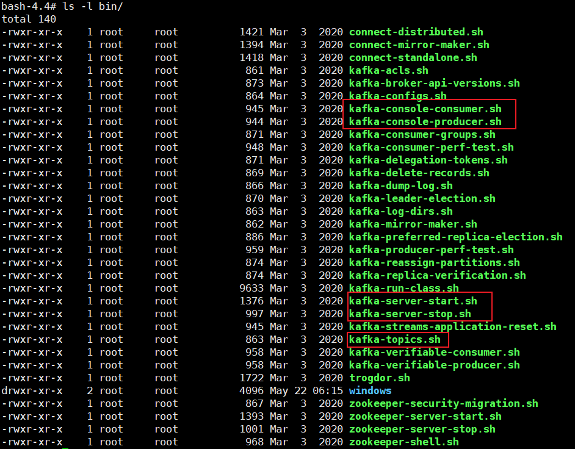
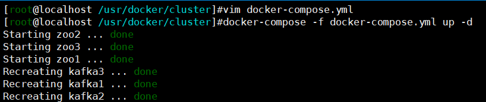
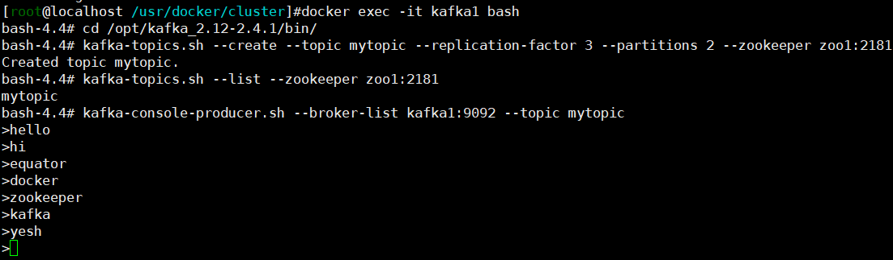
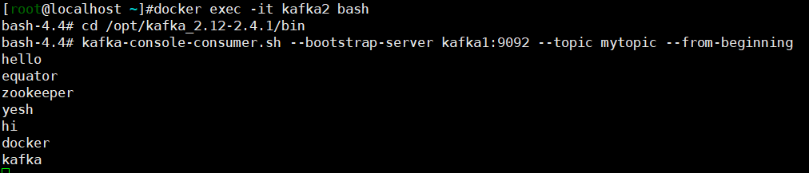
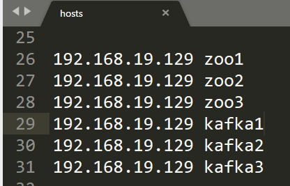
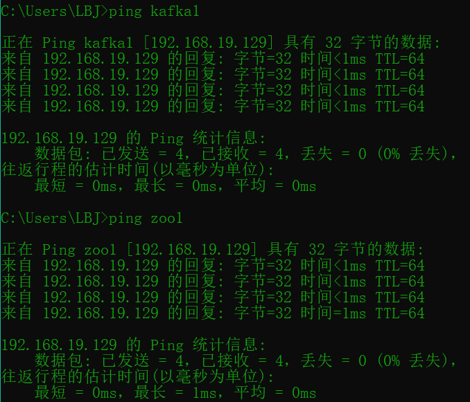
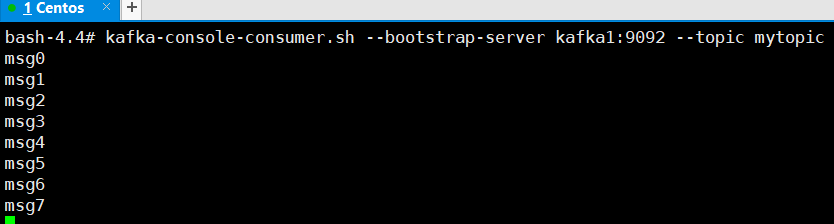

# 概述

> Kafka是一个分布式的基于发布订阅的消息队列

- Kafka的架构：生产者生产数据到消息队列，消费者从队列拉取数据。

## 应用场景

- 解耦：M个生产者与N个消费者直连，会产生`M*N`个连接；使用消息队列作为中间件解耦，只需要`M+N`个连接。
- 削峰：缓解生产者速率>>消费者速率的场景，如流量突增的情况。

## 基础架构

- Producer，生产者
- Topic，主题，用于对消息进行分类
- Broker，Kafka的节点
- Partition，分区，Topic的负载均衡机制
- Replication，复制，高可用。生产者与消费者只与Leader交互
- Consumer，消费者，从消息队列拉取数据
- Consumer Group，消费者组，消费者组内的所有成员一起订阅某个主题的所有分区，一个消费者组中，每一个分区只能由组内的一个消费者订阅。


# 安装配置

## 单机

### 创建自定义网络

- `docker network create --driver=bridge --subnet=172.18.0.0/16 --gateway=172.18.0.1 my-cluster-network`

| 服务      | IP         | 端口（主机:容器） |
| --------- | ---------- | ----------------- |
| zookeeper | 172.18.1.1 | 2181:2181         |
| kafka     | 172.18.2.1 | 9092:9092         |

### 编写配置文件

- `kafka-single.yml`配置文件

```yml
version: '3'
services:
  zookeeper:
    image: zookeeper:3.4
    restart: always
    hostname: zookeeper
    container_name: zookeeper
    ports:
      - 2181:2181
    volumes:
      - "/usr/workspace/volumes/single/zk/data:/data"
      - "/usr/workspace/volumes/single/zk/datalog:/datalog"
    networks:
      my-cluster-network:
        ipv4_address: 172.18.1.1

  kafka:
    image: wurstmeister/kafka:2.12-2.4.1
    restart: always
    hostname: kafka
    container_name: kafka
    privileged: true
    ports:
      - 9092:9092
    environment:
      KAFKA_ADVERTISED_HOST_NAME: kafka
      KAFKA_LISTENERS: PLAINTEXT://kafka:9092
      KAFKA_ADVERTISED_LISTENERS: PLAINTEXT://kafka:9092
      KAFKA_ADVERTISED_PORT: 9092
      KAFKA_ZOOKEEPER_CONNECT: zookeeper:2181
    volumes:
      - "/usr/workspace/volumes/single/kafka/logs:/kafka"
    networks:
      my-cluster-network:
        ipv4_address: 172.18.2.1
    depends_on:
      - zookeeper

networks:
  my-cluster-network:
    external:
      name: my-cluster-network
```

### 启动

- `docker-compose -f kafka-single.yml up -d`

### 测试



## 集群

### 创建自定义网络

```
docker network create --driver=bridge --subnet=172.18.0.0/16 --gateway=172.18.0.1 my-cluster-network
```

| 服务       | IP         | 端口（主机:容器） |
| ---------- | ---------- | ----------------- |
| zookeeper1 | 172.18.1.1 | 2181:2181         |
| zookeeper2 | 172.18.1.2 | 2182:2181         |
| zookeeper3 | 172.18.1.3 | 2183:2181         |
| kafka1     | 172.18.2.1 | 9092:9092         |
| kafka2     | 172.18.2.2 | 9093:9092         |
| kafka3     | 172.18.2.3 | 9094:9092         |

### 编写配置文件

> yml文件可以使用IDEA或者pycharm格式化一下，然后使用[网站](https://www.bejson.com/validators/yaml_editor/)校验一下

- 编写`kafka-cluster.yml`配置文件

```yml
version: '3'
services:
  zoo1:
    image: zookeeper:3.4
    restart: always
    hostname: zoo1
    container_name: zoo1
    ports:
      - 2181:2181
    volumes:
      - "/usr/workspace/volumes/zkcluster/zoo1/data:/data"
      - "/usr/workspace/volumes/zkcluster/zoo1/datalog:/datalog"
    environment:
      ZOO_MY_ID: 1
      ZOO_SERVERS: server.1=zoo1:2888:3888 server.2=zoo2:2888:3888 server.3=zoo3:2888:3888
    networks:
      my-cluster-network:
        ipv4_address: 172.18.1.1

  zoo2:
    image: zookeeper:3.4
    restart: always
    hostname: zoo2
    container_name: zoo2
    ports:
      - 2182:2181
    volumes:
      - "/usr/workspace/volumes/zkcluster/zoo2/data:/data"
      - "/usr/workspace/volumes/zkcluster/zoo2/datalog:/datalog"
    environment:
      ZOO_MY_ID: 2
      ZOO_SERVERS: server.1=zoo1:2888:3888 server.2=zoo2:2888:3888 server.3=zoo3:2888:3888
    networks:
      my-cluster-network:
        ipv4_address: 172.18.1.2

  zoo3:
    image: zookeeper:3.4
    restart: always
    hostname: zoo3
    container_name: zoo3
    ports:
      - 2183:2181
    volumes:
      - "/usr/workspace/volumes/zkcluster/zoo3/data:/data"
      - "/usr/workspace/volumes/zkcluster/zoo3/datalog:/datalog"
    environment:
      ZOO_MY_ID: 3
      ZOO_SERVERS: server.1=zoo1:2888:3888 server.2=zoo2:2888:3888 server.3=zoo3:2888:3888
    networks:
      my-cluster-network:
        ipv4_address: 172.18.1.3

  kafka1:
    image: wurstmeister/kafka:2.12-2.4.1
    restart: always
    hostname: kafka1
    container_name: kafka1
    privileged: true
    ports:
      - 9092:9092
    environment:
      KAFKA_ADVERTISED_HOST_NAME: kafka1
      KAFKA_LISTENERS: PLAINTEXT://kafka1:9092
      KAFKA_ADVERTISED_LISTENERS: PLAINTEXT://kafka1:9092
      KAFKA_ADVERTISED_PORT: 9092
      KAFKA_ZOOKEEPER_CONNECT: zoo1:2181,zoo2:2181,zoo3:2181
    volumes:
      - "/usr/workspace/volumes/kafkaCluster/kafka1/logs:/kafka"
    networks:
      my-cluster-network:
        ipv4_address: 172.18.2.1
    depends_on:
      - zoo1
      - zoo2
      - zoo3

  kafka2:
    image: wurstmeister/kafka:2.12-2.4.1
    restart: always
    hostname: kafka2
    container_name: kafka2
    privileged: true
    ports:
      - 9093:9092
    environment:
      KAFKA_ADVERTISED_HOST_NAME: kafka2
      KAFKA_LISTENERS: PLAINTEXT://kafka2:9092
      KAFKA_ADVERTISED_LISTENERS: PLAINTEXT://kafka2:9092
      KAFKA_ADVERTISED_PORT: 9092
      KAFKA_ZOOKEEPER_CONNECT: zoo1:2181,zoo2:2181,zoo3:2181
    volumes:
      - "/usr/workspace/volumes/kafkaCluster/kafka2/logs:/kafka"
    networks:
      my-cluster-network:
        ipv4_address: 172.18.2.2
    depends_on:
      - zoo1
      - zoo2
      - zoo3

  kafka3:
    image: wurstmeister/kafka:2.12-2.4.1
    restart: always
    hostname: kafka3
    container_name: kafka3
    privileged: true
    ports:
      - 9094:9092
    environment:
      KAFKA_ADVERTISED_HOST_NAME: kafka3
      KAFKA_LISTENERS: PLAINTEXT://kafka3:9092
      KAFKA_ADVERTISED_LISTENERS: PLAINTEXT://kafka3:9092
      KAFKA_ADVERTISED_PORT: 9092
      KAFKA_ZOOKEEPER_CONNECT: zoo1:2181,zoo2:2181,zoo3:2181
    volumes:
      - "/usr/workspace/volumes/kafkaCluster/kafka3/logs:/kafka"
    networks:
      my-cluster-network:
        ipv4_address: 172.18.2.3
    depends_on:
      - zoo1
      - zoo2
      - zoo3

networks:
  my-cluster-network:
    external:
      name: my-cluster-network
```

- 说明

```
- extra_hosts，添加主机名映射，将会在/etc/hosts创建记录
- external_links，容器互连
- 以上两个参数，在使用自定义网络之后，一般不再需要了。容器之间直接可以互连，也可以通过容器名称访问。

zookeeper端口说明：
	代码访问client的端口号： 2181
	leader和flower通信的端口号： 2888
	选举leader时通信的端口号： 3888
```

### 启动

- 启动docker compose：`docker-compose -f kafka-cluster.yml up -d`



### 测试

```
# 生产者生产数据
docker exec -it kafka1 bash

cd /opt/kafka_2.12-2.4.1/bin/

kafka-topics.sh --create --topic mytopic --replication-factor 3 --partitions 2 --zookeeper zoo1:2181

kafka-topics.sh --list --zookeeper zoo1:2181

kafka-console-producer.sh --broker-list kafka1:9092 --topic mytopic

# 消费者消费数据
docker exec -it kafka2 bash

cd /opt/kafka_2.12-2.4.1/bin

kafka-console-consumer.sh --bootstrap-server kafka1:9092 --topic mytopic --from-beginning
```





## 主机使用代码连接

### 配置域名解析

- `WIndows`系统，域名解析配置文件为`C:\Windows\System32\drivers\etc\hosts`



- 验证



- 也可以刷新一下DNS：`ipconfig /flushdns`

### 测试代码

```java
import org.apache.kafka.clients.producer.KafkaProducer;
import org.apache.kafka.clients.producer.ProducerRecord;
import java.util.Properties;

public class MyProducer {
    public static void main(String[] args) {
        // 创建Kafka配置信息
        Properties conf = new Properties();
        // 指定连接的Kafka集群
        conf.put("bootstrap.servers", "kafka1:9092");
        // ack策略
        conf.put("acks", "all");
        // 重试次数
        conf.put("retries", 3);
        // 批次大小 16 k
        conf.put("batch.size", 16 * 1024);
        // 攒batch等待时间
        conf.put("linger.ms", 1);
        // RecordAccumulator缓冲区大小
        conf.put("buffer.memory", 32 * 1024 * 1024);
        // 指定序列化器
        conf.put("key.serializer", "org.apache.kafka.common.serialization.StringSerializer");
        conf.put("value.serializer", "org.apache.kafka.common.serialization.StringSerializer");
        KafkaProducer<String, String> producer = new KafkaProducer<>(conf);
        for (int i = 0; i < 8; i++) {
            producer.send(new ProducerRecord<>("mytopic", "msg" + i));
        }
        // 如果没有关闭资源，数据不够batch或者时间小于攒batch时数据会被清空不会被发送出去
        producer.close();
    }
}
```



## 代码无法与Kafka集群通信

- [参考案例](https://blog.csdn.net/zhaominpro/article/details/79068141?utm_medium=distribute.pc_relevant_t0.none-task-blog-2%7Edefault%7EBlogCommendFromMachineLearnPai2%7Edefault-1.control&depth_1-utm_source=distribute.pc_relevant_t0.none-task-blog-2%7Edefault%7EBlogCommendFromMachineLearnPai2%7Edefault-1.control)
- 修改配置文件

```
version: '3'
services:
  zoo1:
    image: zookeeper:3.4
    restart: always
    hostname: zoo1
    container_name: zoo1
    ports:
      - 2181:2181
    volumes:
      - "/usr/workspace/volumes/zkcluster/zoo1/data:/data"
      - "/usr/workspace/volumes/zkcluster/zoo1/datalog:/datalog"
    environment:
      ZOO_MY_ID: 1
      ZOO_SERVERS: server.1=zoo1:2888:3888 server.2=zoo2:2888:3888 server.3=zoo3:2888:3888
    networks:
      my-cluster-network:
        ipv4_address: 172.18.1.1

  zoo2:
    image: zookeeper:3.4
    restart: always
    hostname: zoo2
    container_name: zoo2
    ports:
      - 2182:2181
    volumes:
      - "/usr/workspace/volumes/zkcluster/zoo2/data:/data"
      - "/usr/workspace/volumes/zkcluster/zoo2/datalog:/datalog"
    environment:
      ZOO_MY_ID: 2
      ZOO_SERVERS: server.1=zoo1:2888:3888 server.2=zoo2:2888:3888 server.3=zoo3:2888:3888
    networks:
      my-cluster-network:
        ipv4_address: 172.18.1.2

  zoo3:
    image: zookeeper:3.4
    restart: always
    hostname: zoo3
    container_name: zoo3
    ports:
      - 2183:2181
    volumes:
      - "/usr/workspace/volumes/zkcluster/zoo3/data:/data"
      - "/usr/workspace/volumes/zkcluster/zoo3/datalog:/datalog"
    environment:
      ZOO_MY_ID: 3
      ZOO_SERVERS: server.1=zoo1:2888:3888 server.2=zoo2:2888:3888 server.3=zoo3:2888:3888
    networks:
      my-cluster-network:
        ipv4_address: 172.18.1.3

  kafka1:
    image: wurstmeister/kafka:2.12-2.4.1
    restart: always
    hostname: kafka1
    container_name: kafka1
    privileged: true
    ports:
      - 9092:9092
    environment:
      KAFKA_ADVERTISED_HOST_NAME: kafka1
      KAFKA_LISTENERS: PLAINTEXT://kafka1:9092
      KAFKA_ADVERTISED_LISTENERS: PLAINTEXT://$你的虚拟机IP:9092
      KAFKA_ADVERTISED_PORT: 9092
      KAFKA_ZOOKEEPER_CONNECT: zoo1:2181,zoo2:2181,zoo3:2181
    volumes:
      - "/usr/workspace/volumes/kafkaCluster/kafka1/logs:/kafka"
    networks:
      my-cluster-network:
        ipv4_address: 172.18.2.1
    depends_on:
      - zoo1
      - zoo2
      - zoo3

  kafka2:
    image: wurstmeister/kafka:2.12-2.4.1
    restart: always
    hostname: kafka2
    container_name: kafka2
    privileged: true
    ports:
      - 9093:9092
    environment:
      KAFKA_ADVERTISED_HOST_NAME: kafka2
      KAFKA_LISTENERS: PLAINTEXT://kafka2:9092
      KAFKA_ADVERTISED_LISTENERS: PLAINTEXT://$你的虚拟机IP:9093
      KAFKA_ADVERTISED_PORT: 9092
      KAFKA_ZOOKEEPER_CONNECT: zoo1:2181,zoo2:2181,zoo3:2181
    volumes:
      - "/usr/workspace/volumes/kafkaCluster/kafka2/logs:/kafka"
    networks:
      my-cluster-network:
        ipv4_address: 172.18.2.2
    depends_on:
      - zoo1
      - zoo2
      - zoo3

  kafka3:
    image: wurstmeister/kafka:2.12-2.4.1
    restart: always
    hostname: kafka3
    container_name: kafka3
    privileged: true
    ports:
      - 9094:9092
    environment:
      KAFKA_ADVERTISED_HOST_NAME: kafka3
      KAFKA_LISTENERS: PLAINTEXT://kafka3:9092
      KAFKA_ADVERTISED_LISTENERS: PLAINTEXT://$你的虚拟机IP:9094
      KAFKA_ADVERTISED_PORT: 9092
      KAFKA_ZOOKEEPER_CONNECT: zoo1:2181,zoo2:2181,zoo3:2181
    volumes:
      - "/usr/workspace/volumes/kafkaCluster/kafka3/logs:/kafka"
    networks:
      my-cluster-network:
        ipv4_address: 172.18.2.3
    depends_on:
      - zoo1
      - zoo2
      - zoo3

networks:
  my-cluster-network:
    external:
      name: my-cluster-network
```

- 重启Kafka集群