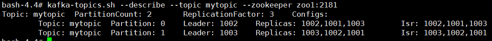
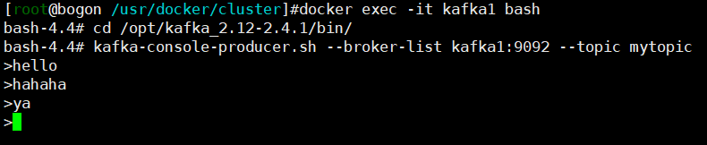

# 命令

> 命令行中使用Kafka，一般用于测试

## Topic

### 查看

- 查看主题列表，`kafka-topics.sh --list --zookeeper zoo1:2181`

### 增加

- 创建主题，`kafka-topics.sh --create --topic mytopic --replication-factor 3 --partitions 2 --zookeeper zoo1:2181`
- `partitions`必须小于等于broker的数量，`replication-factor`与broker的数量没有必然的关系

### 删除

- 删除主题，`kafka-topics.sh --delete --topic mytopic --zookeeper zoo1:2181`

### 查看主题元数据

- 查看主题数据，`kafka-topics.sh --describe --topic mytopic --zookeeper zoo1:2181`

## Producer

### 生产数据

- `kafka-console-producer.sh --broker-list kafka1:9092 --topic mytopic`

## Consumer

### 消费数据

- ~~kafka-console-consumer.sh --zookeeper zoo1:2181 --topic mytopic --from-beginning~~ ，已过时。0.9版本之后，Kafka消费者不使用zookeeper保存数据。

- `kafka-console-consumer.sh --bootstrap-server kafka1:9092 --topic mytopic --from-beginning`。
  - `--from-beginning`，从头开始消费

# API

> 代码中使用Kafka