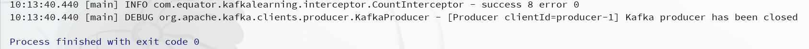

# 命令

> 命令行中使用Kafka，一般用于测试

## Topic

### 查看

- 查看主题列表，`kafka-topics.sh --list --zookeeper zoo1:2181`

### 增加

- 创建主题，`kafka-topics.sh --create --topic mytopic --replication-factor 3 --partitions 2 --zookeeper zoo1:2181`
- `partitions`必须小于等于broker的数量，`replication-factor`与broker的数量没有必然的关系

### 删除

- 删除主题，`kafka-topics.sh --delete --topic mytopic --zookeeper zoo1:2181`

### 查看主题元数据

- 查看主题数据，`kafka-topics.sh --describe --topic mytopic --zookeeper zoo1:2181`


## Producer

### 生产数据

- `kafka-console-producer.sh --broker-list kafka1:9092 --topic mytopic`


## Consumer

### 消费数据

- ~~kafka-console-consumer.sh --zookeeper zoo1:2181 --topic mytopic --from-beginning~~ ，已过时。0.9版本之后，Kafka消费者不使用zookeeper保存数据。

- `kafka-console-consumer.sh --bootstrap-server kafka1:9092 --topic mytopic --from-beginning`。
  - `--from-beginning`，从头开始消费


# API

> 代码中使用Kafka

## Producer API

### 消息发送流程

- 消息提交到线程共享变量RecordAccumulator（相当于缓冲队列），Sender线程不断地从RecordAccumulator中拉取消息发送到Kafka broker。
- 消息流向：Producer->Interceptors->Serializer->Partitioner->RecordAccumulator->Sender->Topic
- 参数配置
  - `batch.size`，发送数据的批次大小
  - `linger.ms`，攒batch的最长等待时间

### 异步发送API

```java
import lombok.extern.slf4j.Slf4j;
import org.apache.kafka.clients.producer.KafkaProducer;
import org.apache.kafka.clients.producer.ProducerConfig;
import org.apache.kafka.clients.producer.ProducerRecord;

import java.util.Properties;

@Slf4j
public class MyProducerWithPartitioner {
    public static void main(String[] args) {
        // 创建Kafka配置信息
        Properties conf = new Properties();
        conf.put(ProducerConfig.BOOTSTRAP_SERVERS_CONFIG, "kafka1:9092;kafka2:9093;kafka3:9094");
        conf.put(ProducerConfig.KEY_SERIALIZER_CLASS_CONFIG, "org.apache.kafka.common.serialization.StringSerializer");
        conf.put(ProducerConfig.VALUE_SERIALIZER_CLASS_CONFIG, "org.apache.kafka.common.serialization.StringSerializer");
        // 添加自定义分区器
        conf.put(ProducerConfig.PARTITIONER_CLASS_CONFIG, "com.equator.kafkalearning.partitioner.MyPartitioner");
        KafkaProducer<String, String> producer = new KafkaProducer<>(conf);
        for (int i = 0; i < 8; i++) {
            producer.send(new ProducerRecord<>("mytopic", "MyProducerWithPartitionerMsg" + i), (recordMetadata, e) -> {
                log.info("recordMetadata: partition: {}, offset: {}", recordMetadata.partition(), recordMetadata.offset(), e);
            });
        }
        producer.close();
    }
}
```

### 同步发送API

- 设置一个分区，使用同步发送可以保证全局有序，但是意义不大
- 同步发送依赖于Future

```java
public class MySyncProducer {
    public static void main(String[] args) throws ExecutionException, InterruptedException {
        // 创建Kafka配置信息
        Properties conf = new Properties();
        conf.put(ProducerConfig.BOOTSTRAP_SERVERS_CONFIG, "kafka1:9092;kafka2:9093;kafka3:9094");
        conf.put(ProducerConfig.KEY_SERIALIZER_CLASS_CONFIG, "org.apache.kafka.common.serialization.StringSerializer");
        conf.put(ProducerConfig.VALUE_SERIALIZER_CLASS_CONFIG, "org.apache.kafka.common.serialization.StringSerializer");
        KafkaProducer<String, String> producer = new KafkaProducer<>(conf);
        for (int i = 0; i < 8; i++) {
            Future<RecordMetadata> future = producer.send(new ProducerRecord<>("mytopic", "MyProducerWithCallbackMsg" + i));
            RecordMetadata recordMetadata = future.get();
            log.info("recordMetadata: partition: {}, offset: {}", recordMetadata.partition(), recordMetadata.offset());
        }
        producer.close();
    }
}
```

## Consumer API

### 自动提交offset

```java
@Slf4j
public class MyConsumer {
    public static void main(String[] args) {
        // 创建Kafka配置信息
        Properties conf = new Properties();
        // 指定连接的Kafka集群
        conf.put(ConsumerConfig.BOOTSTRAP_SERVERS_CONFIG, "kafka1:9092;kafka2:9093;kafka3:9094");
        // 自动提交与自动提交的延迟
        conf.put(ConsumerConfig.ENABLE_AUTO_COMMIT_CONFIG, true);
        conf.put(ConsumerConfig.AUTO_COMMIT_INTERVAL_MS_CONFIG, "1000");
        // 指定序列化器
        conf.put(ConsumerConfig.KEY_DESERIALIZER_CLASS_CONFIG, "org.apache.kafka.common.serialization.StringDeserializer");
        conf.put(ConsumerConfig.VALUE_DESERIALIZER_CLASS_CONFIG, "org.apache.kafka.common.serialization.StringDeserializer");
        // 消费者组
        conf.put(ConsumerConfig.GROUP_ID_CONFIG, "my_group_1");
        // 重置offset earliest（from beginning）|latest 前提是一个新的消费者或者offset已经过时
        conf.put(ConsumerConfig.AUTO_OFFSET_RESET_CONFIG, "earliest");
        KafkaConsumer<String, String> consumer = new KafkaConsumer<>(conf);
        // 订阅主题
        consumer.subscribe(Collections.singletonList("mytopic"));
        // 拉取数据
        while (true) {
            ConsumerRecords<String, String> consumerRecords = consumer.poll(Duration.ofSeconds(1));
            for (ConsumerRecord<String, String> consumerRecord : consumerRecords) {
                log.info("consumerRecord {} {} {}", consumerRecord.key(), consumerRecord.offset(), consumerRecord.value());
            }
        }
        // 关闭连接
        // consumer.close();
    }
}
```

### 手动提交offset

```java
@Slf4j
public class MyOffsetCommitConsumer {
    public static void main(String[] args) {
        // 创建Kafka配置信息
        Properties conf = new Properties();
        // 指定连接的Kafka集群
        conf.put(ConsumerConfig.BOOTSTRAP_SERVERS_CONFIG, "kafka1:9092;kafka2:9093;kafka3:9094");
        // 手动提交
        conf.put(ConsumerConfig.ENABLE_AUTO_COMMIT_CONFIG, false);
        // 指定序列化器
        conf.put(ConsumerConfig.KEY_DESERIALIZER_CLASS_CONFIG, "org.apache.kafka.common.serialization.StringDeserializer");
        conf.put(ConsumerConfig.VALUE_DESERIALIZER_CLASS_CONFIG, "org.apache.kafka.common.serialization.StringDeserializer");
        // 消费者组
        conf.put(ConsumerConfig.GROUP_ID_CONFIG, "my_group_1");
        // 重置offset earliest（from beginning）|latest 前提是一个新的消费者或者offset已经过时
        conf.put(ConsumerConfig.AUTO_OFFSET_RESET_CONFIG, "earliest");
        KafkaConsumer<String, String> consumer = new KafkaConsumer<>(conf);
        // 订阅主题
        consumer.subscribe(Collections.singletonList("mytopic"));
        // 拉取数据
        while (true) {
            ConsumerRecords<String, String> consumerRecords = consumer.poll(Duration.ofSeconds(1));
            for (ConsumerRecord<String, String> consumerRecord : consumerRecords) {
                log.info("consumerRecord {} {} {}", consumerRecord.key(), consumerRecord.offset(), consumerRecord.value());
            }
            // 同步提交
            // consumer.commitSync();
            consumer.commitAsync((offsets, e) -> {
                if (e != null) {
                    log.error("offset commit error",e);
                }
            });
        }
    }
}
```

### 自定义存储offset

- offset同步时间太长，处理完数据后offset提交失败，会导致重复消费数据。offset同步时间太短，数据还没有处理完，offset就提交了，会丢失数据。所以需要自定义存储offset引入事务机制。
- 维护offset的维护需要考虑到消费者的rebalance场景。消费者的rebalance指的是当有新的消费者加入消费者组、已有消费者退出消费者组或者消费者组订阅的主题分区发生变化，就会触发分区的重新消费。rebalance后，消费者需要获取到自己被重新分配到的分区，并定位到每个分区最近提交的offset位置继续消费。

## 自定义Interceptor

### 拦截器原理

### 拦截器案例

- 修改拦截器

```java
public class TimeInterceptor implements ProducerInterceptor<String, String> {
    @Override
    public void configure(Map<String, ?> configs) {

    }

    @Override
    public ProducerRecord<String, String> onSend(ProducerRecord<String, String> record) {
        String value = record.value() + "-" + MessageUtil.getMsg();

        return new ProducerRecord<>(record.topic(), record.partition(), record.key(), value);
    }

    @Override
    public void onAcknowledgement(RecordMetadata metadata, Exception exception) {

    }

    @Override
    public void close() {

    }
}
```

- 计数拦截器

```java
@Slf4j
public class CountInterceptor implements ProducerInterceptor<String, String> {

    int success = 0;
    int error = 0;

    @Override
    public void configure(Map<String, ?> configs) {

    }

    @Override
    public ProducerRecord<String, String> onSend(ProducerRecord<String, String> record) {
        return record;
    }

    @Override
    public void onAcknowledgement(RecordMetadata metadata, Exception exception) {
        if (metadata != null) {
            success++;
        } else {
            error++;
        }
    }

    @Override
    public void close() {
        log.info("success {} error {}", success, error);
    }
}
```

- 指定拦截器列表

```java
// 添加拦截器
conf.put(ProducerConfig.INTERCEPTOR_CLASSES_CONFIG,Arrays.asList("com.equator.kafkalearning.interceptor.TimeInterceptor", "com.equator.kafkalearning.interceptor.CountInterceptor"));
```

- 测试


