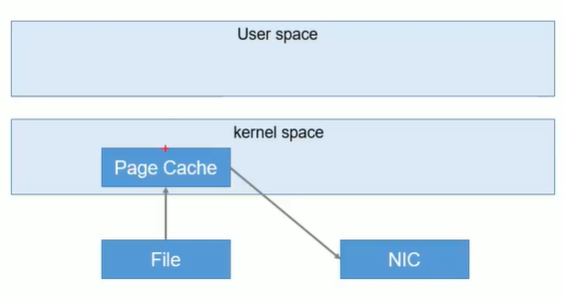

# 工作流程

- 消息分区内有序


- topic是逻辑上的概念，partition是物理上的概念，每个partition对应一个log文件，该log文件存储的是producer生产的消息，每条消息都会有offset。消费者消费数据时，会记录自己消费的offset。

# 文件存储

- 为了避免log文件过大导致消息定位困难，Kafka采取分片与索引机制：一个topic下有多个partition，一个partition下有多个segment。

```
*.log		文件
*.index 	索引
*.log与*.index命名规则是当前segment的第一条消息的offset
查找数据时，先通过二分查找方法查找index文件，再查找log文件。此外，log文件中每条消息大小相同，可以通过计算快速定位到对应的数据。
*.log保存的是序列化后的消息
*.index保存的是(offset,起始偏移量)
```

# 生产者

## 分区策略

### 分区的原因

1. 提高并发度，以partition为单位进行读写，分散读写压力
2. 便于集群拓展，一个topic下partition的数量可以根据实际情况调整

### 分区的原则

- 生产者生产的消息会被封装为`ProducerRecord`对象
  - topic [required]
  - partition
  - timestamp
  - key
  - value [required]
  - headers

- partition选择流程
  - 指定了partition，发送到指定的partition
  - 没有指定partition，但是指定了key，`partition=hash(key)%num_partition`
  - partition与key均没指定，进行轮询（round-robin）。

## 生产者ISR

### 数据可靠性

- 为保证数据的可靠性，topic下的partition收到producer生产的消息后，需要返回ack信息。如果producer没有接收到ack信息，则会重新发送消息。
- 使用副本机制保证数据可靠性有两种策略
  - 半数以上follower完成同步，认为写成功。延迟较低，为了容忍n台节点的故障，需要2n+1个副本。
  - 全部follower完成同步，认为写成功。延迟较高，为了容忍n台节点的故障，需要n+1个副本。
  - Kafka需要全部follower完成同步后才认为写入成功，发送ack消息。原因是半数机制会导致大量的数据冗余，而网络延迟对Kafka影响不大。

### ISR机制

- ISR机制避免数据同步过程中，由于某个follower节点宕机无法完成同步导致leader等待时间过长。ISR（in-sync replica set），即与leader保持同步的follower集合。ISR是动态的，follower超过`replica.lag.time.max.ms`时间未完成数据同步，则会被踢出ISR。leader宕机时，从ISR中选举新的Leader。
- ISR选择follower的条件
  - 同步消息条数（0.9之后版本废弃该条件，因为生产者是批量发送数据的，当batch_size大于消息条数差值时，会导致节点频繁进出ISR）
  - 同步消息耗时

## 生产者ACK机制

- 不同的消息重要性可能不一样，Kafka提供不同的ack策略。`acks`参数配置ack策略。
- `ack=0`，producer不等待broker的ack消息，有可能丢失数据。
- `ack=1`，leader成功落盘后返回ack消息。follower数据同步成功之前，leader宕机，有可能丢失数据。
- `ack=-1|all`，producer等待leader与全部follower成功落盘后才返回的ack。follower数据同步成功后，broker发送ack之前，leader宕机，会导致数据重复（producer没有收到ack消息会重新发送数据）。极端情况下，ISR没有其它可用节点，仍可能丢失数据。

## 数据一致性问题

> 当leader与众多follower之间的消息offset不一致时，该如何解决一致性问题？


- 高水位与低水位
  - LEO（Log End Offset），每个副本最后一个offset。
  - HW（High Watermark），ISR所有副本中最小的LEO。
  - HW之前的消息才对consumer可见，保险起见的数据对齐方案。

- 故障恢复
  - follower故障：follower故障被踢出ISR，恢复后，该follower会舍弃HW后的数据，并向leader进行数据同步直到LEO大于等于HW，重新加入ISR。
  - leader故障，选择新的leader后，其余follower会将HW后的数据丢弃，从新leader同步数据。
  - 水位机制只能保证副本之间的数据一致性（消费者角度的数据一致性），而不是保证不重复不遗漏数据。

## ExactlyOnce

- ack策略设置为-1，可以（基本）保证数据不丢失，即At Least Once
- ack策略设置为0，保证消息只被生产者发送一次，即At Most Once
- 既不丢失数据也不重复数据，即Exactly Once。0.11版本后的Kafka引入幂等性特性间接实现Exactly Once，即在broker去重。`Exactly Once=幂等性+At Least Once`
- `enable.idempotentence`设置为true开启幂等性特性，Producer会被分配一个PID，发送到同一个partition的消息有一个Sequence Number，Broker使用(PID,Partition,Sequence Number)三元组缓存去重。
- Producer重启后PID会变化。幂等性无法支持跨分区，跨会话的Exactly Once。

# 消费者

## 消费方式

- push，broker将消息推向消费者。很难适应消费速率不同的消费者。
- pull，Kafka的消费方式，消费速率由消费者决定，缺点是轮询比较耗费资源，可以通过参数timeout控制轮询等待时长。

## 分区分配策略

### Round Robin

- 从消费者组角度分配

- 将消费者组订阅的主题当作一个整体来轮询

```
如消费者组（A，B），订阅主题（T1，T2），T1、T2各自有三个分区。
则最终轮询列表为（T1-1，T1-2，T1-3，T2-1，T2-2，T2-3）集合排序后的列表
```

- 好处是消费者之间分配的partition比较均匀，缺点是需要保证消费者组不对订阅的主题有不同的要求。如消费者A只处理T1的消息，消费者B只处理T2的消息，这种场景会导致消费者消费的消息可能会混乱，不适合轮询处理。

### Range

- 默认的策略
- 从主题角度分配

```
如消费者组（A，B），订阅主题（T1，T2），T1、T2各自有三个分区。
消费者A得到partition（T1-1，T1-2，T2-1，T2-2），消费者B得到（T1-3，T2-3），消费者组订阅的主题越多，消费者之间的partition差异会越来越大。
```

### 分配时机

- 增加（启动消费者）或者删除（宕机）消费者时，触发重新分配

## offset保存机制

> Kafka 0.9版本之前，consumer默认将offset保存在zookeeper中。后续版本默认将offset保存到Kafka的一个topic `__consumer_offsets`中

- 修改`consumer.properties`配置文件中的`exclude.internal.topics=false`，使得消费者可以消费系统主题。
- 启动消费者时指定配置文件：`bin/kafka-console-consumer.sh --topic __consumer_offsets --zookeeper zoo1:2181 --consumer.config config/consumer.properties --from-beginning`

- offset的保存依据是(消费者组,主题,分区)，便于某个消费者宕机后其它消费者接着消费消息。

## 消费者组

- 消费者组中消费者数量应该与消费者组订阅的主题partition数量保持一致以充分利用消费者能力。

# 高效读写

## 顺序写磁盘

- producer写入消息时，以追加的形式追加到日志文件末端。顺序写磁盘减少了了磁盘寻址时间。

## 零拷贝机制

- 减少读写中间过程





## 集群分区机制

- 分布式读写

# Zookeeper与Kafka

- Kafka集群中的一个broker会被选举为controller，负责管理集群broker的上下线，所有topic的分区副本分配和leader分配等协调工作。controller依赖于zookeeper。
- controller是抢占式的，一般是先启动的broker会成为controller。

# 事务

> 0.11版本后Kafka支持事务，在保证Exactly Once语义基础上使得生产者和消费者可以跨分区和会话实现事务。

- 事务使得Exactly Once语义可以跨分区与会话

## Producer事务

- 引入一个全局唯一的TransactionID，并将Producer获得的PID和TransactionID绑定，Producer宕机重启之后可以根据TransactionID找回PID。
- Kafka通过Transaction Coordinator管理事务，负责将事务写入内部Topic进行保存。

## Consumer事务

- 消费者事务保证较弱：消费者可以通过offset访问任意的消息，同一个事务的消息也有可能由于segment的删除而被删除。

