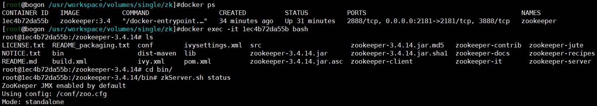
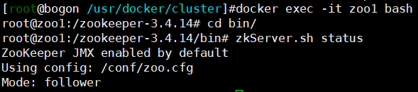
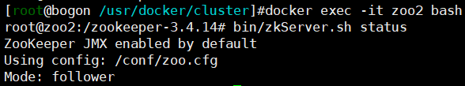

# 概述

- 基于观察者模式设计的分布式服务管理框架，zookeeper=文件系统+通知机制。
- zookeeper是树形数据结构，每个节点是一个ZNode，每个ZNode路径都是唯一的。每个节点默认存储1MB数据。

```
-- /							路径：/
	-- /node1					路径：/node1
		-- /test1				路径：/node1/test1
		-- /test2				路径：/node1/test2
	-- /node2					路径：/node2
		-- /test1				路径：/node2/test1
		-- /test3				路径：/node2/test3
```

## zookeeper集群

- zookeeper集群是一主多从的集群机制，半数以上的节点存活集群即可正常工作。（集群最小节点数为3）
- 全局数据一致，每个节点的数据完全相同。
- 数据更新具有原子性，实时性较高

## 应用场景

### 统一命名服务

- 为微服务提供命名服务，树形数据结构也挺适合公司里面的团队结构的。

```
-- /
	-- /services
		-- /login_services
			- IP1
			- IP2
		-- /feedback_services
			- IP1
			- IP2
```

### 软负载均衡

- 在统一命名服务的基础上，将节点访问数信息写入ZNode，优先让访问数较小的服务处理新请求

```
- /
	-- /services
		-- /login_services
			- IP1 访问数 99
			- IP2 访问数 100
		-- /feedback_services
			- IP1 访问数 100
			- IP2 访问数 1000
```

### 统一配置管理

- 集中管理配置文件，客户端监听ZNode，可以实现动态配置

### 统一集群管理

- 将节点信息写入ZNode，监听ZNode可以获取节点实时状态

- 可以利用临时节点（客户端断开连接时，数据被清除）的特点实现节点动态上下线通知

# 安装配置

## 单机

> 可以直接启动，但是使用docker-compose写配置文件的话，更加规范美观

### 配置文件

- `zk-single.yml`

```yml
version: '3'
services:
  zookeeper:
    image: zookeeper:3.4
    restart: always
    container_name: zookeeper
    volumes:
      - /usr/workspace/volumes/single/zk/data:/data
      - /usr/workspace/volumes/single/zk/logs:/datalog
    ports: 
      - "2181:2181"
      
可选数据卷挂载：- /usr/workspace/volumes/single/zk/config:/conf
```

### 启动

```
docker-compose -f zk-single.yml up -d
```

### 测试



## 集群

### 创建网络

- 创建自定义网络：`docker network create --driver=bridge --subnet=172.18.0.0/16 --gateway=172.18.0.1 my-cluster-network`

| 服务       | IP         | 端口（主机:容器） |
| ---------- | ---------- | ----------------- |
| zookeeper1 | 172.18.1.1 | 2181:2181         |
| zookeeper2 | 172.18.1.2 | 2182:2181         |
| zookeeper3 | 172.18.1.3 | 2183:2181         |

### 编写配置文件

- `zk-cluster.yml`

```yml
version: '3'
services:
  zoo1:
    image: zookeeper:3.4
    restart: always
    hostname: zoo1
    container_name: zoo1
    ports:
      - 2181:2181
    volumes:
      - "/usr/workspace/volumes/zkcluster/zoo1/data:/data"
      - "/usr/workspace/volumes/zkcluster/zoo1/datalog:/datalog"
    environment:
      ZOO_MY_ID: 1
      ZOO_SERVERS: server.1=zoo1:2888:3888 server.2=zoo2:2888:3888 server.3=zoo3:2888:3888
    networks:
      my-cluster-network:
        ipv4_address: 172.18.1.1

  zoo2:
    image: zookeeper:3.4
    restart: always
    hostname: zoo2
    container_name: zoo2
    ports:
      - 2182:2181
    volumes:
      - "/usr/workspace/volumes/zkcluster/zoo2/data:/data"
      - "/usr/workspace/volumes/zkcluster/zoo2/datalog:/datalog"
    environment:
      ZOO_MY_ID: 2
      ZOO_SERVERS: server.1=zoo1:2888:3888 server.2=zoo2:2888:3888 server.3=zoo3:2888:3888
    networks:
      my-cluster-network:
        ipv4_address: 172.18.1.2

  zoo3:
    image: zookeeper:3.4
    restart: always
    hostname: zoo3
    container_name: zoo3
    ports:
      - 2183:2181
    volumes:
      - "/usr/workspace/volumes/zkcluster/zoo3/data:/data"
      - "/usr/workspace/volumes/zkcluster/zoo3/datalog:/datalog"
    environment:
      ZOO_MY_ID: 3
      ZOO_SERVERS: server.1=zoo1:2888:3888 server.2=zoo2:2888:3888 server.3=zoo3:2888:3888
    networks:
      my-cluster-network:
        ipv4_address: 172.18.1.3
        
networks:
  my-cluster-network:
    external:
      name: my-cluster-network
```

### 启动

- `docker-compose -f zk-cluster.yml up -d`

### 测试

- 分别进入zoo1、zoo2以及zoo3容器，发现zoo1、zoo2是Follower，zoo3是Leader，集群搭建完毕。






## 配置文件解读

```
# 心跳间隔（ms），也是zookeeper中一个基本的单位
tickTime=2000
# 初始化最大延迟时间(10*tickTime)
initLimit=10
# 同步时间（5*tickTime）
syncLimit=5
# 客户端访问端口号
clientPort=2181

# 数据文件目录、数据持久化路径
# 快照日志 
dataDir=xxx
# 事务日志
dataLogDir=xxx

# zookeeper3.4之后zookeeper支持自动清理快照文件和事务日志文件的功能
# 保留文件的个数
autopurge.snapRetainCount=3
# 自动清理的频率，单位为小时，0为不清理
autopurge.purgeInterval=0

# 最大客户端连接数
maxClientCnxns=60
# 集群配置项
server.A=B:C:D（A为服务器编号，B为服务器IP，C为数据通信（副本拷贝）端口，D为选举端口）
```

