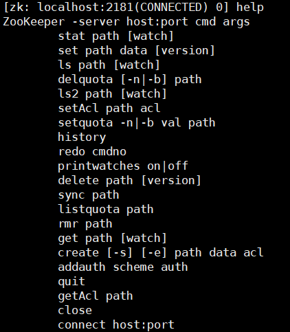
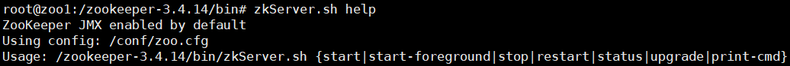

# 命令

> 命令行中使用zookeeper，一般用于测试

## 客户端

- 启动客户端，`bin/zkCli.sh`



- 创建数据，`create [-e] [-s] $path $data`。$path不能以/结尾
  - -e 创建短暂节点（ephemeral）
  - -s 创建目录编号节点（sequence）
- 查看路径信息

```
# 查看ZNode子目录，加watch监听目录，一次性注册
ls $path [watch]
# 查看ZNode目录详情
ls2 $path
```

- 查看数据，`get $path [watch]`
  - 加上watch，对数据进行监听，一次性注册


- 更新数据，`set $path $new_data`
- 删除ZNode，`delete $path`。递归删除非空ZNode，`rmr $path`

## 服务端



# API

> 代码中使用zookeeper