# 概述

- Flink是一个分布式处理引擎与框架，用于对有界和五届数据流进行状态计算
- 传统的数据架构是基于有限数据集的，而流式数据更加真实地反映了生产环境的数据产生特点。流式数据处理的目标是低延迟、高吞吐、结果的准确性、良好的容错性。

## 流处理的发展演变

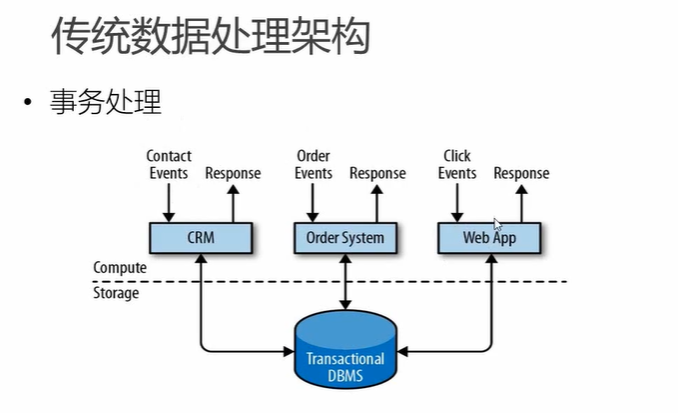

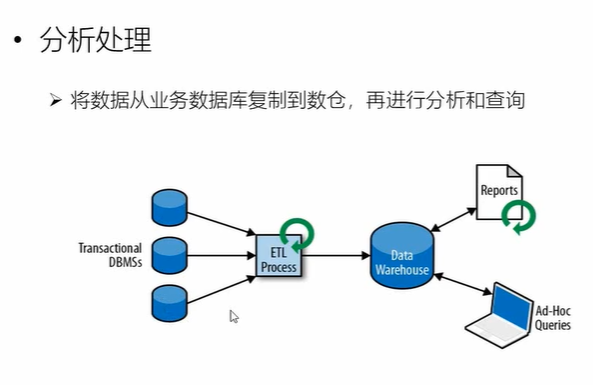

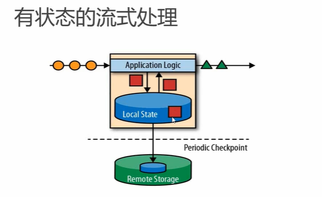

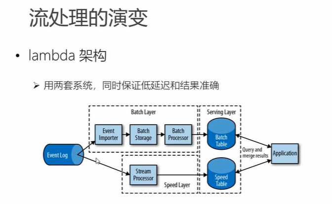

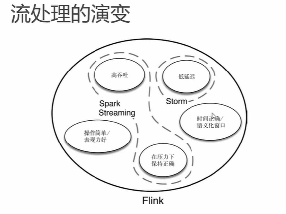

## Flink的特点

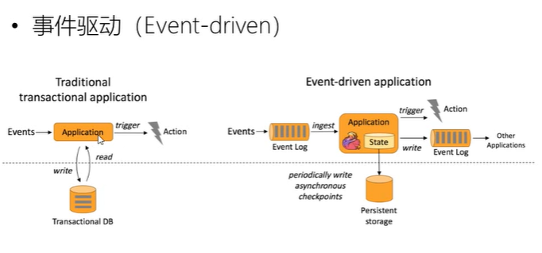


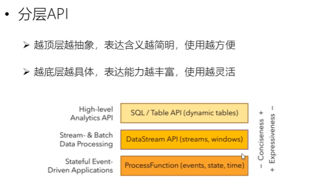


## Flink与Spark Streaming

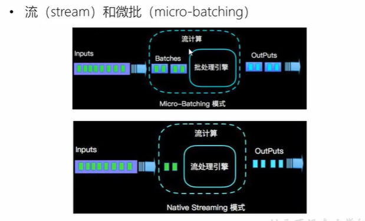


# Flink部署

## 项目结构

- bin
- conf

```
配置文件，格式key:value

# JobManager的堆内存大小（Flink计算过程中的状态保存在本地内存中，属于堆外空间）
jobmanager.heap.size:1024m

# TaskManager整个进程的总内存大小
taskmanager.memory.process.size:1728m

# 线程槽位，表示的是并行的最大能力（静态配置），对于每个taskManager而言（实际并行能力为numberTaskSlots*numberOfTaskManager，TM数量在另外配置文件中配置）
taskmanager.numberTaskSlots:1

# 默认并行度，程序实际执行的并行度
paralleism.default:1
```

- examples
- lib

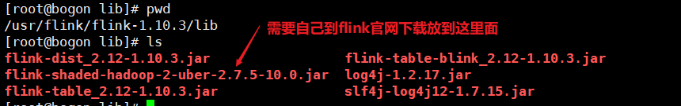

## 单机版

- 启动

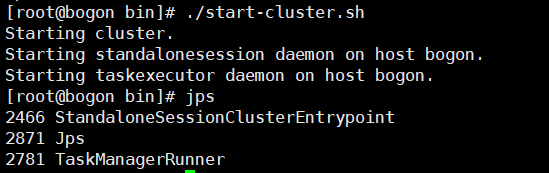

- WEB界面提交任务

> 并行度配置优先级：代码>WEB配置>配置文件


- 命令行提交任务

  ```
  ./bin/flink run -c com.xxx.ClassName -p 3 path-of-jar --host 192.168.19.128 --port 7777
  
  ./bin/flink cancel job_id （flink list -a查看job列表）
  ```

## Yarn版本

> 要求Flink是有Hadoop（2.2以上）支持的版本，并且集群中安装有HDFS服务。

### Session-cluster模式

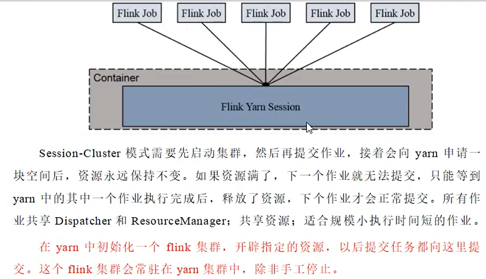

### Per-Job-Cluster模式

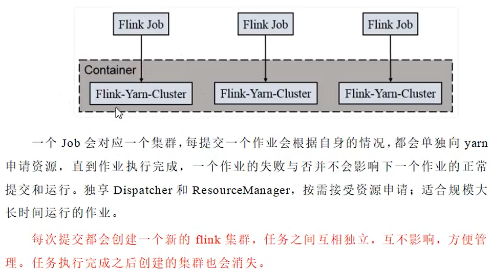

## K8s版本

# 运行时组件

## 运行时的组件

- JobManager
- TaskManager
- ResourceManager
- Dispatcher（非必须）

## 任务提交流程

## 任务调度原理

# 窗口

# 时间语义与watermark

# 状态管理

# 容错机制

# 状态一致性

# Table API与Flink SQL

# CEP