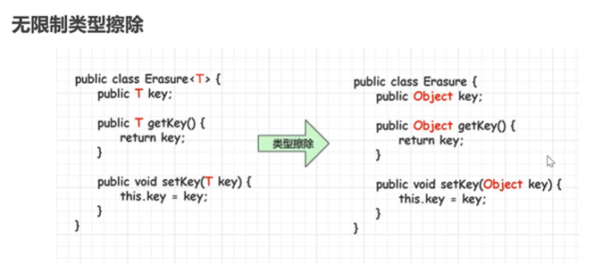
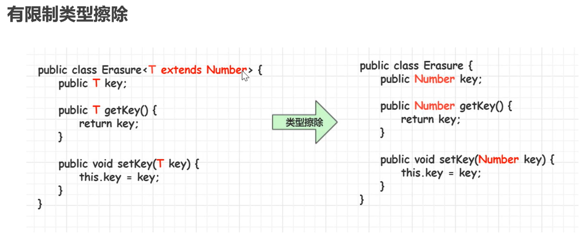
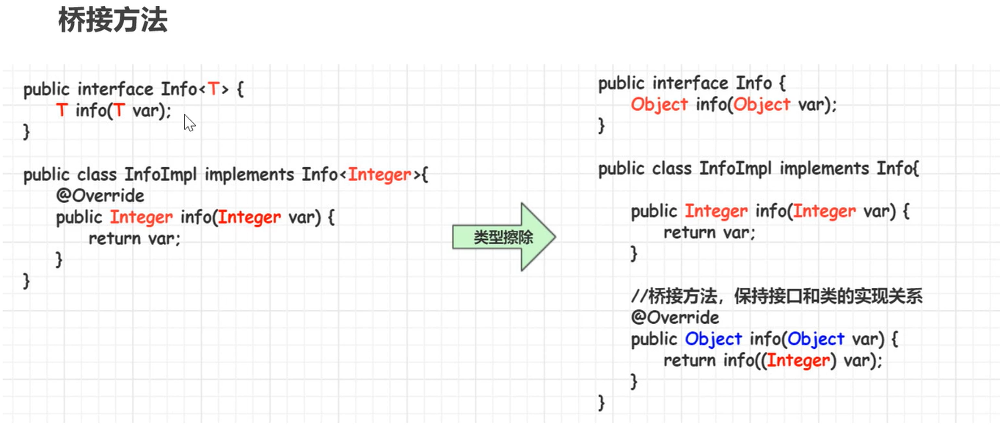

# 概述

- Java推出泛型以前，使用Object表示任意类型。编程过程中需要明确知道元素的类型，否则容易产生`ClassCastException`。
- Java泛型（generics）是JDK5的新特性，提供了编译时类型安全检查机制。**泛型的本质是类型参数化，也就是所操作的数据类型被指定未一个参数。**

# 泛型类

## 定义

```
// 定义
class 类名称 <泛型标识, 泛型标识> {
	private 泛型标识 变量名;
}
// 常见的泛型标识：T、E、K、V

// 使用 JDK7后后面类型可以不写
类名<具体数据类型> 对象名 = new 类名<>();
```

- 泛型类，如果没有指定具体的数据类型，操作类型是Object
- 泛型的类型参数只能是类类型，不能是基本数据类型
- 泛型逻辑上可以看成多个不同的类型，但是实际上是同一个类型（泛型擦除）

## 派生

- 如果子类也是泛型类，子类和父类泛型需要一致（子类向父类传递，子类的泛型至少有一个与父类保持一致）

```
public Children<T,P> extend Parent<T>{}
```

- 如果子类不是泛型类，父类需要明确泛型的数据类型

```
public Children extend Parent<String>{}
```

# 泛型接口

## 定义

```
interface 接口名称 <泛型标识,泛型标识>{
	泛型标识 方法名();
}
```

- 如果实现接口的类是泛型类，则至少一个泛型与接口保持一致

```
public class Impl<T,P> implements Inter<T>{
	public T 方法(); 
}
```

- 如果实现接口的类不是泛型类，则定义时需要明确指定泛型接口的数据类型

```
public class Impl implements Inter<String>{
	public String 方法(); 
}
```

# 泛型方法

## 定义

```
修饰符 <T,E> 返回值类型 方法名(泛型形参列表){}
```

- 泛型类中使用了泛型的成员方法不是泛型方法，**只有显式声明了泛型列表的方法才是泛型方法**
- 泛型方法的类型是调用泛型方法时指定的
- **泛型类中的泛型方法的泛型标识与泛型类的泛型标识是完全独立的**
- 泛型类中的普通成员方法不能声明为静态方法（泛型方法才支持static能力）

```
public static <T> xxx(T t){} 
```

- 泛型支持可变参数

# 类型通配符

- 类型通配符一般使用`?`代替具体的类型实参，类型通配符是类型实参而不是类型形参
- 一般用在泛型`<>`中表示任意的类型

## 类型通配符的上限

- `类/接口<? extends 实参类型XXX>`，?的上限是XXX。要求该泛型的类型只能是实参类型XXX或者是XXX的子类类型。
- 使用上限通配符的集合无法填充元素，因为元素类型不确定

## 类型通配符的下限

- `类/接口<? super 实参类型XXX>`，?的下限是XXX。要求该泛型的类型只能是实参类型XXX或者是XXX的父 类类型。
- 使用下限通配符的集合可以填充元素

# 泛型擦除

- 泛型信息只存在与代码编译阶段，在进入JVM之前（编译为字节码），与泛型相关的信息会被擦除，称之为泛型擦除。






- 类型擦除和多态发生了冲突，为了解决这个问题编译器会产生一个桥方法。在虚拟机中会由参数和返回值类型不同而产生两个不同的字节码文件，但是虚拟机能够正确的处理这种情况



# 泛型和数组

## 创建

- 可以声明带泛型的数组引用，但是不能直接创建带泛型的数组对象。（泛型是需要擦除的，但是数组需要一直持有对象类型，相悖了）

```
ArrayList<String>[] listArr = new ArrayList[3];

ArrayList<Integer> intList = new ArrayList<>();
intList.add(100);

ArrayList<String> strList = new ArrayList<>();
strList.add("abc");

listArr[0] = strList;
System.out.println(listArr.getClass());
String s = listArr[0].get(0);
System.out.println(s);
```

- 可以通过java.lang.reflect.Array的newInstance(Class<T>,int) 创建T[]数组

```java
public class GenericArray<T> {
    /**
     * 错误用法
     * private T[] array = new T[10];
     */
    private T[] array;

    public GenericArray(Class<T> clz, int len) {
        array = (T[]) Array.newInstance(clz, len);
    }

    public void set(T item, int idx) {
        array[idx] = item;
    }

    public T get(int idx) {
        return array[idx];
    }
}
```

- 尽量不要使用泛型数组，而是使用泛型集合

# 泛型与反射

- `Class<T>`
- `Constructor<T>`，用于创建实例