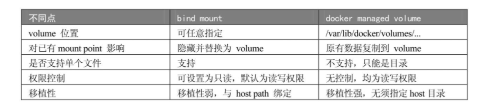

# Docker基本概念


> 镜像可以认为是类，容器则是由类创建的实例

- 镜像：可以认为是模板，题干模板来创建容器服务
- 容器：核心Linux系统
- 仓库：存放镜像的地方

# Docker配置

## 安装

> [centos安装](https://docs.docker.com/engine/install/centos/)

- 确保Linux环境为3.10以上，`uname -r`、`cat /etc/os-release`

- ```
  yum install -y yum-utils device-mapper-persistent-data lvm2
  
  yum-config-manager --add-repo http://mirrors.aliyun.com/docker-ce/linux/centos/docker-ce.repo
  
  yum makecache fast
  
  sudo yum install docker-ce docker-ce-cli containerd.io
  
  systemctl start docker
  
  docker version
  
  docker run hello-world
  ```

- 系统服务配置

  ```
  # 设置服务为系统服务
  systemctl enable docker.service
  
  # 容器配置
  docker run --restart=always
  # 已启动容器配置
  docker update --restart=always <CONTAINER ID>
  ```

## 配置加速

> https://cr.console.aliyun.com/cn-hangzhou/instances/mirrors

# 命令

> https://docs.docker.com/reference/


## 帮助命令

- `docker command --help`
- `docker version` 
- `docker info`

## 镜像命令

- `docker images`，查看本机所有镜像
- `docker search`，搜索镜像
- `docker pull 镜像名[:tag]`，下载镜像，分层下载（联合文件系统）。
- `docker rmi`删除镜像，`docker rmi -f $(docker images -aq)`

# 镜像

- `docker pull`下来的镜像为镜像层，是只读的；用户操作的为容器层。
- 提交镜像到本地，`docker commit `，相当于VM的快照

## 基础镜像

- 不依赖其他镜像，从scratch构建；其他镜像可以以之为基础进行扩展。一般是迷你版的Linux发行版Docker镜像。
- Linux操作系统由内核空间以及用户空间组成，内核空间核心是kernel，用户空间文件系统是rootfs。基础镜像直接使用宿主机的kernel，自己提供rootfs。容器只能使用宿主机的kernel而不能进行修改或者升级。

## 容器层

- 当容器启动时，一个新的可写层被加载到镜像的顶层，该层被称为容器层，下面的层级都是镜像层，镜像层都是只读的。多个镜像层之间联合在一起成为联合文件系统，上层的路径会把下层的路径覆盖
- 只有当需要修改时才复制一份数据，这种特性被称作Copy-on-Write机制。这样就实现了镜像被多个容器共享。

## 构建镜像

### docker commit

> 不建议使用

- 运行容器

- 修改容器

- 将容器保存为新的镜像

  `docker commit old_image_name new_image_name`

### docker file

> 用来构建镜像的构建文件

#### 构建步骤

- 编`dockerfile`文件
- `docker build -t target_image_name -f dockerfile_path`构建成为镜像
- `docker run`运行镜像
- `docker push`发布镜像（DockerHub、阿里云镜像仓库）
- `docker history` 查看构建历史过程

#### 基础语法

- 关键字都大写
- 执行顺序为从上到下
- `#`表示注释
- 每一个指令都会创建一个新的镜像层并提交


#### 指令

- `FROM` 基础镜像，一般是scratch等
- `MAINTAINER` 姓名+邮箱，声明作者，`name<email>`
- `RUN` 镜像构建时运行的命令
- `COPY` 类似于`ADD`，复制本地文件到镜像，COPY支持两种形式： `COPY src dest`与`COPY ["src", "dest"]`。
- `ADD`与`COPY`类似，会自动解压
- `WORKDIR` 指定工作目录，为后面的RUN、CMD、ENTRYPOINT、ADD或COPY指令设置镜像中的当前工作目录
- `VOLUME` 挂载的目录
- `EXPOSE `暴露端口
- `CMD` 容器启动时运行的命令，Dockerfile中可以有多个CMD指令，但只有最后一个生效。CMD可以被docker run之后的参数替换。
- `ENTRYPOINT`，容器启动时的命令，可以追加。（Dockerfile中可以有多个ENTRYPOINT指令，但只有最后一个生效。CMD或dockerrun之后的参数会被当作参数传递给ENTRYPOINT）

``` 
# DockerFile 文件名为DockerFile则build时不需要-f参数
FROM centos
CMD ["ls","-a"]

docker build -f DockerFile -t test_image .

docker run xxx -l #报错，ls -a被替换为-l


# test.df
FROM centos
ENTRYPOINT ["ls","-a"]

docker build -f test.df -t test_image .

docker run xxx -l #正常，ls -a被追加为ls -a -l
```

- `ONBUILD` 构建一个被继承的dockerfile时触发
- `ENV` 构建时设置环境变量

# 容器

## 运行容器

- 运行容器 `docker run`
- 指定容器启动时执行的命令
  - CMD
  - ENTRYPOINT
  - docker run命令行中指定
- 后台运行容器 `-d`参数
- `--name`参数为容器命名
- 进入容器
  - `docker attach`，attach到容器启动命令的终端
  - `docker exec -it <container> bash|sh`
  - 区别
    - attach直接进入容器启动命令的终端，不会启动新的进程。如果想直接在终端中查看启动命令的输出，用attach（当然也可以使用`docker logs -f container_id`）；其他情况使用exec。
- 容器的分类
  - 服务类容器，一般使用 `docker run -d`启动，多为数据库服务等
  - 工具类容器，一般使用`docker run -it`启动，多为临时性容器，如`busybox`
## 容器命令

### 运维

- create：先创建容器，稍后启动

- start：运行起来的容器就是一个进程，run命令实际上是create与start的组合

- stop：向容器进程发送SIGTERM信号

- kill：向容器进程发送SIGKILL信号

- restart：先stop、再start

- 服务类容器配置自动重启

  ```
  --restart=always
  或者
  --restart=on-failure:3（最多自动重启三次）
  ```

- pause、unpause 暂停容器让出CPU

### 限制容器资源

- `-m`、`--memory`，设置内存的使用限额，默认为-1
- `--memory-swap`，设置内存+交换空间的限额默认为-1，如果只设置`memory`，则`memory-swap`为`memory`的两倍。
- `-c`，`--cpu-shares`设置使用CPU的权重
- ` --blkio-weight`设置容器block IO优先级
- `--device-read|write-bps`，设置bps（byte per second，每秒读写的数据量）
- `--device-read|write-iops`，设置iops（io per second，每秒IO的次数）

## 容器底层原理

> cgroup实现资源限额，namespace实现资源隔离

### Control Group

- cgroup是操作系统进行资源配置限额的工具，通过命令参数配置资源限额实际上就是在配置cgroup。
- Linux在`/sys/fs/cgroup`中对资源进行管理配置

### namespace

- Mount namespace让容器看上去拥有整个文件系统
- 简单地说，UTS namespace让容器有自己的hostname
- IPC namespace让容器拥有自己的共享内存和信号量（semaphore）来实现进程间通信
- PID namespace让容器拥有自己独立的一套PID
- Network namespace让容器拥有自己独立的网卡、IP、路由等资源
- User namespace让容器能够管理自己的用户，host不能看到容器中创建的用户

## 杂乱

- `docker run [options] image`

  - options

    ```
    --name="alias"
    
    -d 以守护进程运行
    
    -it 以交互方式运行并进入容器
    
    -p 主机端口:容器端口
    
    -e 环境配置（如限制ES内存大小）
    ```

- `docker ps` 列出当前运行的容器
  - `-a`显示运行历史
  - `-n-?` 显示最近n个
  - `-q`只显示编号

- 容器运维

  - 退出

  ```
  exit 直接停止并推出
  ctrl + P + Q，不停止退出
  ```

  - `docker start、restart、stop、kill`
  - `docker exec -it 容器ID /bin/bash`，进入运行中的容器开启新的终端
  - `docker attach 容器ID`进入运行中的容器

- `docker rm 容器ID `删除已停止的容器，`-f`强制删除

- `docker logs`查看日志
- `docker top 容器ID`，查看容器进程信息
- `docker inspect 容器ID`，查看容器元数据

- `docker cp 容器ID:容器path（source） 主机path（target）`
- `docker stats`查看容器CPU信息

# 存储

## storage driver

- storage driver实现了多层数据的堆叠并为用户提供一个单一的合并之后的统一视图
- 推荐优先使用Linux发行版默认的storage driver
- 那些无状态的应用，直接将数据放在由storage driver维护的层中是很好的选择

## 容器数据卷

> docker的理念是将应用与环境打包成为镜像，如果数据保存到容器里面，删除容器就会丢失数据。通过数据卷技术可以将容器目录挂载到宿主机上（双向的）
>
> Data Volume本质上是Docker Host文件系统中的目录或文件，能够直接被mount到容器的文件系统中。

### bind mount

> bind mount是将host上已存在的目录或文件mount到容器。比较直观高效，但是移植性较差

- 容器启动时，加上参数`-v`进行挂载，格式为`<host path>:<containerpath>:<permission>`
  - permission，指定为ro，只读。默认可读写
- 添加单一文件`<host_file_path>:<container_file_path>`，只需要向容器添加文件，不希望覆盖整个目录。host中的源文件必须要存在，不然会当作一个新目录bind mount给容器。

### docker managed volume

> 不需要指定mount源，指明mount point即可

- docker volume只能查看docker managed volume，还看不到bind mount；同时也无法知道volume对应的容器，这些信息还得靠docker inspect
- 

### 使用

- 命令开启数据卷

```
// 可以有多个v参数
docker run -v 主机目录:容器目录
// docker run -v /容器目录（匿名挂载）
// docker run -v 数据卷名字:容器目录（具名挂载）
docker run -v 主机目录:容器目录:[ro|rw]，设置读写权限，ro只能宿主机改变
// 不指定主机目录则默认保存到 /var/lib/docker/volumes/xxx/_data
```

- `docker volume 数据卷命令`

### 数据卷容器

```
# 创建数据卷容器（最好使用docker create，作用只是提供数据，它本身不需要处于运行状态
docker run -it --name father_container_name  image_name

docker run -it --name son_container_name --volumes-from father_container_name image_name，son_container可以有多个
```
# Docker网络

## 命令

- `docker network ls`，查看所有docker网络
- 在`docker run`命令中以参数`--network=network_name`指定使用的网络
- `docker network inspect network_name`，查看网络详情

## 基础概念

- 安装了docker之后，会有一个网卡docker0。其以桥接模式连接到宿主机，利用了`veth-pair`技术
- `veth-pair`就是一对虚拟设备接口，一端连着协议，一端彼此连接（星型网络）
- 每启动一个容器，docker会为其分配一个IP
- docker中所有的网络接口都是虚拟的，效率高

## 容器互联

- `--link`参数，应用场景使用容器名称代替IP（DNS）
- `docker run -d -P --name tomcat02 --link tomcat01 tomcat`，单向连接
- 在`/etc/hosts`配置文件中进行了配置
- 不推荐使用

# 自定义网络

## 网络模式

- none，不配置网络，安全性较高。

- bridge，桥接模式
- host，与宿主机共享网络，连接到host网络的容器共享Docker host的网络栈，容器的网络配置与host完全一样。性能较高，但是端口不能和宿主机的一样。
- container：容器网络互通（用的少，局限性大）

## 基本命令

- 指定网络模式，`docker run -d -P --name tomcat_test --net bridge tomcat`，默认为桥接模式
- 创建网络，`docker network create --driver bridge --subnet 192.168.0.0/16 --gateway 192.168.0.1(eth0的IP) mynet`
  - `driver `指定网络驱动。Docker提供三种网络驱动：bridge、overlay和macvlan。overlay和macvlan用于创建跨主机的网络
  - `subnet`、`gateway`设置子网与网关。使用`subnet`创建的网络可以采用`--ip`参数指定静态IP

## 不同网络连通

- `docker network connect [options] NETWORK CONTAINER`
- 通过`inspect`指令可以看到网络下的容器；相当于一个容器两个IP地址

# Docker Compose

> docker 官方容器编排工具

## 基本概念

- 使用`yaml`文件配置、运行多个容器

- 基本步骤

  - 编写`dockerFile`
  - 编写`docker-compose.yml`配置文件

  ```yaml
  version: "3.9"  # optional since v1.27.0
  services:
    web:
      build: . // 构建本地镜像，需要dockerfile
      ports:
        - "5000:5000"
      volumes:
        - .:/code
        - logvolume01:/var/log
      links:
        - redis
    redis:
      image: redis // 拉取
  volumes:
    logvolume01: {}
  ```

  - `docker-compose up`启动项目

- 基本角色
  - service，服务，容器，应用
  - project，项目，一组相关的service

## 配置文件语法

```
version: // 版本
services:
	service1:
		image: // docker命令
		build:
		ports:
		depends_on: other_service // 依赖，启动顺序
	service2:
[other_config]:
```

- `compose up --build`，重新构建

# Docker Swarm

> 集群部署，简化版K8S

## 集群搭建

- 概念
  - Node
    - 管理节点，`docker node ls`，查看节点信息
    - 工作节点
  - 

- 基本命令

  - `docker swarm --help`
  - 初始化节点，`docker swarm init --advertised address $IP`
  - 获取token
    - `docker swarm join-token manager`
    - `docker swarm join-token worker`

  - 加入集群
    - `docker swarm join --token $TOKEN`，加入节点
    - `docker swarm join --token $TOKEN`

## Raft一致性协议

- 保证大多数节点可用
- 三个主节点，必须大于1台节点可用

## 弹性部署

- `docker service`
- 集群环境下，容器转换为服务，引入副本的概念

## 基本命令

- `docker service create `服务启动，VS`docker run`容器启动。
- `docker service ps`
- `docker service update --replicas $NUMBER $SERVICE_NAME`，或者 `docker service scale $SERVICE_NAME=NUMBER` 弹性扩缩容

## 拓展概念

# Docker Stack

> compose为单机部署，stack为集群部署

# Docker Secret

# Docker Config

# 实战-springboot项目发布

## 基本步骤

1. 构建springboot项目

2. 打包应用，`maven package`，打包

3. 编写dockerfile

   ```
   FROM java:8
   
   COPY *.jar /app.jar
   
   CMD ["--server.port=8080"]
   
   EXPOSE 8080
   
   ENTRYPONIT ["java","-jar","/app.jar"]
   ```

4. 构建镜像
5. 发布运行

