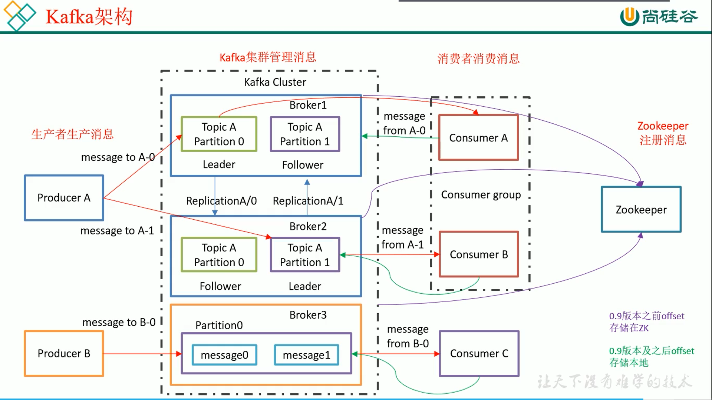

# 概述

## 定义

- Kafka是一个分布式的基于发布订阅的消息队列
- 消息队列的好处
  - 解耦合
  - 可恢复性
  - 缓冲：生产速度>>消费速度
  - 削峰
  - 异步通信

## 消息队列的两种模式

- 点对点模式：一对一，消费者主动拉取数据，消息被消费之后被清除。
- 发布/订阅模式：一对多，消息被消费之后不会被清除而是保留一段时间。
  - 消费者主动拉取（Kafka），轮询需要消耗资源
  - 队列主动推送，生产者生产过快容易导致消费者无法消化

# 入门

## 基础架构

- 副本机制：生产者消费者都是与leader交互，leader出现故障时，某个follower成为leader。

# 架构

# API

# 监控

# Flume对接Kafka