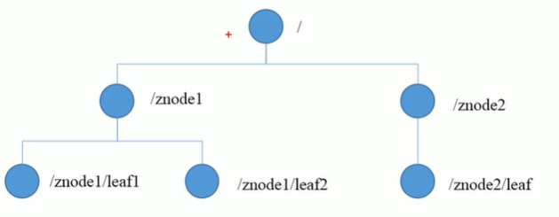
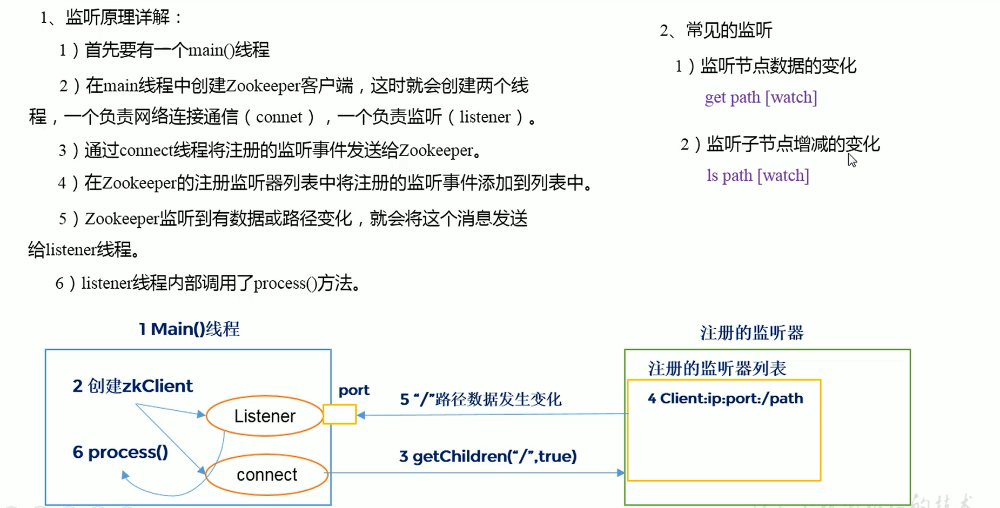
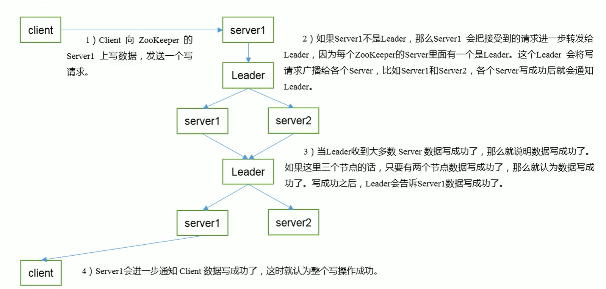

# 入门

## 概述

- 分布式的，为分布式应用提供协调服务的应用。
- 观察者设计模式，zookeeper=文件系统+通知机制

## 特点

- 主从模式
- 集群中半数以上节点存活，集群即可正常工作
- 全局数据一致，任何节点的数据都是一致的
- 更新请求顺序执行，同一个客户端的更新请求按照其发送顺序依次执行
- 数据更新原子性
- 实时性较高

## 数据结构

- zookeeper数据模型与Unix文件系统类似，整体上可以看作是一棵树，每个节点称为ZNode，默认可以存储1MB的数据，每个ZNode都可以通过其路径唯一标识。



## 应用场景

- 统一命名服务：对应用/服务进行命名
- 统一配置管理：管理配置文件
- 统一集群管理：管理集群节点状态
- 服务器节点动态上下线
- 软负载均衡：记录服务的访问数，根据当前访问数进行服务调度

# 安装

## 配置文件

```
# 心跳间隔（ms），也是zookeeper中一个基本的单位
tickTime=2000
# 初始化最大延迟时间(10*tickTime)
initLimit=10
# 同步时间（5*tickTime）
syncLimit=5
# 客户端访问端口号
clientPort=2181
# 数据文件目录、数据持久化路径
dataDir=xxx
dataLogDir=xxx
# 其它
autopurge.snapRetainCount=3
autopurge.purgeInterval=0
maxClientCnxns=60
# 集群配置项
server.A=B:C:D（A为服务器编号，B为服务器IP，C为通信端口，D为选举端口）
```

# 原理

## 选举机制

- 半数选举机制：集群半数以上机器存活，集群可用，所以适合安装奇数台服务。
- 配置文件中无须指定主从关系，leader通过内部选举机制临时产生。
- 选举流程：先给自己投票，如果无法产生leader，则给id大的节点投票

## 节点类型

- 持久：客户端与服务端断开连接之后，创建的节点不删除
  - 创建ZNode时设置顺序标识，ZNode名称后会附加一个值，顺序号时一个单调递增的计数器，由父节点维护。（在分布式系统中，顺序号可以被用来为所有事件进行全局排序，客户端可以通过顺序号推断事件的顺序）
- 短暂：客户端与服务端断开连接之后，创建的节点自己删除。（适合用于记录节点是否在线）
- 是否持久与是否编号，两两组合共四种组合

## Stat结构体

- czxid 创建节点的事务 zxid
- ctime 创建的时间戳毫秒数
- mzxid 最后更新的事务zxid
- mtime 最后修改的时间毫秒数
- pZxid 最后更新的子节点zxid
- cversion 子节点变化号（修改次数）
- dataversion 数据变化号
- aclVersion 访问控制列表变化号
- ephemeralOwner 临时节点，值为ZNode拥有者的sessionid，如果不是临时节点则为0
- dataLength 数据长度
- numChildren 子节点数量

## 监听器原理



## 写数据流程



# 实战

## 服务端命令

```
# 启动服务器
/bin/zkServer start
# 查看节点状态
/bin/zkServer status
```

## 客户端命令

```
# 启动客户端
bin/zkCli.sh

# 退出 
quit
# 显示所有操作命令
help

# 查看当前ZNode包含的内容
ls /

# 查看数据详情 
stat /path_name

# 创建节点 [-e] 创建短暂节点（ephemeral） [-s] 创建序号节点（sequence）
create /path_name "data"
# 创建多级节点
create /path_name1/path_name2 "data"

# 修改节点的值
set /path_name "new_data"

# 监听节点数据变化 加上watch指令，监听一次
get /path_name watch
# 监听节点变化
ls /path_name watch

# 删除节点
delete /path_name
# 递归删除节点
rmr /path_name
```

## API使用