# 马尔可夫模型

- 状态转换序列可以观测

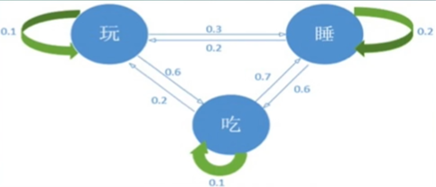

# 隐马尔可夫模型

- Hidden Markov Model（HMM）
- 状态序列不能直接观测到，需要从可以直接观测到的序列推算
- 结构最简单的动态贝叶斯网络

## HMM五元组

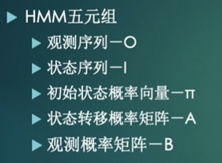

## HMM三要素

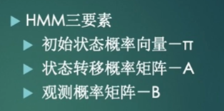

## 基本假设

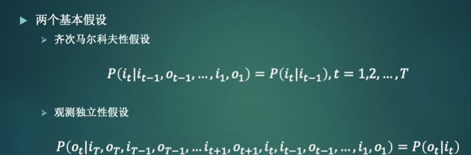

- 齐次马尔可夫性假设：任意时刻t的状态，只依赖于t-1时刻的状态

- 观测独立性假设：某一时刻的观测只与该时刻的状态有关

## 实例

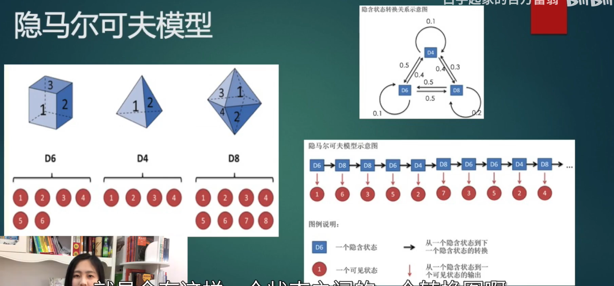

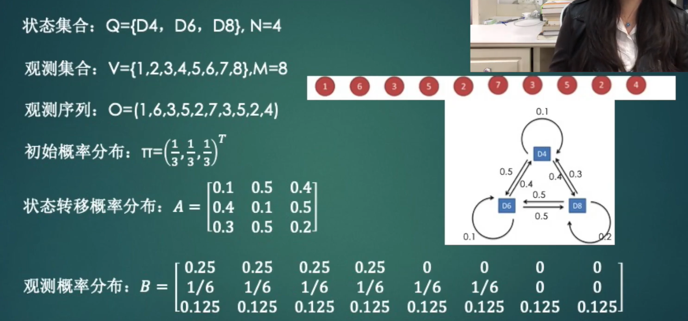

## HMM三类问题

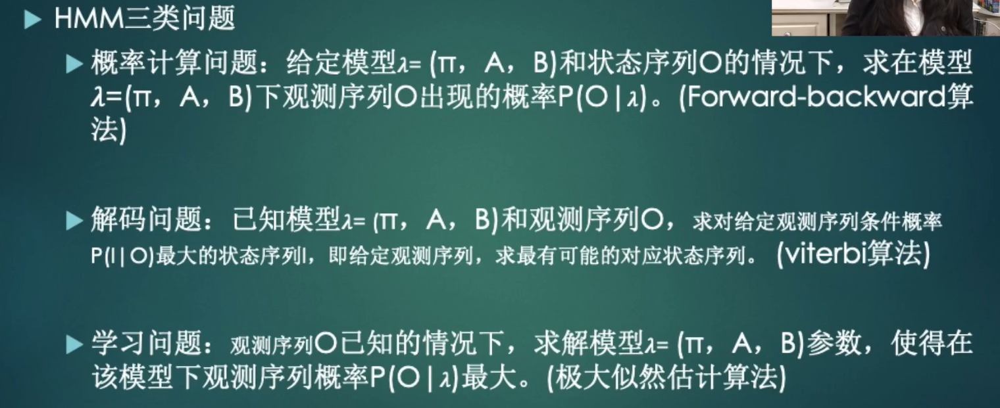

# 概率计算问题

## 直接计算

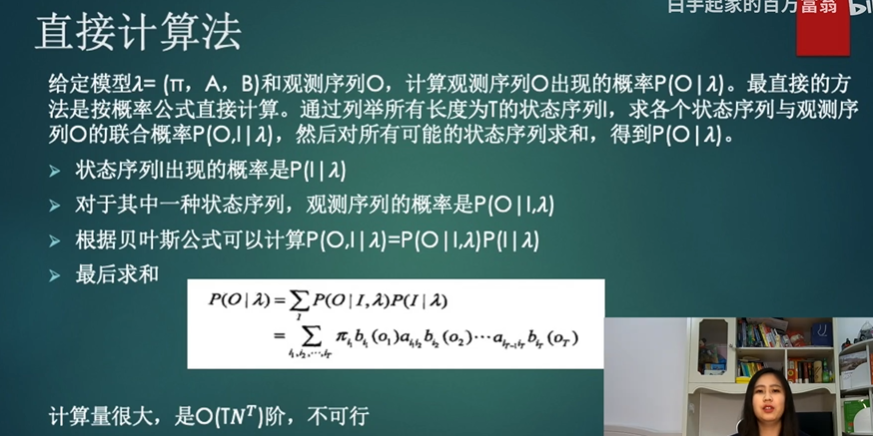

## 前向算法

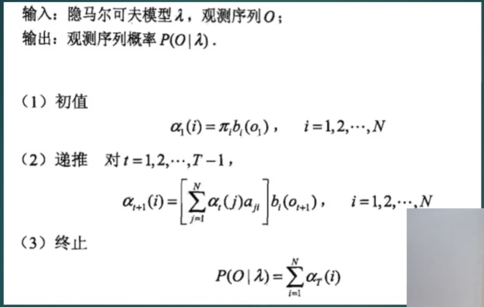

- 前向：`1~t-1`递推
- 后向：`t+1~n`递推

## 后向算法

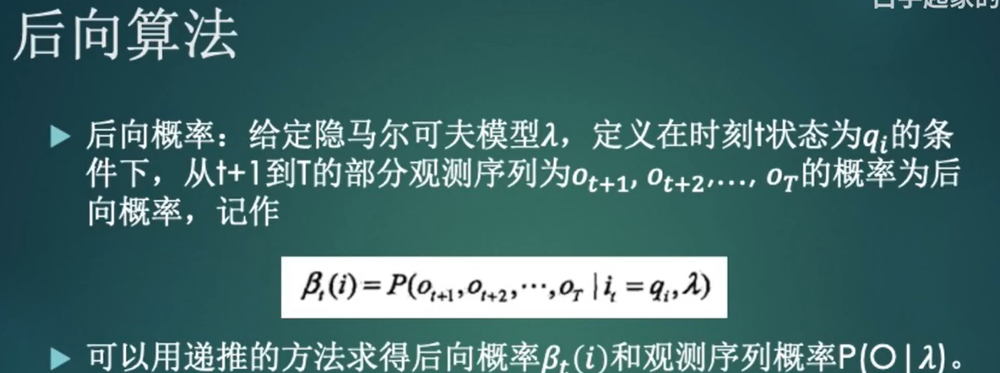

## 维特比算法

- 动态规划
- 隐马尔科夫解码、条件随机场的预测问题

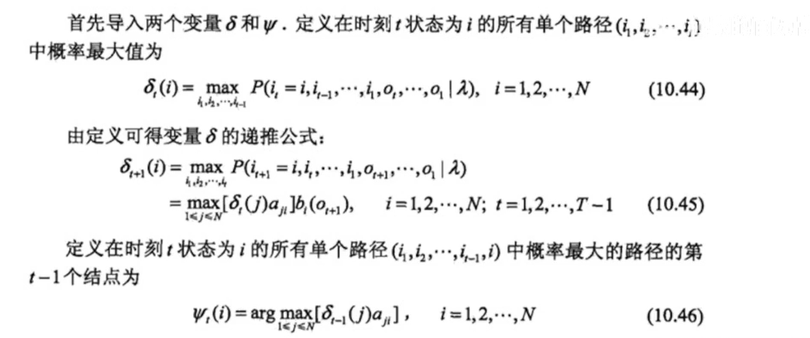

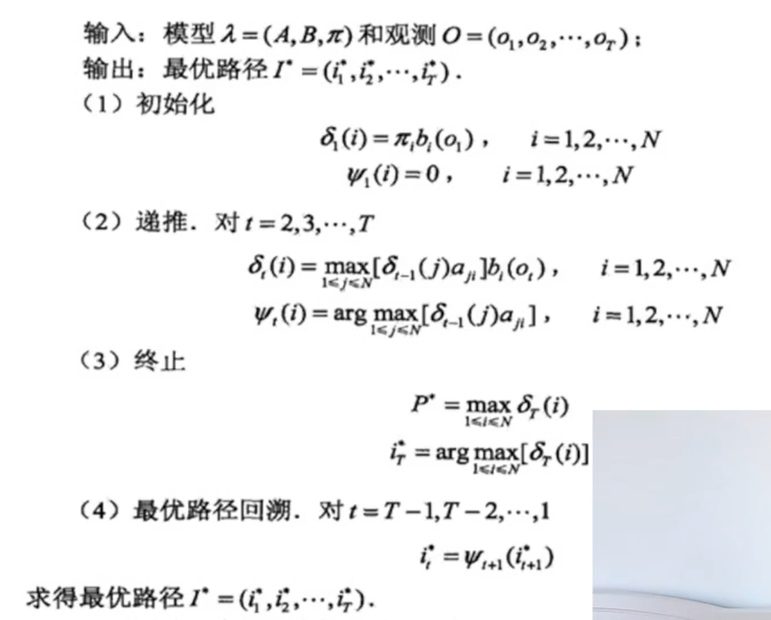

