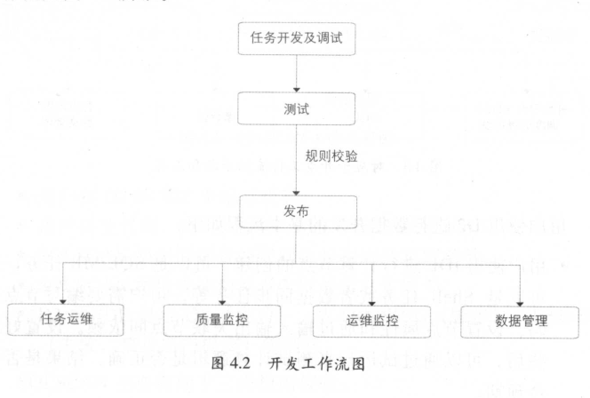
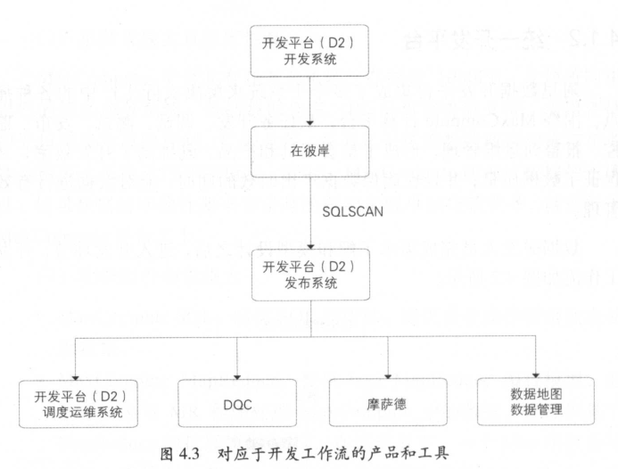

# 离线数据开发

> 收集数据不是目的，而是手段。拥有数据之后，还需要对数据进行开发、挖掘，只有被整合与计算的数据才能用于洞察数据规律。

## 数据开发平台

> 阿里巴巴数据研发岗位的一般工作流程：需求分析->模型设计->ETL开发->测试->发布上线->日常运维->任务下线。业务发展快，交付时间短，运维任务数量多，运维环境复杂。

### 统一计算平台

- 离线数仓的存储与计算都基于阿里的海量数据处理平台`MaxCompute`。
- `MaxCompute`架构如下
  - 客户端：以RESTful API、SDK、可视化系统等方式进行离线数据开发
  - 接入层：负责用户认证与访问控制
  - 逻辑层：处理请求、资源管理与调度
  - 存储计算层：负责计算任务的实际执行

### 统一开发平台

> 集成多个子系统来化简数据研发的工作流程

- 工作流程的每一步对应用到的系统如下
  - D2（在云端）是集开发、发布、调度运维一体的数据开发平台；
  - 在彼岸，数据测试平台，主要功能有数据对比、数据分布（检查数据是否与schema一致等）、数据脱敏；
  - DQC（Data Quality Center），数据质量中心。负责数据监控以及数据清洗；

## 任务调度系统

> 大数据环境下的数据处理，需要运维大量的任务，任务的种类也不尽相同，任务之间也存在着复杂的依赖关系。

- 用户在D2平台提交的任务，需要由调度系统统一进行调度运行。调度系统的核心是调度引擎和执行引擎。
- 调度引擎根据任务的状态机模型以及工作流的状态机模型，以事件驱动的方式进行任务调度。
- 执行引擎负责在实际的平台上创建对应的任务并维护其状态。

### 调度系统的特点与应用

- 调度配置：以手动以及自动的方式维护任务的依赖关系，如识别出数据表的输入与输出，将本任务与输入表关联，减少手动维护调度配置导致依赖配置更新不及时的情况。
- 定时调度（指定时间日期调度）与定期调度（间隔性调度）。
- 基线管理，对任务进行优先级划分，按照优先级的不同将任务划分到不同的基线中，进行统一的管理。