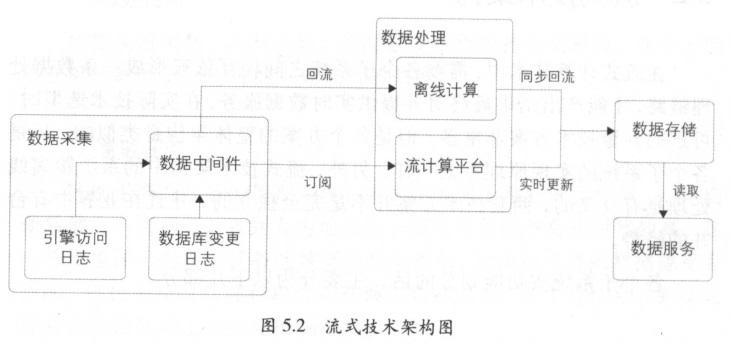
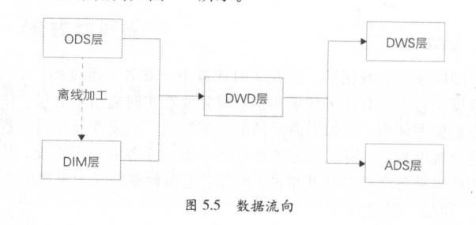

# 实时技术

> 本文内容摘录于《大数据之路：阿里巴巴大数据实践》

## 简介

- 根据数据的时效性可以将数据分为如下三种数据
  - 离线：数据延迟时间粒度为天
  - 准实时：数据延迟时间粒度为小时
  - 实时：数据延迟时间粒度为秒

- 实时数据需要流处理系统进行处理，指的是业务系统每产生一条数据立即就会被采集并发送到流处理系统中处理（实际上一般的数据都允许采集工具进行一段时间的缓存以降低数据采集服务的压力），不需要定时调度任务来处理。流处理具有时效性高、性能要求高、任务长时间运行（对比批处理的间歇性运行）。
- 流处理不能完全替代批处理。

## 流式技术架构

> 流计算技术中，需要各个子系统组成数据处理链路，协作产出结果最终对外提供实时数据服务。

### 数据采集

- 采集的数据种类主要有
  - 数据库变更日志，如MySQL的`binlog`日志
  - 引擎访问日志，如Nginx的访问日志
  - 用户行为数据？（书上没说）
- 出于性能考虑，数据收集会**攒batch**，牺牲一定的实时性换取较低的资源消耗。当数据大小达到限制，或者时间间隔达到限制时（避免数据量太小长时间不发送数据），将数据发送给数据中间件。

### 数据处理

- 实时计算任务都部署在流计算系统上，先从数据中间件获取数据再对数据进行对应的处理。常用的流计算引擎系统有Storm、Spark、Flink等。
- 实时任务的经典问题：去重指标、数据倾斜、事务处理。

### 数据存储

- 实时任务运行过程中需要存储以供恢复或者关联的数据主要有：
  - 中间计算结果
  - 最终结果数据
  - 维表数据：通过同步工具将数据从离线系统导入在线存储系统中，供实时任务关联实时流数据。
- 实时任务一般都是多线程处理的，对应的存储系统也需要支持并发读写，延迟低。常用的存储系统有HBase、Tair、MongoDB。

### 数据服务

- 实时数据落地到存储系统后，使用方可以通过统一的接口获取实时数据，不需要关心底层细节，便于后续存储系统迁移以及分析监控。

## 流式数据模型

### 数据分层

- ODS层：Operation Data Store，直接从业务系统采集到的最原始的数据，属于操作数据层。如订单状态的变更记录，有多条数据。
- DWD层：Data Warehouse Detail，在ODS层上经过业务过程建模产出的实时事实明细层。如订单的支付记录，只有一条数据。
- DWS层：Data WareHouse Service，订阅明细层数据后，会在实时任务中计算各维度汇总指标。如果维度是比较通用的，会放在DWS层。如卖家的实时成交金额。
- ADS层：Application Data Service，个性化维度汇总层，非通用维度的汇总。如外卖地区的实时成交金额，仅供外卖业务线使用。
- DIM层：Dimension，实时维表层，从离线维表层抽取到在线系统供实时任务调用。如订单商品类目和行业的对应关系维表。
- 本书的模型分层结构与传统数仓的分层结构还不太一样，后续再总结吧。

- ODS到DIM的ETL过程在离线系统中进行，完毕后将其同步到实时任务使用的存储系统中。ODS层和DWD层会放在数据中间件中，DWS和ADS会放在在线存储系统中供下游调用。

### 多流关联

- 多流关联指的是把两个实时数据流进行主键关联，由于数据的到达顺序是不确定和无序的，实时数据的多流关联常常需要相互等待，只有双方的数据都到达了，才能关联成功。

### 维表使用

- 在实时计算中，关联维表一般会使用当前的实时数据T去关联T-2的维表数据。原因是T-1的数据无法及时准备好，通过多流实时关联来关联T-1的数据与T的变更来得到全量数据，也存在一定的困难。

## 大促保障与挑战

- 大促一般意义上指的是电商行业的促销活动，但是在用户量巨大的应用中，进行一次大型的运营活动也是一种“大促”。
- 电商大促的特点：毫秒级延迟（用于实时对外展示，如淘宝双十一大屏）、洪峰明显、高保障性、高准确性。

### 对实时任务进行优化

- 优化独占资源与共享资源的策略：如果一个任务大部分时间都在抢占资源，则需要考虑给它分配更多的独占资源。
- 选择缓存机制，降低数据库读写次数。
- 合并计算单元，降低拓扑层级，缩短数据处理链路。
- 共享内存对象，减少字符拷贝
- 在吞吐量与时延上进行取舍

### 链路保障

- 多链路搭建，多机房容灾甚至异地容灾。
- 可以通过对比多条链路的结果判断哪条链路出现了问题，有问题的链路一般结果会比其它链路的结果小，而且后续会越来越小。

### 压力测试

- 数据压测主要是蓄洪压测，即将过去几小时或者数天的数据重放来模拟大促时的巨大流量。
- 产品层面的压测：关注服务端的性能与前端页面的稳定性。
