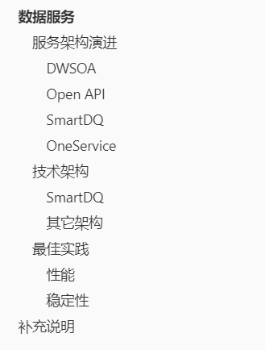
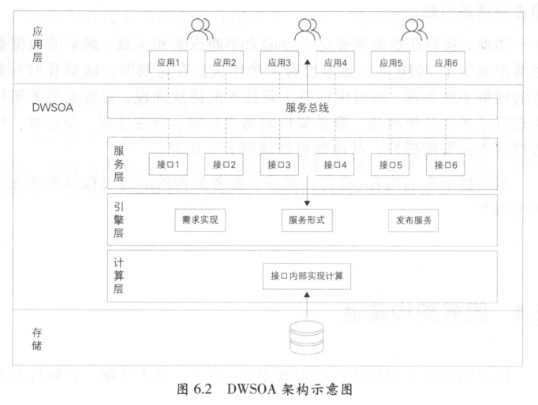
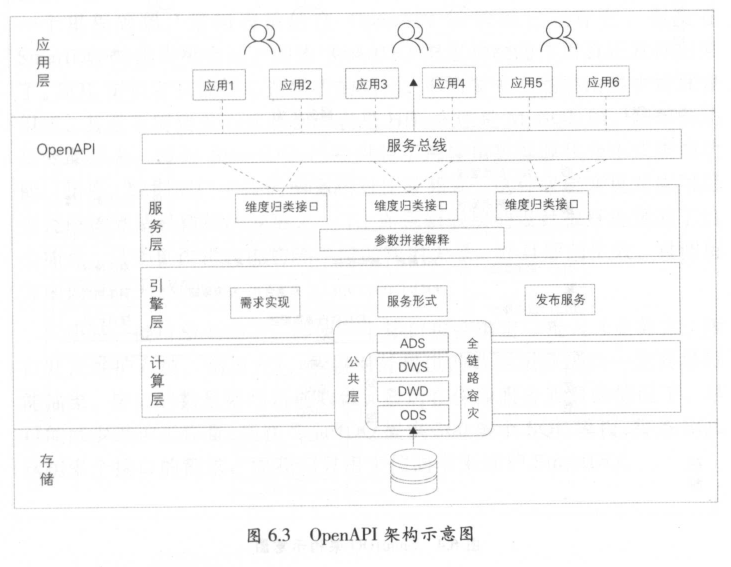
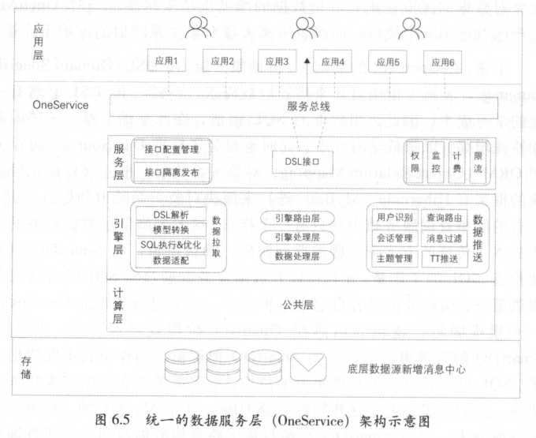

# 数据服务

> 数据服务解决了数据部门生产的海量数据难以被高效利用的问题。
>
> 
>
> 本文内容摘录于《大数据之路：阿里巴巴大数据实践》。

## 本文目录

## 服务架构演进

> DWSOA->Open API->SmartDQ->OneService

### DWSOA

- SOA，Service-Oriented Architecture。SOA是一种设计方法，系统由多个服务组成，服务之间通过网络调用。
- DWSOA，即Data Warehouse SOA，需求驱动地将数据通过SOA服务暴露出去。
- 简单但是拓展性、复用性不高，明显的**烟囱式**开发。

### Open API

- Open API架构下主要是将数据按照统计粒度进行聚合形成逻辑表，如会员维度的表会将以会员为中心的数据聚合在一起，通过会员接口暴露出去，收敛了接口的数量，提高复用性。

### SmartDQ

- 实际场景下维度的数量也是巨大的，Open API架构下也会存在接口数量爆炸的问题。SmartDQ通过DSL描述取数需求，将简单的数据查询接口数量降至1。
- DSL（Domain Specific Language，领域专用语言），是对一种事物的抽象描述，SQL是一种DSL，Json也是一种DSL。

### OneService

> SmartDQ解决了简单的查询需求，但是不能解决复杂的业务逻辑。OneService实现了真正的平台化，用户可以一站式地创建、发布、监控、下线自己的数据服务。

- 提供个性化的插件满足特殊的数据查询需求；
- 提供实时数据的推送服务；
- 支持定时任务服务。

## 技术架构

### SmartDQ

- SmartDQ可以看作是将多个主键相同的物理表组合成为一个虚拟的逻辑表，并将该逻辑表挂载在某一个主题下。
- 其中核心模块的处理流程是：
  - DSL解析->逻辑Query->物理Query
  - Query拆分，不同的物理表用到不同的Query
  - SQL执行，将各自的SQL拿到物理表上执行查询
  - 结果合并，将查询结果合并为一个统一的视图

### 其它架构

- 过于复杂，难以概括，请看原著哈哈哈

## 最佳实践

### 性能

- 资源分配
  - 剥离计算资源：将复杂的计算剥离开来，交由底层数据公共层调用，避免在接口中反复调用计算。
  - 查询资源分配：将大查询与小查询防止不同的线程池执行，避免大查询影响小查询。
  - 执行计划优化：将多次小查询合并为一次查询；优化不合理的查询方式。
- 缓存优化
  - 元数据缓存：元数据数据量不大，但是频繁被用到，可以加载到内存中缓存起来。
  - 模型缓存：将DSL->SQL的结果以模板化的方式缓存起来，节省解析时间。
  - 结果缓存：将通用的、大查询的结果缓存起来。
- 查询能力
  - 合并查询：设计了一种新的语法，使用REPLACE语法，优先查询离线数据（最准确），如果离线数据尚未产出，则查询实时数据。
  - 推送服务：使用推送的方式代替长轮询。

### 稳定性

- 发布系统
  - 元数据隔离：日常环境、预发环境和线上环境隔离避免影响线上元数据
  - 隔离发布：对逻辑表层面进行上锁操作，避免不同用户之间相互影响

- 隔离
  - 机房隔离：多机房部署容灾，此外采取“内部调用优先，同机房调用优先”减少多机房部署带来的物理开销
  - 分组隔离：将调用者分组，避免调用者相互影响

- 安全限制
  - 限制最大查询结果条数
  - 限制必传字段避免全表扫描
  - 限制超时时间
- 监控
  - 调用日志采集：调用者信息、性能指标、错误信息等
  - 调用监控：统计长时间无调用的数据表进行下线处理，统计慢SQL
- 限流与降级
  - 限流：限制QPS
  - 降级：某个数据源出现问题时，可以通过限流措施将QPS限制降为0，也可以通过修改元数据暂时移除故障数据源

# 补充说明

- 《为什么我推荐你做数据研发》一文中说到，怎么学习大数据的传送门：https://www.equator8848.xyz/pages/justdoit/%E6%95%B0%E6%8D%AE%E6%B5%81%E5%AE%9E%E6%88%98/