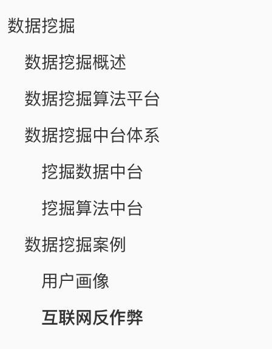
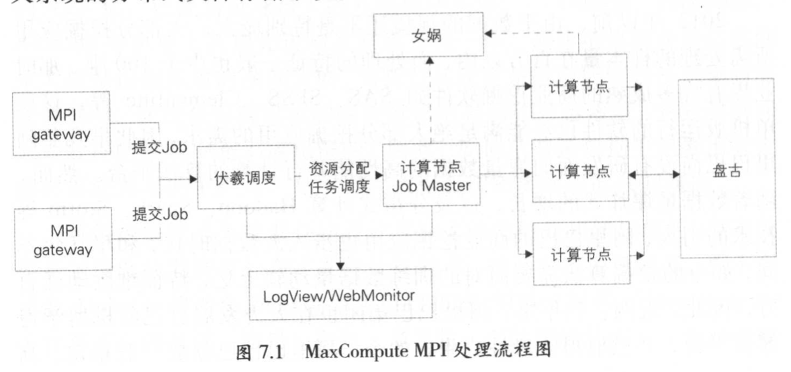

# 数据挖掘

> 本文内容摘录于《大数据之路：阿里巴巴大数据实践》。

## 数据挖掘概述

- 无数据不智能、无智能不商业。只有经过数据挖掘，海量的数据才能变成“信息”以及“知识”。

## 数据挖掘算法平台

- 大数据时代之前，SPSS等单机软件尚且可以hold住百万级别数据。进入大数据时代后，单机数据挖掘软件已经无法处理海量的数据。
- 阿里巴巴采用MapReduce与Hive解决大部分离线数据分析任务。对于需要快速迭代、频繁进行网络通信的算法任务，其采用MPI作为计算框架。（MPI，Message Passing Interface，一种较为底层的分布式系统通信框架）
- 阿里MPI处理流程如下：其中伏羲为分布式调度系统，女娲为分布式一致性协调服务，盘古为分布式文件储存系统。

## 数据挖掘中台体系

- 一次完整的数据挖掘过程包括商业理解、数据准备、特征工程、模型训练、模型测试、模型部署、线上应用、效果反馈等一系列步骤。如果各个部门团队每次都重复这一套流程，无疑会带来资源的浪费。
- 数据挖掘也可以中台化，由于数据挖掘主要由数据+算法组成，故数据挖掘中台主要分为数据中台与算法中台。
- 数据挖掘主要分为面向个体的挖掘以及面向关系的挖掘。

### 挖掘数据中台

- 与数据仓库等技术类似，数据中台也遵循分层思想，尽最大可能地解耦与复用。
- FDM（Feature DataMining Layer），特征层，储存模型训练前用到的特征指标并进行统一的清洗和处理。
- IDM（Individual），个体挖掘指标中间层，储存面向个体挖掘场景的通用性数据，如商家、买家等维度的指标。
- RDM（Relational），关系挖掘指标中间层，储存面向关系挖掘场景的通用性数据，如商品相似度。
- ADM（Application-oriented），应用层，储存较为个性的深度加工后的指标数据。

### 挖掘算法中台

- 不少算法工程师熟悉算法，但是在实际生产环境中，也有可能由于业务经验不足或者数据洞察能力欠缺，处理问题效率不高。
- 算法中台将一些常用的挖掘场景抽取出来形成对应的方法论与实操模板。如个体挖掘中的用户画像，关系挖掘中的相似关系以及竞争关系挖掘。

## 数据挖掘案例

### 用户画像

- 用户画像即给用户打上标签，如职业、爱好等。用户画像主要分为基础属性、购物偏好、社交关系、财富属性。
- 淘宝针对用户的浏览、加购、下单等行为，分析商品相关信息，综合计算出买家的偏好风格。

### 互联网反作弊

- 主要解决问题：账号与资金安全、非人行为识别、虚假订单、广告推广、UGC恶意信息检测（UGC，User Generated Content，也就是用户生成内容，平时QQ空间发的说说，微信发的朋友圈都属于这一类别）。
- 反作弊的方法
  - 基于业务规则识别：根据实际场景不断进行总结归纳识别规则。
  - 基于有监督学习：通过正负样本标记进行有监督学习，需要解决的问题是需要解决类别不平衡的问题，因为不正常的用户往往只占很小一部分。
  - 基于无监督学习：该方法假设作弊等异常行为与正常行为在某一个特征上有明显区别，如某个用户在大部分用户不活跃的时间进行大量操作，其有可能是异常用户。
- 实际上反作弊系统会综合以上几种方法，且采取离线实时同时进行的方式确保准确性与实时性。