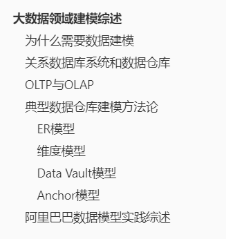

# 大数据领域建模综述

> 本文内容摘录于《大数据之路：阿里巴巴大数据实践》。

## 为什么需要数据建模

- 数据模型就是海量数据组织和存储方法，其强调从业务、数据存储和使用角度合理存储数据。
- 好的数据模型是高性能、低成本、高效率、高质量的前提。

## 关系数据库系统和数据仓库

- 现代信息管理系统几乎都是使用关系型数据库来存储与处理数据。大数据时代下，数据存储与计算虽然在分布式等方面突飞猛进，但是仍在大规模使用关系型数据库理论，只是数据的模型范式有所不同。

## OLTP与OLAP

- OLTP（On-Line Transaction Processing，联机事务处理），主要面向数据的随机读写，通过满足三范式的实体关系模型解决数据冗余和一致性问题。
- OLAP（On-Line Analytical Processing，联机分析处理），主要面向数据的批量读写，关注数据的整合与数据处理吞吐量。
- 二者目的不同导致其数据建模方式也不尽相同。

## 典型数据仓库建模方法论

### ER模型

- 从全企业的高度设计满足三范式的模型，使用ER模型（Entity Relationship，实体关系）描述企业业务。不同于OLTP中的ER模型，数据仓库中的ER模型是面向主题的。
- 建模步骤
  - 高层模型，高度抽象的模型，描述主要的主题以及主题间关系
  - 中层模型：细化高层模型的主题数据项
  - 物理模型：设计物理存储

### 维度模型

- 数据仓库最经典的模型，从分析决策的需求出发构建模型，为分析需求服务。最常用的是星形模型，其次是雪花模型。
- 建模步骤
  - 选择需要分析决策的业务过程，如交易的支付或者退款
  - 选择粒度，通过判断分析需求需要细分的程度，决定选择的粒度
  - 识别维表，基于粒度设计维表与维度属性
  - 选择事实，确定分析需要衡量的指标

### Data Vault模型

- ER模型的衍生，其强调建立一个可审计的基础数据层，即强调历史性、可追溯性以及原子性。
- 主要构成
  - Hub，企业业务实体
  - Link，表示Hub之间的关系，也就是所谓的“中间表”
  - Satellite（Satellite，卫星），一个Hub可以有多个Satellite，其是Satellite的详细数据表

### Anchor模型

- 对Data Vault进行了进一步的规范化处理，核心思想是只添加不修改，将模型设计为满足六范式的模型。模型拓展性高，但是也会带来更多的join操作。

## 阿里巴巴数据模型实践综述

> 分为多个阶段演进

- 阶段一：基于Oracle数据库的特性进行数据存储与加工，没有系统化的模型方法体系。
- 阶段二：引入ER模型+维度模型，成为四层架构，但是实践发现ER模型设计产出速度缓慢。模型分为四层：
  - ODL 操作数据层，与源数据保持一致
  - BDL 基础数据层，引入ER模型加强数据整合
  - IDL 接口数据层，基于维度模型构建数据集市
  - ADL 应用数据层，数据个性化应用
- 阶段三：采用维度建模作为核心模型方法论，构建公共层模型数据架构体系。