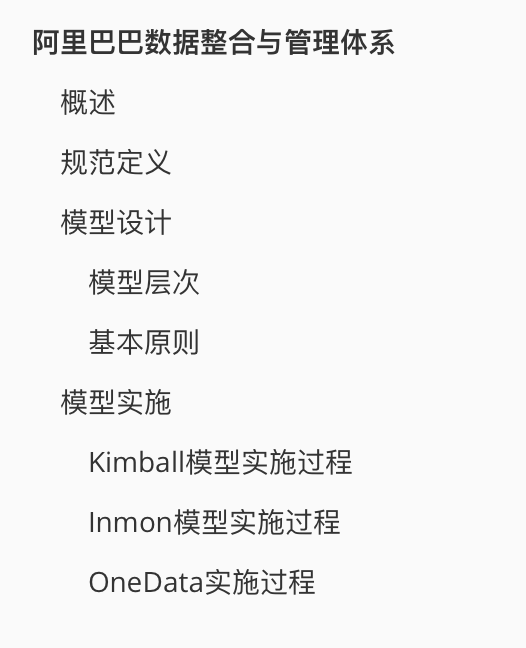
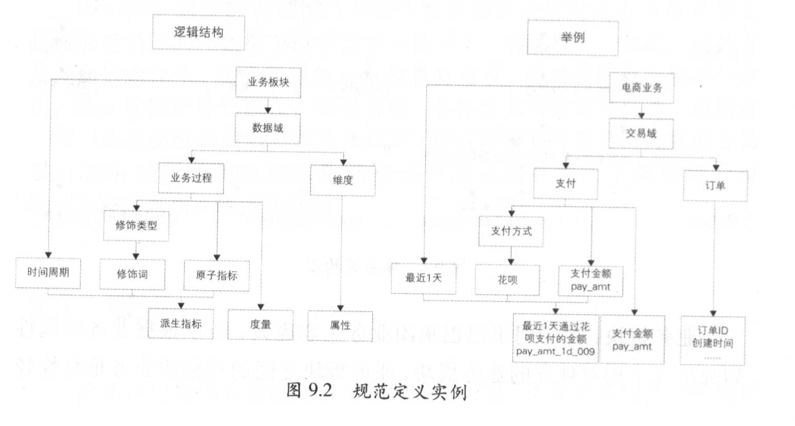
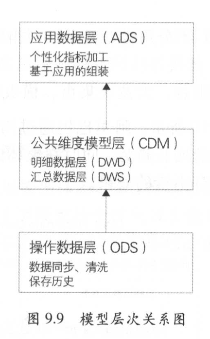

# 阿里巴巴数据整合与管理体系

> 本文内容摘录于《大数据之路：阿里巴巴大数据实践》。

## 概述

- 通过建设统一的、规范化的数据接入层与数据中间层，通过数据服务与数据产品建设数据公共层，降低数据互通成本。
- 架构体系
  - 业务板块：由于阿里的生态复杂庞大，需要根据业务属性划分出几个独立的业务板块
  - 规范定义：统一的数据规范命名体系
  - 模型设计：以维度建模理论为基础，基于维度建模总线架构，构建一致性的维度与事实

## 规范定义

- 规范定义指的是以维度建模为理论基础，划分和定义数据域、业务过程、维度、度量/原子指标、修饰类型、修饰词、时间周期、派生指标等。

- 规范定义主要是在指标的录入环节，以树形结构进行数据组织。具体表现是用户在系统上从下拉框中选择具体的枚举值或者按照一定的规范填写具体值，便于后续的维护与检索。

## 模型设计

### 模型层次

- 操作数据层ODS：将几乎无处理的原数据存放于数据仓库中
- 公共维度模型层CDM：明细事实数据与维表数据（根据ODS层数据加工生成）；公共指标汇总数据（根据维表数据和明细事实数据加工生成）
  - 明细数据层DWD
  - 汇总数据层DWS
- 应用数据层ADS：个性化的统计指标数据，根据CDM与ODS层加工生成，数据使用方一般不会再次提供给外部使用（避免数据口径不统一）

### 基本原则

- 高内聚和低耦合：业务相近的、粒度一致的数据设计为一个逻辑或者物理模型，高概率同时访问、低概率同时访问的数据分别储存
- 核心模型与拓展模型分离：核心模型支持常用的核心业务，拓展模型支持个性化与少量应用的需求
- 公共处理逻辑下沉以及单一化：公用逻辑不应该暴露给应用层实现，也不应该在多处同时存在

## 模型实施

### Kimball模型实施过程

- 高层模型：创建高层维度模型图
- 详细模型：为高层模型填充缺失的信息，解决设计问题，测试模型验证其完备性，确保满足业务需求
- 模型审查、再设计与验证：评审与返工
- 提交ETL工程师设计与开发：ETL实施

### Inmon模型实施过程

- ERD（Entity Relation Diagram，实体关系图），描述了公司业务中的实体、主题域以及其关系
- DIS（Data Iten Set，数据项集），描述了数据模型中关键字与细节数据之间的关系
- 物理层（Physical Model），描述数据模型的物理特性

### OneData实施过程

- 数据调研：了解业务领域与业务线，了解各方人员真实需求，直接决定了数仓建设是否成功
- 架构设计：
  - 数据域划分：数据域指的是面向业务分析，将业务过程或者维度进行抽象后的结果。如会员有新增、登录动作，交易有下单、支付等动作。二者分别属于会员域与交易域
  - 构建总线矩阵：明确业务过程与维度的关系
- 规范定义：规范定义指标体系
- 模型设计
- 总结复盘：OneData的实施是一个螺旋式的迭代过程，重要环节的实施过程中都需要引入评审机制。