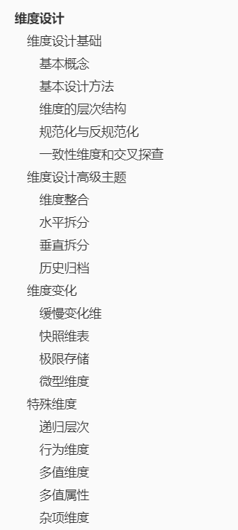
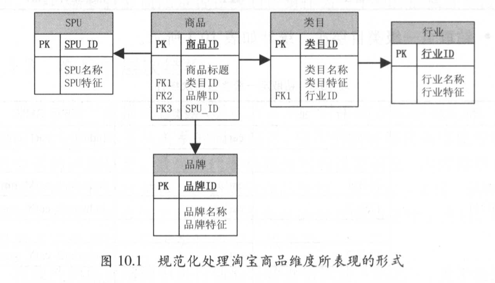
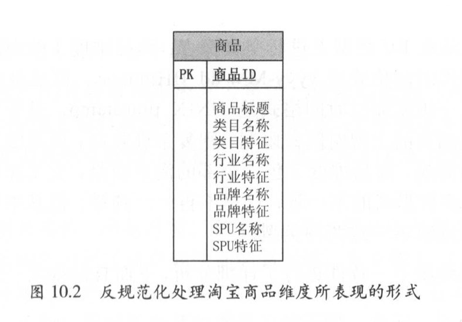
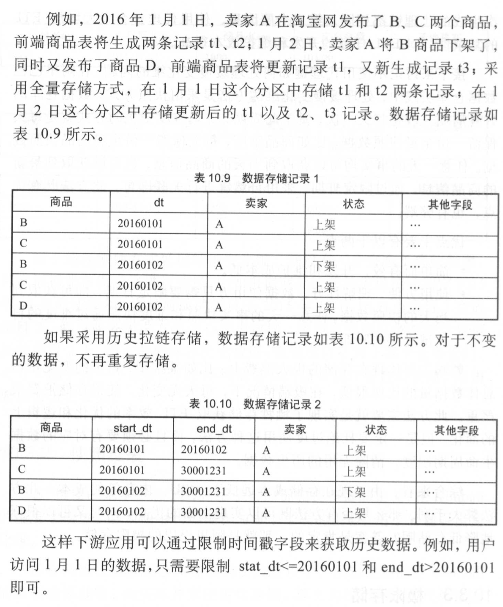

# 维度设计

> 本文内容摘录于《大数据之路：阿里巴巴大数据实践》。

- 本文很长，你忍一下

## 维度设计基础

### 基本概念

- 维度是维度建模方法论中的灵魂，该方法论中，度量被称为“事实”，环境被称为“维度”，维度是用于分析事实所需要的环境。
- 维度所包含的表示维度的列，被称为维度属性。维度属性是查询、分组的约束条件，多用于查询约束、分类汇总以及排序等操作。
- 维度使用主键标识其唯一性，分为代理键与自然键。自然键具有业务意义，代理键不具有业务意义。
- 个人理解：维度就是一张数据表🐴。

### 基本设计方法

- 维度的设计过程就是确定维度属性的过程。
- 维度设计的一般步骤
  - 选择维度或者新建维度
  - 确定主维表
  - 确定相关维表，通过梳理业务挖掘与主维表存在关联关系的维表
  - 确定维度属性

### 维度的层次结构

- 维度中一些属性以层次方式或者一对多的方式相互关联，可以被理解为包含连续主从关系的层次属性，在属性的层次结构中进行下钻是数据钻取的方法之一。如某公司2021年营收额度数据中，从月份下钻，可以得到1~12月的12条记录；从部门下钻，可以得到n个部门的n条记录。

### 规范化与反规范化

- 当属性层次被实例化为一系列维度而不是单一的维度时，这种模型被称为雪花模型，也是大多数OLTP的规范化方式，可以有效地避免数据的冗余。（即分为多张表，各表之间通过ID关联）

- 将维度的属性层次合并到单个维度中是一种反规范化操作，其使用储存空间换取查询的性能与易用性。

### 一致性维度和交叉探查

- 将不同数据域的事实合并在一起进行数据探查，称为交叉探查。如将统计了商品维度PV与UV的日志域，与统计了商品维度最近一天的下单GMV的交易域合并，计算转换率等工作。
- 不同数据域计算过程中使用的维度不一致，会导致交叉探查存在问题。一般可以分为维度格式不一致与内容不一致。
- 一致性维度的表现形式
  - 共享维表：通用的维表有且仅有一个，如商品、买家、卖家等维表
  - 一致性上卷：一个维度的维度属性是另外一个维度的维度属性的子集，且其结构与内容一致
  - 交叉属性：两个维度具有部分相同的维度属性，如商品维度有类目属性、商家维度有主营类目属性，可以在相同的属性上进行交叉探查

## 维度设计高级主题

### 维度整合

- 数据仓库的定义：面向主题的，集成的、非易失的且随时间变化的数据集合，用来支持管理人员的决策。其中，集成是最为重要的特性。
- 数仓的数据来源可能是多个异构的系统，多个系统使用的命名习惯、物理储存等都有可能不一致。数据进入数仓时，需要进行集成统一。
- 维度整合主要体现如下：
  - 命名规范统一：表、字段名称统一
  - 字段类型统一：相同或者相似的字段类型统一
  - 业务含义相同的表统一：业务相近的表整合统一，差异较大的表分而置之

### 水平拆分

- 将维度按照类别或者类型进行细分，如商品表根据业务线可以分为海淘商品与飞猪商品表等，它们虽然同属于商品，但是飞猪商品还包含景点，门票等信息。
- 如果业务之间差异性较大，合并在一起，某一行记录可能存在很多空值，这时候需要水平拆分，把表变短。此外，将业务差异性大的表合并在一起，弊大于利，常常会牵一发而动全身，导致系统的不稳定。

### 垂直拆分

- 当某些维度属性产出时间不一致，或者使用频率差异性较大时，也可以根据产出时间或者使用频率进行垂直拆分，把表变窄。

### 历史归档

- 定时对历史数据做归档工作，节约储存成本。

## 维度变化

### 缓慢变化维

- 反应历史变化也是数仓的重要特点之一，因为在现实世界中维度的属性并不是完全静态的，与数据增长较快的事实表相比，维度变化较为缓慢。
- 处理缓慢变化维的方式（Kimball模型）
  - 重写维度值，不保留历史数据，即直接修改存量数据中的某一个纬度值。如商品表中类目维度从类目1直接修改为类目2，订单表中关联的记录可能与客观事实不符合。
  - 插入新的维度行，保留了历史数据，即主维表中新增一行维度记录。如商品表中新增一个类目为类目2的商品，订单表中历史数据与历史维度值关联，维度变化后的数据与当前维度值关联。
  - 添加维度列：如新增一列“所属新类目”，原本的存量数据迁移至“所属旧类目”一列。

### 快照维表

- Kimball模型要求使用代理键作为每个维表的主键，用于处理缓慢变化维度，但是实践中并没有使用代理键。原因是分布式计算系统中没有事务概念，生成唯一的代理键成本很高；使用代理键会增加ETL工作的复杂度。
- 阿里巴巴采用快照维表的方式处理缓慢变化维，一般一天保留一份全量数据，任意一天的事实快照和维度快照通过维度自然键进行关联即可。

### 极限存储

- 历史拉链存储：指的是通过新增两个时间戳字段start_dt与end_dt，将变更数据以天为粒度记录下来。这样没有变化的数据将不再重复存储，但是缺点是难以理解、分区数量过多。

- 极限存储使用了历史拉链存储，的目的是解决“快照维表”带来的存储浪费问题。其通过查询解析使得底层的逻辑对用户透明化，采取分月做拉链存储的方式减少分区数量。

### 微型维度

- 使用极限存储需要避免维度的过度增长，否则极限存储效果会变差。可以使用垂直拆分的方式保持主维度的稳定性，也可以采取微型维度的方式解决问题。
- 微型维度指的是将一部分不稳定的属性从主维表中移出，将其放置到拥有自己代理键的新表，这个表之间的维度属性之间两两组合，产生新的数据行。（其局限性是只适用于枚举值）

## 特殊维度

### 递归层次

- 维度的递归层次，依据层级是否固定分为均衡层次结构和非均衡层次结构。地区信息为均衡层级，分为国家、省份、城市等有限个层级；某个公司的子母公司关系则是非均衡层次。
- 递归层次可以使用递归SQL实现，但是成本较高。可以使用层次结构扁平化、使用层次桥接表等方法处理解决。

### 行为维度

- 与事实相关的维度被称为行为维度，如交易、物流等。
- 对于行为维度，可以冗余到现有的维表中；也可以加工成单独的维表。前者需要考虑避免维度增长过度导致极限存储效果变差，也需要避免耦合度过高。

### 多值维度

- 事实表中的一条记录在某维表中有多条对应的记录，该属性被称为多值属性，如父订单与子订单的关系。
- 多值维度可以通过以下方式实现
  - 降低事实表的粒度，如直接采用子订单粒度。但是不太实际，多值维度往往不可避免
  - 采用多字段，当维表取值不会太多时，可以采取多字段的方式实现，如合同的受益人
  - 使用桥接表，更加灵活但是成本较高

### 多值属性

- 维度中某个属性字段同时有多个值，该属性被称为多值属性，如商品的属性信息字段，有品牌、材质、重量等等。
- 多值属性处理方式如下
  - 使用一个字段保存多值属性，其中属性是键值对的形式
  - 在属性有限的情况下，将多值属性放在维度的多个属性字段中，也可以增加拓展字段：如一个商家的主营类目，有男装（属性字段1）、女装（属性字段2）、童装（属性字段3）、以及拓展字段“其它类目”
  - 维度主键发生变化，一个维度值存放多条记录，使用方便，拓展性高，但是数据容易膨胀

### 杂项维度

- 一些不能舍弃但是不太重要的维度可以单独放置于一个杂项维表中，使用外键与主维表进行关联。