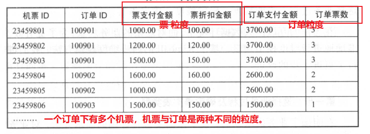
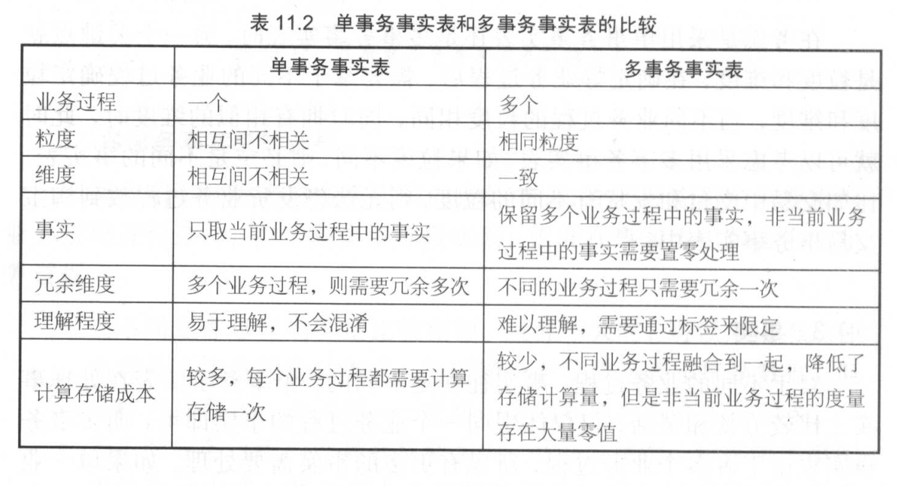
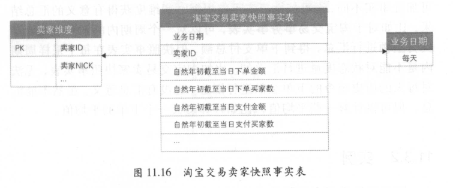
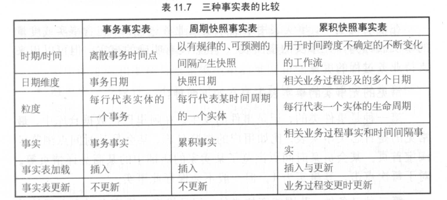
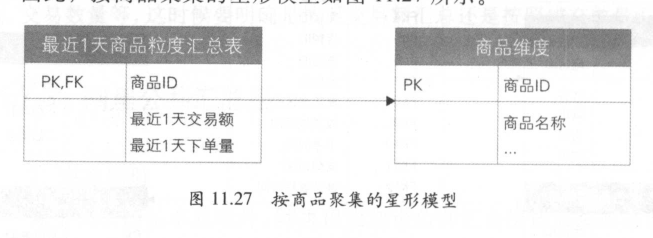

# 事实表设计

> 本文内容摘录于《大数据之路：阿里巴巴大数据实践》。

- 本章讲述了几种事实表：事务事实表、周期性快照事实表、累积快照事实表、无事实事实表、聚集型事实表。

## 事实表基础

### 特性

- 事实表是数据仓库维度建模的核心，与业务紧密相连，通过获取描述业务过程的度量来表达业务过程，包含了引用的维度和与过程有关的度量。
- 相对维表来说，通常事实表比维表细长得多，数据行的增加速度也比维表快。
- 维度属性也可以存储到事实表中，作为“退化维度”。退化维度可以作为事实表的过滤条件，实现聚合操作。
- 个人先小小地总结一下什么是维度与事实？维度指的是业务过程映射到数据模型中的一系列**属性型**字段，如商家名称；事实指的是根据维度等信息计算出来的**结论型**的字段，如销售额。

### 设计原则

- 尽可能包含所有与业务过程相关的事实，以便满足分析需求。
- 只选择与业务过程相关的事实，不包含其它业务过程事实以面耦合过高，如订单下单业务过程的事实表，不应该包含支付金额这个属于支付过程的事实。
- 分解不可加性事实为可加的组件，如将订单的优惠率分解为订单原价与订单优惠金额。
- 选择维度与事实之前须明确粒度，粒度指的是表达业务的细节程度，每个维度和事实必须与所定义的粒度保持一致。
- 同一个事实表中不能包含多种不同粒度的事实，下图是一个bad case。

- 事实单位需要保持一致，对空值使用零值填充，适当使用退化维度提高事实表的易用性。

### 设计方法

- 选择业务过程以及确定事实表类型：通过分析业务过程，选择与需求有关的业务过程。如电商领域中选择“创建订单”或者同时选择“创建订单”与“买家付款”两个业务过程，其事实表类型会有所不同。
- 声明粒度：尽量选择最细级别的原子粒度以保事实表的灵活性，如父子订单的场景中，应该使用子订单粒度。
- 确定维度：确定粒度后也就确认了业务主键，可以进一步确认相关的维度组合以及字段，如粒度为子订单，相关维度有买家、卖家、商品等。
- 确定事实：确定业务过程的度量，如子订单事实表中，有子订单分摊金额、邮费、优惠等。
- 冗余维度：逆规范化便于查询等操作，如子订单事实表中冗余商品类别字段。

## 事务事实表

- 任何类型的事件都可以理解为一种事务，如交易过程中的创建订单、买家付款等事件。事务事实表针对这些过程构建，跟踪定义业务过程的个体行为作为数仓的原子明细数据。

### 设计过程

- 选择业务过程：电商交易中包含的过程主要有创建下单、付款、发货、收货，这四个业务过程是下游分析统计的重点。
- 确定粒度：确定事实表每一行数据表达的细节层次，电商交易中常见的父子订单就是两种粒度。用户下单后，对于同一个商店的商品会生成一个父订单，父订单记录了物流信息、商品优惠等数据；每个商品生成一个子订单，如果只有一个商品，则合并为一个订单。下单、付款、收货三个过程粒度一般为子订单粒度，而发货由于一个子订单可以拆成多个物流单发货，故粒度为物流单。
- 确定维度：确定买家、卖家、商品、商品类目等相关维度。
- 确定事实：事实表应该包含与其描述过程有关的所有事实。
- 冗余维度

### 单事务事实表

- 单事务事实表指的是对每一个业务过程设计一个事实表，优点是可以方便地对每个业务过程进行独立的分析。

### 多事务事实表

- 将不同的事实放到同一个事实表中，一般有两种处理方法：不同业务过程使用不同的事实字段存放，表会比较宽；不同的业务过程使用同一个事实字段存放，但是增加一个业务过程标记字段以示区分。
- 多事务事实表中业务过程的粒度需要尽可能保持一致，维度也尽量保持一致。

### 二者对比

## 周期性快照事实表

- 事务事实表可以很好地跟踪业务过程并对其进行度量，但是其对于一些**状态度量**是低效率的，如卖家累计销售额，这需要对事务事实表进行聚合才可以得出对应的结果。

### 特性

- 快照事实表以预定的时间间隔对状态度量进行采样
- 快照事实表粒度一般由采样周期以及被采样的状态度量两个维度决定，如上表的粒度为**每天**对卖家截至当日的**下单支付金额**进行快照。
- 事务事实表是稀疏的，业务过程发生时才进行记录。快照事实表是稠密的，无论业务过程是否发生变化都会计算、记录数据。
- 快照事实表的度量都是半可加性的，即直接累加没有意义但是可以计算平均值等。

- 快照事实表根据采样维度的数量分为单维度以及混合维度。
- 快照事实表可以通过事务事实表进行汇总产出，也可以直接使用操作型系统的数据作为数据源进行加工。

### 注意事项

- 事务事实表与快照事实表往往是成对设计的。
- 快照事实表在需要获取上一次采样周期数据的场景下，可以把上一次采样的结果附加到当前记录。
- 计算快照事实表时，可以附加年份、季度等多样的字段便于分析。

## 累积快照事实表

### 特点

- 事务事实表对于统计某个业务过程的时长这种需求是低效的，如统计买家支付到卖家发货的时间。

- 建模过程与事务事实表的过程大致相同，适用于维度建模。

- 事务事实表记录的是事务发生时刻的状态，对于实体的某一实例不再更新，而累积快照事实表对实体的某一个实例定期更新。

### 物理实现

1. 使用日期分区表，每天分区存储昨天全量数据与当天增量数据合并后的结果，大量的数据会导致全量表的膨胀。
2. 对一段时间之前的数据进行归档存储，数据量较大，浪费存储空间。
3. 以业务实体结束时间进行分区，每天的分区存放当天结束的数据，使用一个独立的分区存放未结束的数据。这种方案比较节约资源，对ETL友好。

## 三种事实表比较

## 无事实的事实表

- 无事实事实表不包含事实或者度量，但是可以用来支持业务过程的度量。常见的类型有两种
  - 事件类，记录事件的发生。如日志类事实表
  - 条件、范围和资格类，保存了一些元数据，如产品的促销范围

## 聚集型事实表

- 通过汇总明细数据改善查询性能，减少查询时的计算量，以空间换取时间。

## 聚集的原则

- 聚集表提供的数据需要与查询明细数据的结果保持一致
- 不能在同一个表存储不同层次的数据，否则会导致重复计算等问题
- 聚集表粒度与明细表粒度不一定需要保持一致

### 公共汇总层

- 通过聚集构建公共汇总层数据，提高数据查询效率与数据复用性。基本原则是保证数据的公用性，数据不跨数据域，表名称需要明确区分统计周期。

