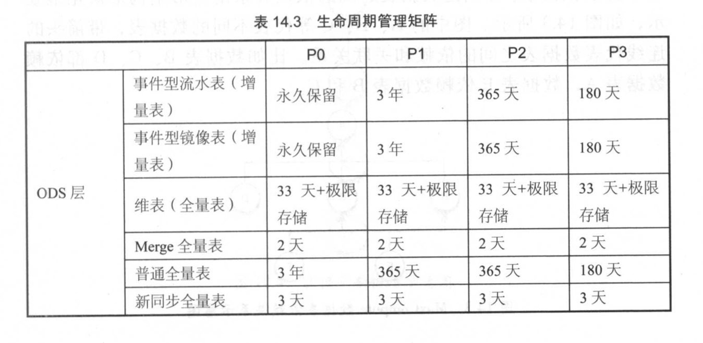
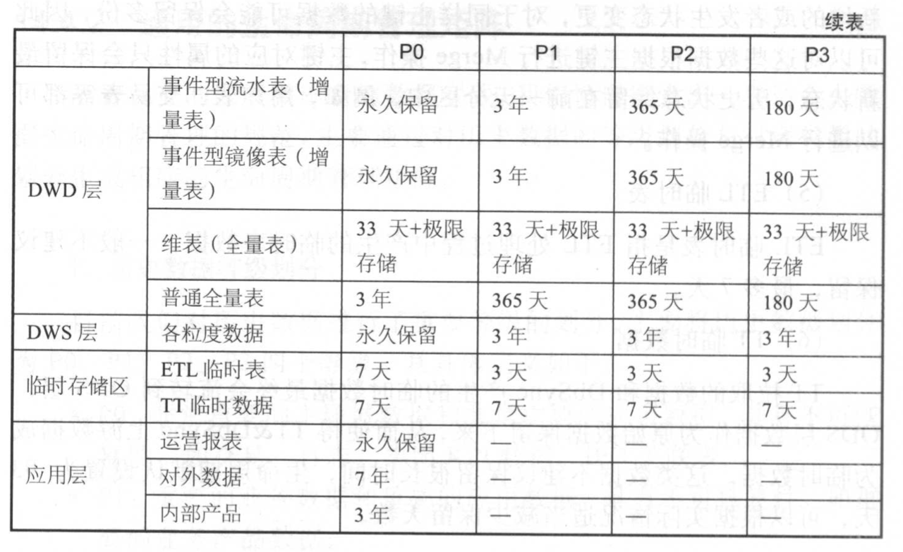

# 储存和成本管理

## 数据压缩

- 分布式文件系统中，为了保障数据的可用性与性能，通常是三副本机制（有效储存比为1:3）。MaxCompute中提供了archive压缩方法，其采用高压缩比的压缩方法，将数据保存为RAID file(6,3)（6份数据+3份校验块）的格式（有效储存比为1:1.5）。

## 数据重分布

- MaxCompute基于列式储存，由于每个表数据分布不同，会导致插入数据的顺序不一样，导致压缩效果差异大。可以通过distribute by与sort by方法进行数据重分布。

## 储存治理项优化

- 基于元数据，诊断与加工产出储存治理优化项，主要包括未管理表、空表、长时间未访问表等。采取流程式方法推动储存的治理运动，降低储存的成本。

## 生命周期管理

- 周期性删除策略，对某些没有价值的历史性数据进行定时删除
- 彻底删除策略：删除无用表数据或者ETL产生的临时数据
- 永久保留策略：重要且不可再生的数据需要永久保留
- 极限存储策略：建议对超过5G的数据分区使用极限存储
- 冷数据管理策略：永久保留策略的优化，将历史数据迁移到冷数据中心进行进行存储
- 增量表merge全量表策略：对使用极限存储没有明显优势的数据表使用增量表merge全量表的策略获取最新全量数据
- 生命周期管理矩阵：对于不同等级的数据、不同类型的数据表采取不同的数据保留策略：

## 数据成本计量

- 简单的成本计算方式可以将一个数据表的成本分为存储成本和计算成本，存储成本计量数据表消耗的存储资源，计算成本计量数据计算过程中CPU的消耗。

- 在计算数据表的成本时，除了存储成本、计算成本，还需要计算扫描成本。不能孤立地分析一个数据表，确保成本评估的准确、公平合理。

## 数据使用计费

- 对存储、计算、扫描付费。