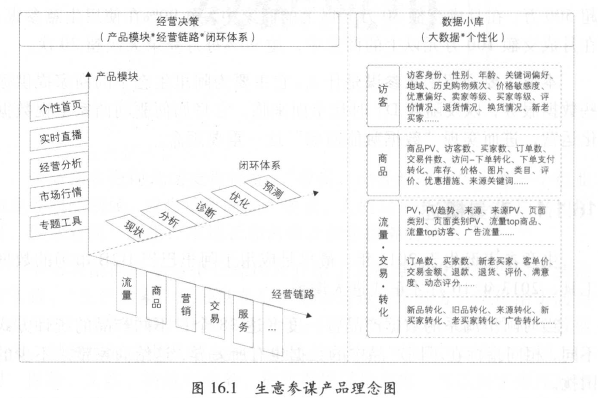
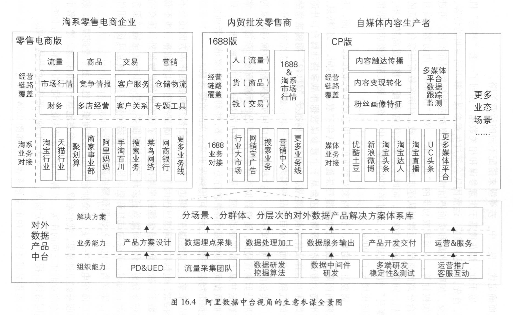
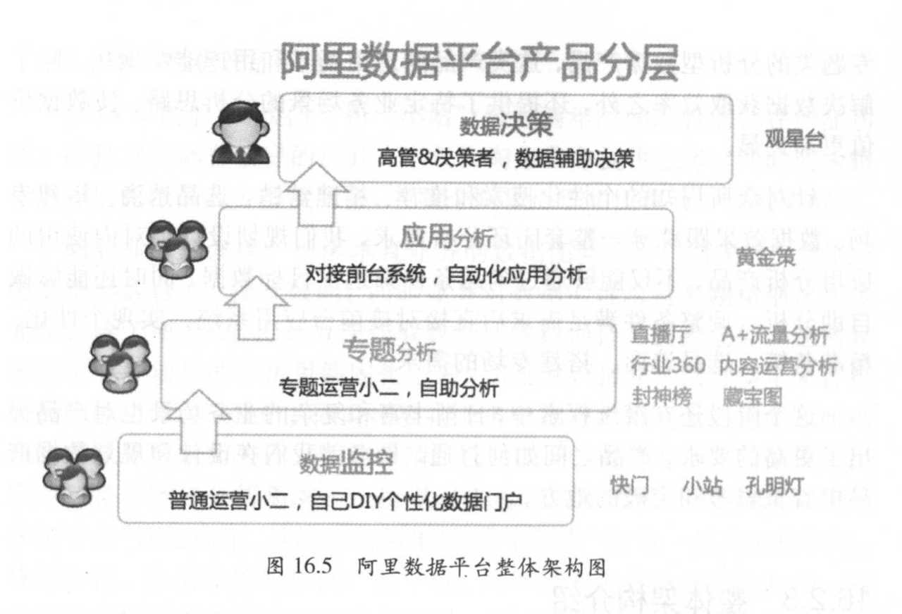

# 数据应用

## 生意参谋

- 阿里巴巴以“生意参谋”作为官方统一的数据产品平台，为商家提供多样化、普惠性的数据赋能。

- 商家在生意参谋看到的数据主要分为三种
  - 看我情，关注自身店铺的数据
  - 看行情，关注行业发展的数据
  - 看敌情，关注竞争对手的数据。其中为了避免泄漏商家的核心信息，需要选择多个商家的数据进行均值化处理

## 数据产品平台

- 数据产品的建设不是一蹴而就的，主要分为以下四个阶段

### 临时需求阶段

- 大数据尚未兴起，数据化运营还未被提及。用户需要了解业务基本数据时，提交需求给数据仓库团队，数据研发通过编写代码运行，将数据给用户，满足用户的临时取数的需求。

### 自动化报表时代

- 工程师已经难以人肉支撑越来越多的数据需求，因此引入了BI工具，通过报表与看板的形式将数据需求固化下来，满足用户自助取数的需求。

### 自主研发BI工具阶段

- 第三方工具拓展性不高，需要自研BI工具满足更多的数据需求，开始真正进入自主研发数据与工具的阶段。

### 数据产品平台

- 垂直业务的数据团队合并，避免数据的重复建设，满足业务对数据越来越精细化和多样化的的诉求。

