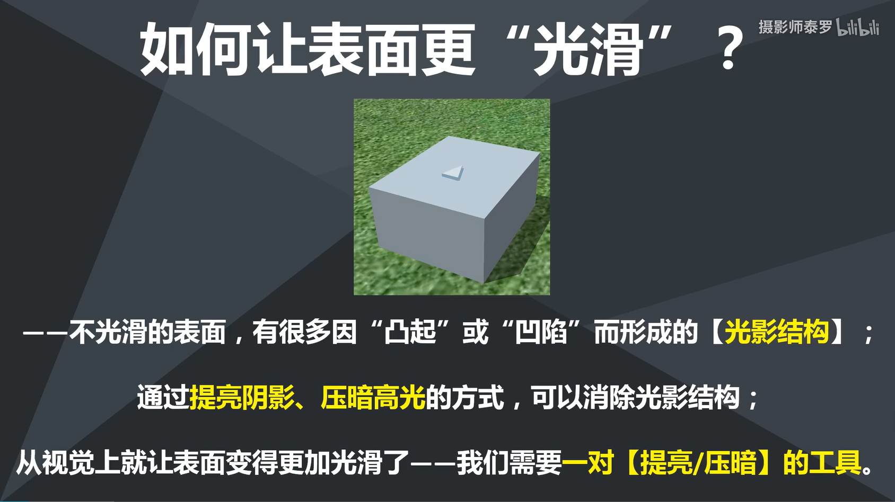

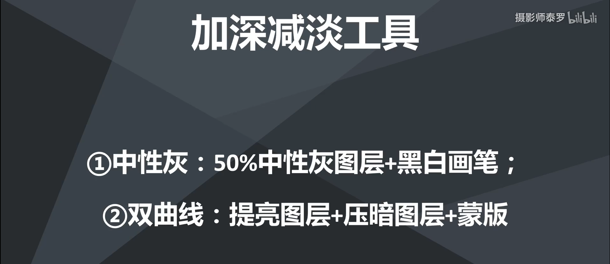

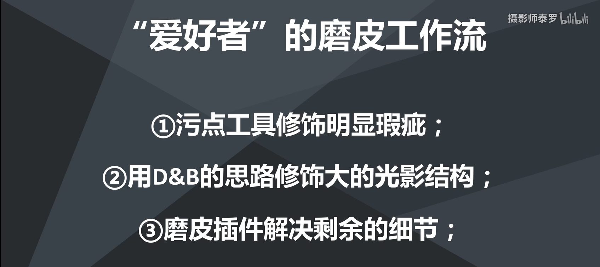

# 观察组

- 建立一个黑白蒙版
- 建立一个曲线（可以提亮、压暗、加强对比）
- 将二者组合成为观察组（`CTRL+G`）

# 双曲线

# 中性灰

- 新建图层（`CTRL+SHIFT+N`）

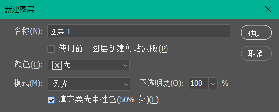

- 调整画笔工具：白色提亮、黑色压暗

# 高低频

> 有两个操作图层，将皮肤分成两层，一层是质感纹理层（比如皮肤的毛孔等），也称为高频层；一层是光滑皮肤层，也称为低频层

- 复制两个图层，分别为高低频率

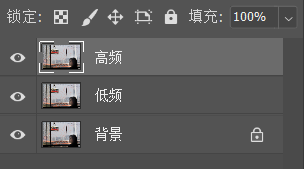

- 低频层执行：滤镜->高斯模糊
- 高频层执行：图像->应用图像，

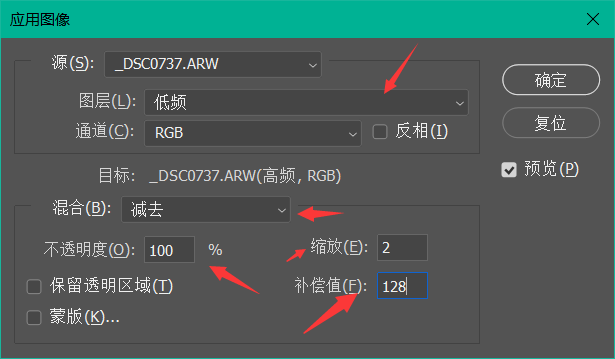

- 高频层改为线性光

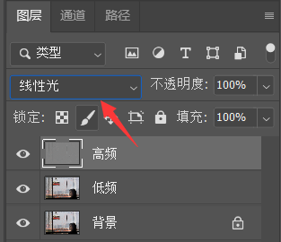

- 高频层采用污点修复画笔对细节进行修复
- 低频层采用套索工具选区然后高斯模糊或者柔性画笔涂抹
- `CTRL+E`合并

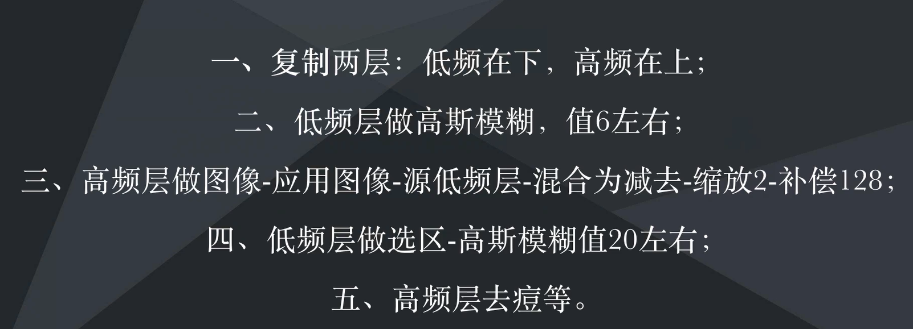

# 反相高低频

- 复制图层
- 图像-调整-反相（`CTRL+I`）
- 选择负片，混合模式设置为亮光

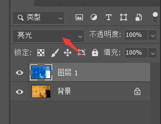

- 滤镜-其他-高反差保留，半径约为20
- 滤镜-模糊-高斯模糊，半径约为4~5
- ALT+添加图层按钮

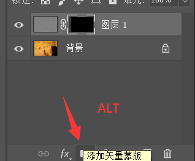

- 选择柔画笔

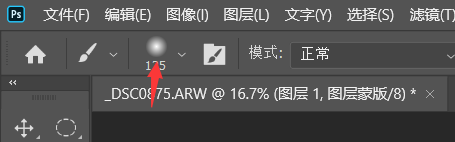

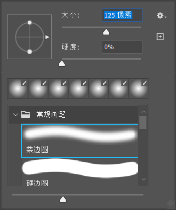 

- 白色画笔

# 黑白质感

