# 构图

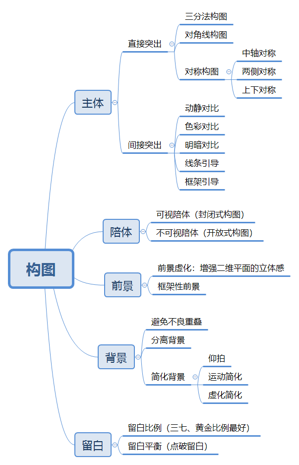

# 角度

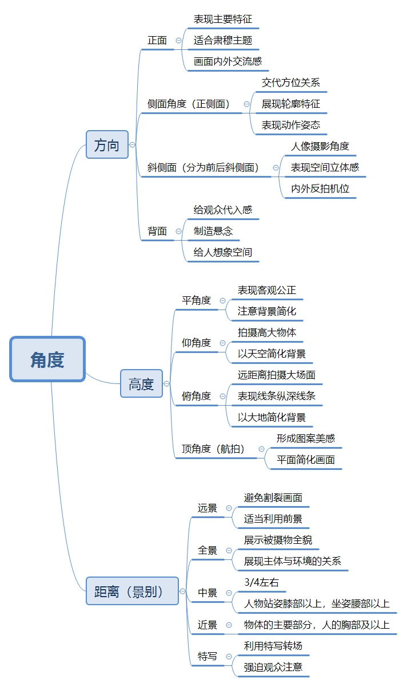

# 造型

# 影调

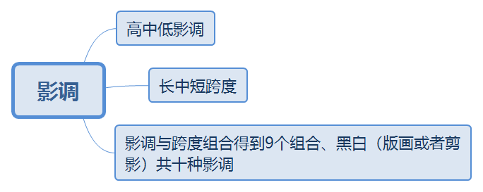

# 前期与后期

## 前期拍摄

- 拍摄主题：根据需求确定主题、风格
- 拍摄内容：模特本身
- 拍摄方法：服化道、神态、背景、构图、用光
- 出片效果：画面的基本效果

## 后期流程

> 三级调色

- 还原：得到一张还原准确的底图
  - 黑白场
  - 色彩还原
  - 基本的层次
  - 适当的饱和度
  - 二次构图
- 加强：风格化、突出画面主题、加强画面氛围
  - 定调（色调）
  - 初步输出
- 精细处理：细节处理，皮肤、眼神、形态
  - 磨皮
  - 五官精修
  - 肤色统一
  - 其它处理
  - 局部光影
  - 二次定调
  - 锐化输出

# 色彩

## 色彩三要素

### 色相

- 色彩的相貌

### 饱和度

- 色彩的浓度，鲜艳程度

### 明度

- 色彩的亮度

## 临近色

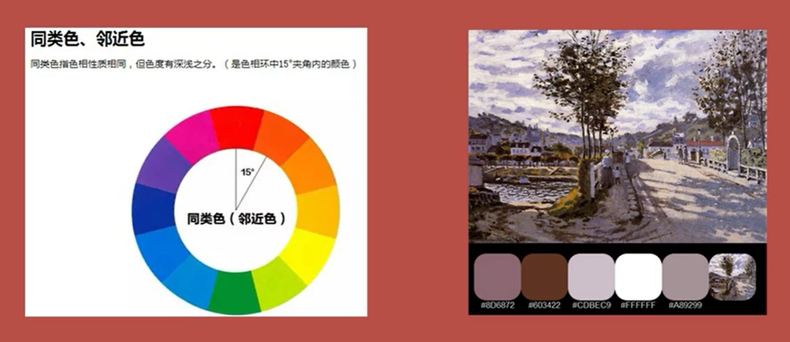

## 近似色

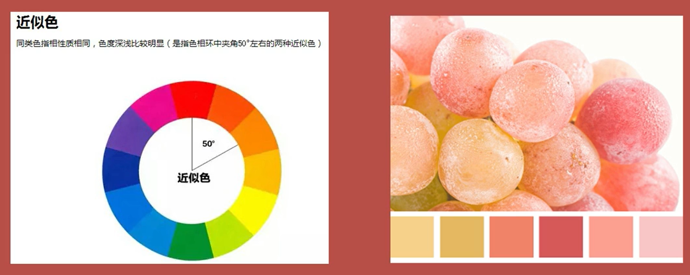

## 对比色

## 补色

## 冷暖色

# 后期基础知识

# 镜头校正

- 自动校正
- 手动校正，可以有效去除色差

# 基本面板（一级调色）

> 点击滑块中间可以恢复默认设置

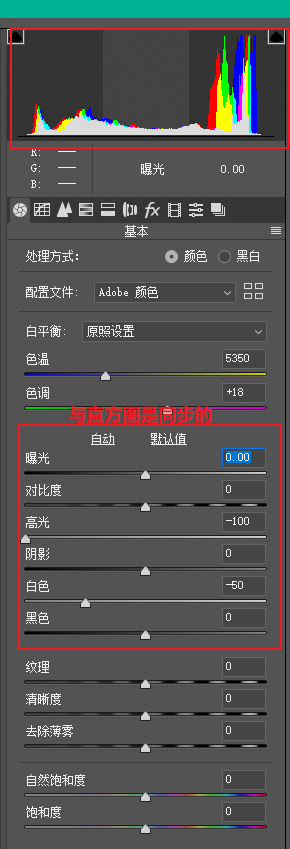

## 白平衡

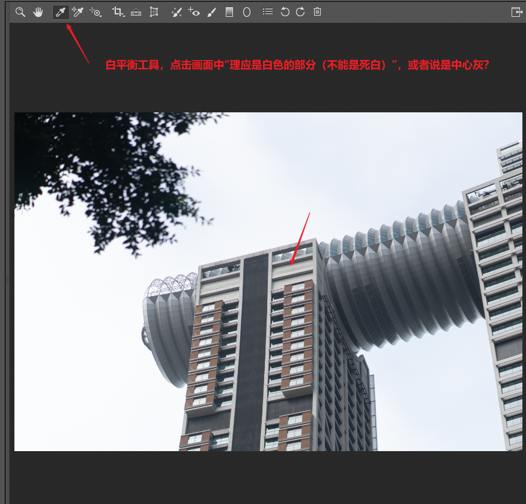

## 曝光

## 对比度

- 亮的更亮，暗的更暗

## 清晰度

## 饱和度

- 自然饱和度调整力度比饱和度小一些

# 色调曲线

- 原始：输出=输入

- RGB

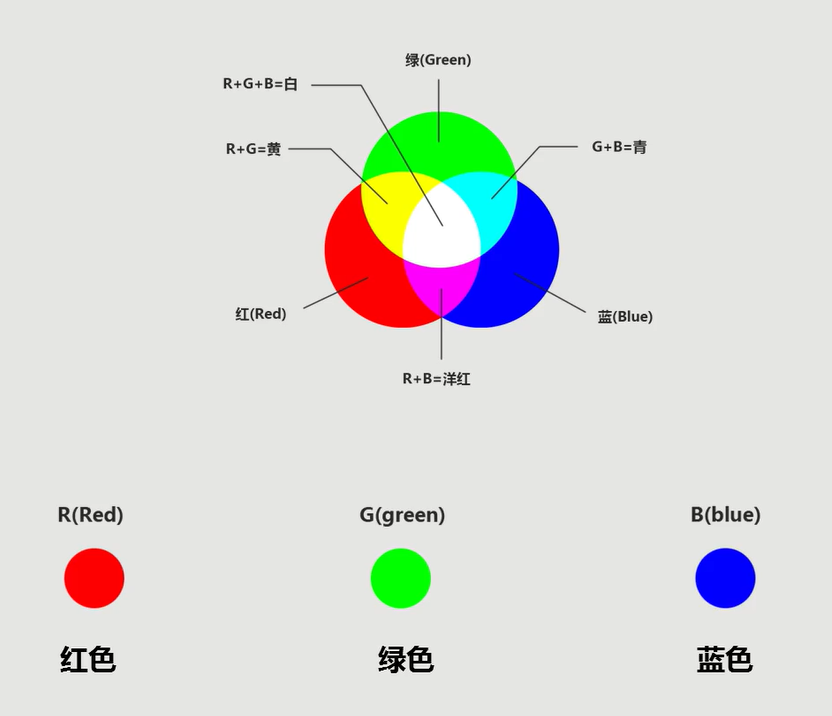

- 三通道曲线

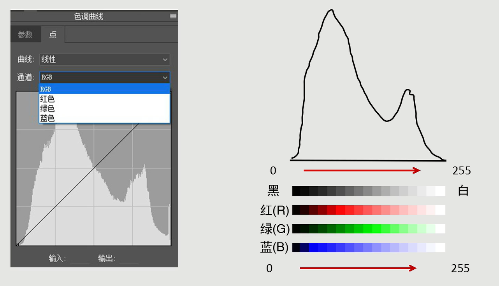

# HSL

> Hue，色相；Saturation，饱和度；Lightness，明度

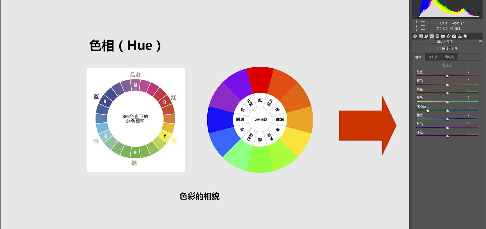

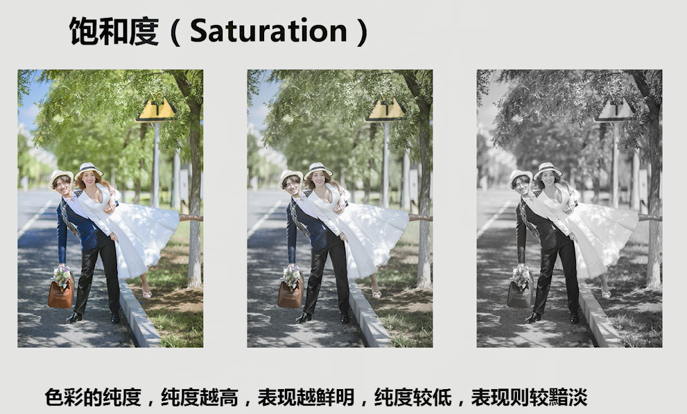

# 分离色调

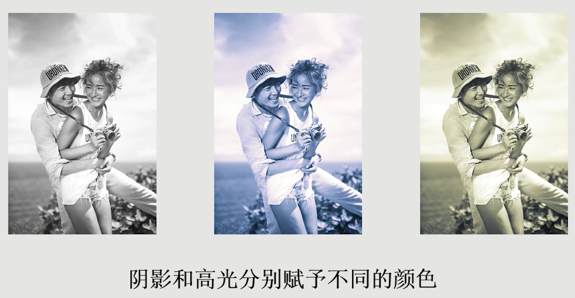

- 主体和背景的冷暖对比突出主体
- 画面的冷暖对比塑造空间感

# 细节面板

## 锐化

- `ALT`键去除颜色干扰
- 数量
- 半径
- 细节
- 蒙版
  - 选择锐化范围，人像一般是边缘

## 减少杂色

- 减少噪点

# 预设

- 设置->存储设置
- 导入

# 工具

## 缩放

## 拖手

## 白平衡工具

## 取色器

## 目标调整工具

## 剪裁

- 再次点击复原

## 拉直

- 以某个方向为垂直方向剪裁

## 变换

